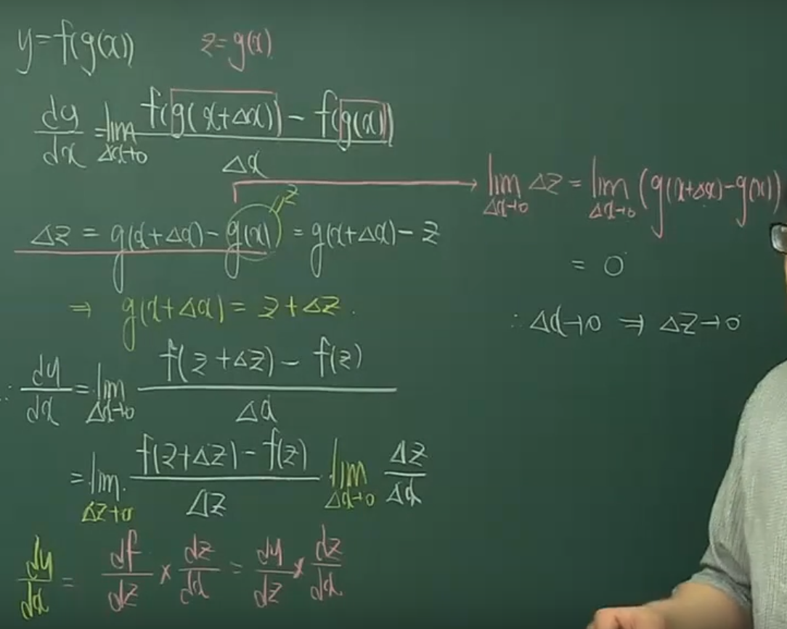

===========
Chain rule
===========

연쇄 법칙 (Chain rule)은 고등학교 때 합성 함수의 미분법으로 배웠고, 그 정의는 아래와 같다.

Definition
===========

:math:`f` 와 :math:`g` 가 모두 미분 가능하고 :math:`F = f \circ g` 가 :math:`F(x) = f(g(x))` 로 정의된 합성 함수이면, :math:`F` 는 미분 가능하고 :math:`F'` 는 다음 곱으로 주어진다.

.. rst-class:: centered

    :math:`F'(x) = f'(g(x)) \cdot g'(x)`

    :math:`\frac{dy}{dx} = \frac{dy}{du} \cdot \frac{du}{dx},\ where\ u = g(x)`

첫 번째 수식을 간단히 설명하면 "겉미분 X 속미분"이라고 말할 수 있다. 그리고 두 번째 수식은 첫 번째 수식을 라이프니츠 기호로 표현한 것이다. 그렇다면 이 수식은 어떻게 나온 것일까?

Proof
======

Reference
==========

* `대학 미적분학 실력 완성 - 11-1강 연쇄법칙 <https://www.youtube.com/watch?v=sPzy-K0Hyr4>`_
