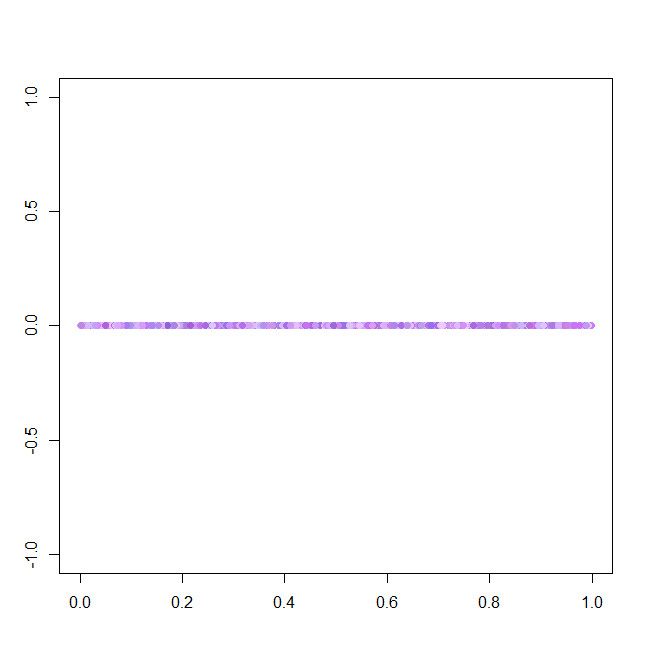
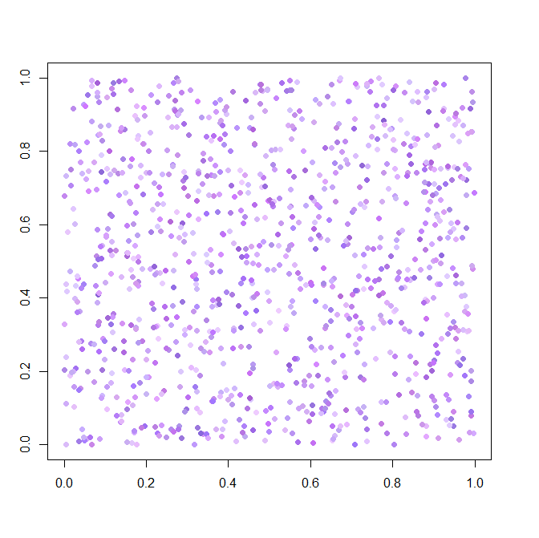
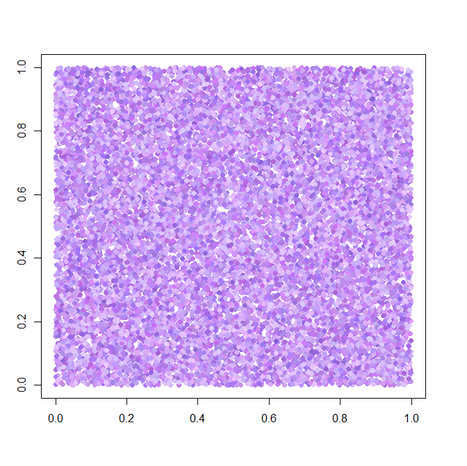

===========
차원의 저주
===========

위키피디아에서 차원의 저주 (Curse of dimensionality)는

    "The curse of dimensionality refers to various phenomena that arise when analyzing and organizing data in high-dimensional spaces (often with hundreds or thousands of dimensions) that do not occur in low-dimensional settings such as the three-dimensional physical space of everyday experience."
    
라고 언급했다. 즉, 고차원 공간에 있는 데이터를 분석할 때 발생하는 여러 가지 현상을 차원의 저주라고 한다. 차원의 저주를 이해하기 위해서는 먼저 차원을 정확히 이해해야 한다.

차원
=====

==== ====== ========
키   몸무게  머리길이
==== ====== ========
168  58     10
162  55     30
159  49     25
165  45     40
==== ====== ========

위와 같은 데이터는 변수 3개 (키, 몸무게, 머리길이)를 가진 3차원 데이터이다. 즉, 변수의 개수가 몇 개인지가 몇 차원인지를 의미하게 되고, 정리해서 **차원 = 변수의 수** 라고 이해하면 접근이 조금 더 쉽다. 다음 그래프로 조금 더 살펴보자.

.. figure:: img/regularization/cod/3d_data_graph.png
    :align: center
    :scale: 90%
  
.. rst-class:: centered

    출처: `꼬낄콘의 분석일지, Dimension / 차원 / 차원의 저주 / 차원축소 <https://kkokkilkon.tistory.com/127>`_

위 그래프처럼 데이터를 그래프로 표현하기 위해서는 각 차원 (변수의 수)만큼 축이 필요하다. 그래서 **차원 = 변수의 수 = 축의 개수** 이라고 생각할 수 있다. 그렇다면 차원이 늘어난다는 것은 어떤 의미일까? 여기서 정리한 내용을 기반으로 하면 **차원이 늘어난다 = 변수의 수가 많아진다 = 축의 개수가 많아진다 = 데이터의 공간이 커진다** 로 받아들일 수 있다.

자, 그러면 이렇게 차원, 변수, 축, 데이터 공간에 대한 이해를 기반으로 차원이 늘어나면 어떤 문제가 생기는지 살펴보자.

차원의 저주
===========

예를 들어 1차원 공간에 다음과 같은 작은 원을 채워보자.

  
.. rst-class:: centered

    출처: `데이터 과학, 차원의 저주 <https://m.blog.naver.com/PostView.nhn?blogId=plasticcode&logNo=221485061322&categoryNo=6&proxyReferer=https%3A%2F%2Fwww.google.com%2F>`_

이를 적절하게 배치하면 1,000개의 원만 있어도 충분히 0에서 1 사이 공간을 채우고 있다. 이번에는 원의 개수를 2배로 늘려서 2,000개의 원을 2차원 공간에 채워보자.

  
.. rst-class:: centered

    출처: `데이터 과학, 차원의 저주 <https://m.blog.naver.com/PostView.nhn?blogId=plasticcode&logNo=221485061322&categoryNo=6&proxyReferer=https%3A%2F%2Fwww.google.com%2F>`_

원의 수를 2배로 늘렸는데 2차원 공간에 빈 공간이 많다. 즉, 원의 개수는 늘어났지만 1차원 공간에 비해 상대적으로 2차원 공간 내 원의 밀도가 낮아졌다. 그럼 여기서 원의 수를 2배로 늘려 2만 개의 원을 표현해보자.

  
.. rst-class:: centered

    출처: `데이터 과학, 차원의 저주 <https://m.blog.naver.com/PostView.nhn?blogId=plasticcode&logNo=221485061322&categoryNo=6&proxyReferer=https%3A%2F%2Fwww.google.com%2F>`_

원의 수를 10배로 늘렸기 때문에 이전보다는 확실히 더 많은 공간을 채우고 있지만, 여전히 빈 공간이 듬성듬성있다. 그럼 여기서 2만 개의 원을 3차원 공간에 채우면 어떻게 될까?

.. figure:: img/regularization/cod/cod_3d_sparse.png
    :align: center
    :scale: 80%
  
.. rst-class:: centered

    출처: `데이터 과학, 차원의 저주 <https://m.blog.naver.com/PostView.nhn?blogId=plasticcode&logNo=221485061322&categoryNo=6&proxyReferer=https%3A%2F%2Fwww.google.com%2F>`_

마찬가지로 차원을 늘렸더니 공간이 커져서 2만 개의 원으로는 3차원 공간을 다 채우기 힘들어 보인다. 여기서 원의 수를 5배 더 늘려 10만 개의 원을 채워보자.

.. figure:: img/regularization/cod/cod_3d_dense.png
    :align: center
    :scale: 80%
  
.. rst-class:: centered

    출처: `데이터 과학, 차원의 저주 <https://m.blog.naver.com/PostView.nhn?blogId=plasticcode&logNo=221485061322&categoryNo=6&proxyReferer=https%3A%2F%2Fwww.google.com%2F>`_

역시 원의 개수를 늘렸더니 더 많은 공간을 채울 수 있는 것을 알 수 있다. 하지만 여전히 완전히 다 채우지 못한 빈 공간이 보인다. 지금까지 언급한 내용 자체가 차원의 저주이다. 즉, 차원이 커짐에 따라 그 공간이 커지고, 그에 따라 공간 내에 모든 경우를 다 채우려면 더 많은 데이터가 필요하다. 이처럼 차원이 커짐에 따라 모든 경우를 다 파악하는데 필요한 데이터가 기하급수적으로 늘어나는 현상을 **차원의 저주** 라고 한다.

문제점
******

그럼 차원의 저주가 어떤 문제를 일으키는 걸까? 예를 들어 데이터가 차원은 높은데 개수가 적고, 이 데이터를 학습하여 분류하는 모델이 있다고 해보자. 이런 경우에 이 모델은 주어진 데이터에 과대적합한 모델이 된다. 그 이유는 데이터의 차원이 높아 그만큼 데이터를 설명하는 변수의 수가 많은데 비해, 데이터의 개수가 적기 때문에 실제 데이터 차원에 해당하는 공간의 많은 경우를 확인할 수 없기 때문에 모델이 과도하게 학습 데이터에 적합된 학습을 할 수 밖에 없다.

이 외에도 다양한 문제가 있을 수 있다. 어쨌든 차원의 저주를 방지하려면 뭔가 방법이 필요하고 지금부터 그 방법에 대해 알아보려고 한다.

Reference
==========

* `Wikipedia, Curse of dimensionality <https://en.wikipedia.org/wiki/Curse_of_dimensionality#Optimization>`_
* `Time Traveler, 7. Curse of Dimension, Reduction of input dimension (차원의 저주) <https://89douner.tistory.com/31?category=868069>`_
* `꼬깔콘, Dimension / 차원 / 차원의 저주 / 차원 축소 <https://kkokkilkon.tistory.com/127>`_
* `데이터 과학, 차원의 저주 <https://m.blog.naver.com/PostView.nhn?blogId=plasticcode&logNo=221485061322&categoryNo=6&proxyReferer=https%3A%2F%2Fwww.google.com%2F>`_
