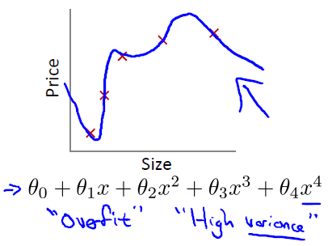
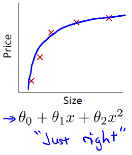

===============
Regularization
===============

.. _advanced_overfitting:

과적합 문제
==========

앞서 머신러닝을 소개할 때 `과적합 <intro.html#overfitting>`_ 이 머신러닝 모델의 일반화를 방해하고, 이 문제를 해결하기 위해 **정칙화 (Regularization)** 가 필요하다고 언급한 적이 있다. 다시 한 번 언급하자면, 과적합은 학습된 모델이 주어진 학습 데이터에 과도하게 적합하여 학습데이터와 다른 실제 데이터에 적용했을 때, 원하는 결과를 제대로 도출하지 못하는 상태라고 할 수 있다. 두 가지 예제를 통해 살펴보자.

선형 회귀 예제: 집 값 예측
*************************

다음 충주의 집 값을 예측하는 선형회귀 모델 예제를 통해 조금 더 자세히 살펴보자.

-------
과소적합
-------

충주의 집 값을 예측할 때 한 가지 요인만을 단순한 형태로 고려하여 예측할 수 있다 (예: 평수 <- 일차 함수). 하지만 이러한 경우 제대로 집 값을 예측하기 어려울 수 있다. 왜냐하면 평수는 집 값을 결정하는 여러 가지 요인 중에 한 가지이기 때문이다. 이러한 경우를 **과소적합 (Underfitting)** 이라고 한다. 아래 그래프에서도 실제 가격과 주어진 선과의 거리가 조금 있는 것을 확인할 수 있다. :strike:`그리고 학습된 모델이 과소적합 상태인 경우, 너무 적은 요인을 고려하여 한 쪽으로 치우친 상태라는 의미로 High bias 하다고 표현하기도 한다. (현재 이해 X, 추후 다시 보기)`

.. figure:: img/regularization/underfitting_ex_regression.png
    :align: center
    :scale: 70%
  
.. rst-class:: centered

    출처: `Coursera, Machine Learning <https://www.coursera.org/learn/machine-learning>`_

-------
과대적합
-------

이번에는 충주의 집 값을 예측할 때 여러 가지 요인을 고려해보자 (예: 평수, 방 개수, 층수, 연식, 위치, 집 주인 이름, 창문 개수, 화장실 위치 등). 이러한 경우에는 너무 많은 요인을 고려해서 집 값을 예측하기 어려울 수 있다. 예를 들어 집 주인 이름이나 창문 개수 등은 집 값을 예측하는데 중요하지 않은 요인이기 때문이다. 이러한 경우를 **과대적합 (Overfitting)** 이라고 한다.

  
.. rst-class:: centered

    출처: `Coursera, Machine Learning <https://www.coursera.org/learn/machine-learning>`_

아니면 위 그래프처럼 한 가지 요인을 고려하면서 다양한 변형된 형태들을 많이 고려하는 경우에도 과대적합이 발생할 수 있다. 그래프에서 실제 가격과 주어진 선이 모두 일치하지만 과도하게 주어진 데이터에 적합되어 있는 것처럼 보인다. 이러한 경우 학습 데이터 이외에 실제 데이터를 표기했을 때 가격과 주어진 선의 차이가 크게 날 수 있다.

그리고 학습된 모델이 과대적합 상태인 경우, 너무 많은 요인들을 고려하거나 하나의 요인을 다양한 형태로 과도하게 고려한다는 의미에서 **High variance** 하다고 표현하기도 한다. 또한 여기서 너무 많은 요인을 고려하는 경우 :doc:`차원의 저주 <curse_of_dimensionality>` 문제가 발생할 수 있다 (링크로 자세한 내용 확인 가능).

.. toctree::
    :hidden:

    curse_of_dimensionality

-------
일반화
-------

그렇다면 학습 데이터와 실제 데이터에 더 적합한 모델은 무엇일까? 과대적합된 모델의 요인에서 **불필요한 요인이나 하나의 요인에서 변형된 형태들을 제거** 해보자 (예: 집 주인 이름, 창문 개수 제외 또는 :math:`\theta_3 x^3,\ \theta_4 x^4` 제거). 이번에는 과소적합 또는 과대적합된 모델보다 훨씬 더 집 값을 잘 예측할 수 있다.

  
.. rst-class:: centered

    출처: `Coursera, Machine Learning <https://www.coursera.org/learn/machine-learning>`_

왜냐하면 집 값을 예측하는데 조금 더 중요한 요인들만 고려했기 때문이다. 위 그래프에서 볼 수 있듯이, 학습 데이터와 약간의 차이가 있지만 큰 차이가 없고, 실제 데이터와도 적합할 가능성이 높아 보인다. 우리는 이런 일반화된 형태의 모델을 찾는 것이 목표다.

분류 예제: 유방암 악성 여부 예측
*******************************

이번에는 유방암의 악성 여부를 분류하는 모델 예제를 통해 조금 더 자세히 살펴보자.

.. figure:: img/regularization/overfitting_ex_classification.png
    :align: center
    :scale: 70%
  
.. rst-class:: centered

    출처: `Coursera, Machine Learning <https://www.coursera.org/learn/machine-learning>`_

--------
과소적합
--------

이전에 집값 예측 문제 (선형 회귀)와 비슷하다. 예를 들어 암 크기와 나이로만 유방암의 악성 여부를 판단하면 그 정확도가 떨어질 수 있다. 그 이유는 너무 적은 요인을 고려하여 다른 요인에 의해 악성 여부가 결정될 수 있기 때문이고, 이러한 경우를 과소 적합이라한다 (위 좌측 그래프).

--------
과대적합
--------

그렇다면 고려하는 요인을 더 늘리거나 (예: 암 크기, 나이, 유전 여부, 암 발생 시기, 환자 이름, 출처 등) 두가지 요인을 다양한 형태로 고려해보자. 이번에는 너무 많은 요인을 고려했기 때문에, 과대적합이 발생할 수 있고 위 우측 그래프에서 알 수 있다.

-------
일반화
-------

그러면 과대적합 상태에서 불필요한 요인들을 제거하여 조금 더 일반화된 모델을 만들어보자 (예: 환자이름, 출처 제외 또는 차수↓, 변수 제거). 위 가운데 그래프에서 알 수 있듯이 약간의 오차는 있지만 실제 데이터에서도 잘 분류할 가능성이 높아보인다.

결론
****

지금까지 살펴본 선형 회귀, 분류 모델에서 적절한 수의 요인을 고려하는 것이 과적합 (과대적합 또는 과소적합) 문제를 해결하는데 도움이 되는 것을 확인할 수 있었다. 이 때, 불필요한 요인들을 제거하는 작업과 같은 방법이 조금 더 일반화된 모델을 만드는데 도움이 되고, 이러한 방법들에는 다음과 같은 것들이 있다.

* 요인 (Feature) 수 줄이기

    * 수작업으로 어떤 요인을 줄일 것인지 결정
    * Model selection algorithm을 사용하여 결정

* 정칙화

    * 모든 요인을 반영하되, 그 정도를 조절하는 방법
    * 조금 유용한 요인이 많은 경우 정칙화가 잘 동작함

* Dataset을 나누는 방법

    * Dataset을 Training, validation, test dataset으로 나눠서 사용

여기에서는 이 중에서 정칙화에 대해서 알아볼 예정이다.

정칙화의 기본 원리
==================

If we have overfitting from our hypothesis function, we can reduce the weight that some of the terms in our function carry by increasing their cost. We wanted to make the following function more quadratic:

.. rst-class:: centered
    
    :math:`\theta_0 + \theta_1x + \theta_2x^2 + \theta_3x^3 + \theta_4x^4`

We'll want to eliminate the influence of :math:`\theta_3x^3.` Without actually getting rid of these features or changing the form of our hypothesis, we can instead modify our cost function:

.. rst-class:: centered

    :math:`min_\theta\ \dfrac{1}{2m}\sum_{i=1}^m (h_\theta(x^{(i)}) - y^{(i)})^2 + 1000\cdot\theta_3^2 + 1000\cdot\theta_4^2`

We've added two extra terms at the end to inflate the cost of :math:`\theta_3` and :math:`\theta_4.` Now, in order for the cost function to get close to zero, we will have to reduce the values of :math:`\theta_3` and :math:`\theta_4` to near zero. This will in turn greatly reduce the values of :math:`\theta_3x^3` and :math:`\theta_4x^4` in our hypothesis function.

As a result, we see that the new hypothesis (depicted by the pink curve) looks like a quadratic function but fits the data better due to the extra small terms :math:`\theta_3x^3` and :math:`\theta_4x^4.`

.. figure:: img/regularization/cost_function.png
  :align: center
  :scale: 100%

We could also regularize all of our theta parameters in a single summation as:

.. rst-class:: centered

    :math:`min_\theta\ \dfrac{1}{2m}\ \sum_{i=1}^m (h_\theta(x^{(i)}) - y^{(i)})^2 + \lambda\ \sum_{j=1}^n \theta_j^2`

The :math:`\lambda,` or lambda, is the regularization parameter. It determines how much the costs of our theta parameters are inflated.

Using the above cost function with the extra summation, we can smooth the output of our hypothesis function to reduce overfitting. If lambda is chosen to be too large, it may smooth out the function too much and cause underfitting. Hence, what would happen if :math:`\lambda = 0` or is too small?

Regularized Linear Regression
==============================

We can apply regularization to both linear regression and logistic regression. We will approach linear regression first.

Gradient Descent
We will modify our gradient descent function to separate out :math:`\theta_0` from the rest of the parameters because we do not want to penalize :math:`\theta_0.`

Repeat {

    :math:`\theta_0 := \theta_0 - \alpha \frac{1}{m} \sum\limits_{i=1}^m (h_\theta(x^{(i)}) - y^{(i)}) x_0^{(i)}`

    :math:`\theta_j := \theta_j - \alpha [(\frac{1}{m} \sum\limits_{i=1}^m (h_\theta(x^{(i)}) - y^{(i)}) x_j^{(i)}) + \lambda_m \theta_j]\ where\ j \in \{1, 2, \cdots n\}`

}

The term :math:`\frac{\lambda}{m}\theta_j` performs our regularization. With some manipulation our update rule can also be represented as:

.. rst-class:: centered

    :math:`\theta_j := \theta_j(1 - \alpha\frac{\lambda}{m}) - \alpha\frac{1}{m}\sum_{i=1}^m(h_\theta(x^{(i)}) - y^{(i)})x_j^{(i)}`

The first term in the above equation, :math:`1 - \alpha\frac{\lambda}{m}` will always be less than 1. Intuitively you can see it as reducing the value of :math:`\theta_j` by some amount on every update. Notice that the second term is now exactly the same as it was before.

**Normal Equation**

Now let's approach regularization using the alternate method of the non-iterative normal equation.

To add in regularization, the equation is the same as our original, except that we add another term inside the parentheses:

.. rst-class:: centered

    :math:`\theta = (X^T X + \lambda \cdot L)^{-1} X^T y`
    
    :math:`where\ L = \begin{bmatrix} 0 &  &  &  &   \\ & 1 &  &  &  \\ &  & 1 &  &  \\ &  &  & \ddots &  \\ &  &  &  & 1 \end{bmatrix}`

:math:`L` is a matrix with 0 at the top left and 1's down the diagonal, with 0's everywhere else. It should have dimension :math:`(n+1)×(n+1).` Intuitively, this is the identity matrix (though we are not including :math:`x_0`), multiplied with a single real number :math:`\lambda.`

Recall that if :math:`m < n,` then :math:`X^TX` is non-invertible. However, when we add the term :math:`\lambda \cdot L,` then :math:`X^TX + \lambda \cdot L` becomes invertible.

Regularized Logistic Regression
===============================

We can regularize logistic regression in a similar way that we regularize linear regression. As a result, we can avoid overfitting. The following image shows how the regularized function, displayed by the pink line, is less likely to overfit than the non-regularized function represented by the blue line:

.. figure:: img/regularization/regularized_lr.png
    :align: center
    :scale: 100%

Cost Function
*************

Recall that our cost function for logistic regression was:

.. rst-class:: centered

    :math:`J(\theta) = - \frac{1}{m} \sum_{i=1}^m \large[ y^{(i)}\ \log (h_\theta (x^{(i)})) + (1 - y^{(i)})\ \log (1 - h_\theta(x^{(i)})) \large]`

We can regularize this equation by adding a term to the end:

.. rst-class:: centered

    :math:`J(\theta) = - \frac{1}{m} \sum_{i=1}^m \large[ y^{(i)}\ \log (h_\theta (x^{(i)})) + (1 - y^{(i)})\ \log (1 - h_\theta(x^{(i)}))\large] + \frac{\lambda}{2m}\sum_{j=1}^n \theta_j^2`

The second sum, :math:`\sum_{j=1}^n \theta_j^2` means to explicitly exclude the bias term, :math:`\theta_0.` I.e. the :math:`\theta` vector is indexed from 0 to n (holding :math:`n+1` values, :math:`\theta_0` through :math:`\theta_n`), and this sum explicitly skips :math:`\theta_0,` by running from 1 to n, skipping 0. Thus, when computing the equation, we should continuously update the two following equations:

Repeat {

    :math:`\theta_0 := \theta_0 - \alpha \frac{1}{m} \sum\limits_{i=1}^m (h_\theta(x^{(i)}) - y^{(i)}) x_0^{(i)}`

    :math:`\theta_j := \theta_j - \alpha [(\frac{1}{m} \sum\limits_{i=1}^m (h_\theta(x^{(i)}) - y^{(i)}) x_j^{(i)}) + \frac{\lambda}{m} \theta_j]\ where\ j \in \{1, 2, \cdots n\}`

}

Bias vs. Variance
==================

In this section we examine the relationship between the degree of the polynomial :math:`d` and the underfitting or overfitting of our hypothesis.

* We need to distinguish whether **bias** or **variance** is the problem contributing to bad predictions.
* :blue:`High bias` is :blue:`underfitting` and :red:`high variance` is :red:`overfitting`. Ideally, we need to find a **golden mean** between these two.

The training error will tend to decrease as we increase the degree :math:`d` of the polynomial.

At the same time, the cross validation error will tend to decrease as we increase :math:`d` up to a point, and then it will increase as :math:`d` is increased, forming a convex curve.

* High bias (underfitting)
    
    * Both :math:`J_{train}(\theta)` and :math:`J_{CV}(\theta)` will be high.
    * :math:`J_{CV}(\theta) \approx J_{train}(\theta).`

* High variance (overfitting)

    * :math:`J_{train}(\theta)` will be low.
    * :math:`J_{CV}(\theta)` will be much greater than :math:`J_{train}(\theta).`

The is summarized in the figure below:

.. figure:: img/regularization/bias_vs_variance.png
    :align: center
    :scale: 100%

Regularization and bias/variance
*********************************

In the below figure, we see that as :math:`\lambda` increases, our fit becomes more rigid. On the other hand, as :math:`\lambda` approaches 0, we tend to over overfit the data.

.. figure:: img/regularization/regularization_and_bias_variance.png
    :align: center
    :scale: 80%

So how do we choose our parameter :math:`\lambda` to get it 'just right'? In order to choose the model and the regularization term :math:`\lambda`, we need to:

* Initialization

    * Create a list of :math:`\lambda s`  (i.e. :math:`\lambda \in {0,0.01,0.02,0.04,0.08,0.16,0.32,0.64,1.28,2.56,5.12,10.24}).`
    * Create a set of models with different degrees or any other variants.

* Search the best :math:`\lambda` and :math:`\theta`

    * Iterate through the :math:`\lambda s` and for each :math:`\lambda s` go through all the models to learn some :math:`\theta`.
    * Compute the cross validation error using the learned :math:`\theta` (computed with :math:`\lambda`) on the :math:`J_{CV}(\theta)` without regularization or :math:`\lambda` = 0.
    * Select the best combo that produces the lowest error on the cross validation set.

* Apply to the  test set
    
    * Using the best combo :math:`\theta` and :math:`\lambda`, apply it on :math:`J_{test}(\theta)` to see if it has a good generalization of the problem.

Learning Curves
****************

Training an algorithm on a very few number of data points (such as 1, 2 or 3) will easily have 0 errors because we can always find a quadratic curve that touches exactly those number of points. Hence:

* As the training set gets larger, the error for a quadratic function increases.
* The error value will plateau out after a certain :math:`m`, or training set size.

----------
High bias
----------

* Low training set size

    * :math:`J_{train}(\theta)` will be low and :math:`J_{CV}(\theta)` will be high.

* Large training set size

    * Both :math:`J_{train}(\theta)` and :math:`J_{CV}(\theta)` will be high with :math:`J_{train}(\theta) \approx J_{CV}(\theta)`.

If a learning algorithm is suffering from **high bias**, getting :strike:`more training data` will not (by itself) help much.

.. figure:: img/regularization/learning_curve_high_bias.png
    :align: center
    :scale: 100%

--------------
High variance
--------------

* Low training set size

    * :math:`J_{train}(\theta)` will be low and :math:`J_{CV}(\theta)` will be high.

* Large training set size

    * :math:`J_{train}(\theta)` increases with training set size and :math:`J_{CV}(\theta)` continues to decrease without leveling off.
    * :math:`J_{train}(\theta) < J_{CV}(\theta)` but the difference between them remains significant.

If a learning algorithm is suffering from **high variance**, getting **more training data** is likely to help.

.. figure:: img/regularization/learning_curve_high_variance.png
    :align: center
    :scale: 100%

Deciding What to Do Next Revisited
***********************************

A decision process can be broken down as follows:

===============================  =============  ==================
Decision                         Fix high bias  Fix high variance
===============================  =============  ==================
Getting more training examples   X              O
Trying smaller sets of features  X              O
Adding features                  O              X
Adding polynomial features       O              X
Decreasing λ                     O              X
Increasing λ                     X              O
===============================  =============  ==================

---------------------------
Diagnosing Neural Networks
---------------------------

* A neural network with fewer parameters is prone to underfitting. It is also computationally cheaper.
* A large neural network with more parameters is prone to overfitting. It is also computationally expensive. In this case you can use regularization (increase λ) to address the overfitting.

Using a single hidden layer is a good starting default. You can train your neural network on a number of hidden layers using your cross validation set. You can then select the one that performs best.

-------------------------
Model Complexity Effects
-------------------------

* Lower-order polynomials (low model complexity)

    * Have high bias and low variance.
    * The model fits poorly consistently.

* Higher-order polynomials (high model complexity)

    * Fit the training data extremely well and the test data extremely poorly.
    * These have low bias on the training data, but very high variance.

In reality, we would want to choose a model somewhere in between, that can generalize well but also fits the data reasonably well.

:h2:`출처`

* `One page summary <https://docs.google.com/document/d/14wRFf7DJXR2zhh5L8VH4Jyfr4Pw2ry80YvhuoQlYrrM/edit?usp=sharing>`_
* `Coursera, Machine Learning <https://www.coursera.org/learn/machine-learning>`_
