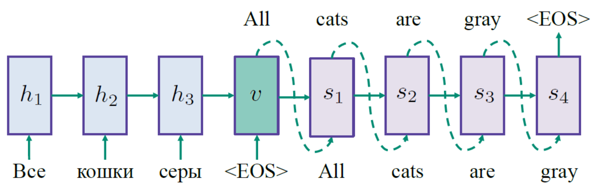
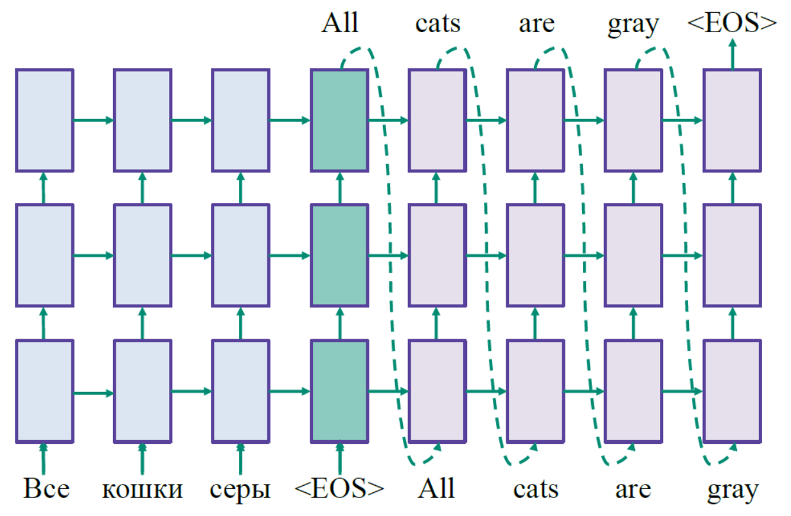
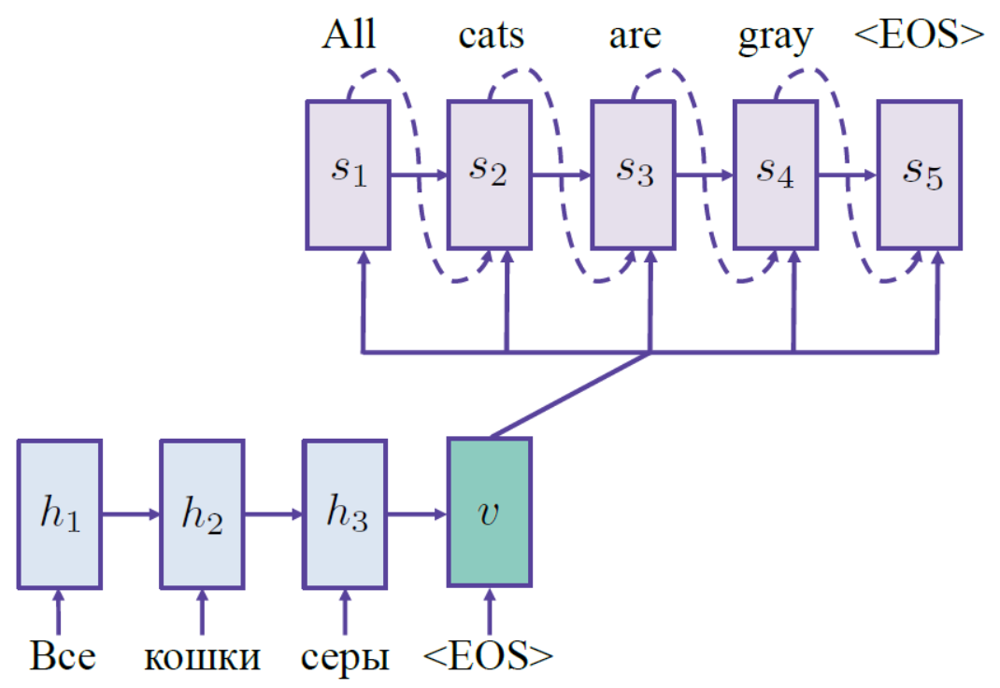

======================================
Encoder-decoder-attention architecture
======================================

Encoder-decoder architecture
============================

Encoder-decoder architectures like sequence to sequence are applied many tasks such as machine translation, summarization or simplification of texts, chatbot and so on.

Sequence to sequence
********************

First, we can start from general idea of the architecture. We have some sequence as the input, and we would want to get some sequence as the output. We have an encoder and the task of the encoder is to build some hidden representation called thought or context vector that tries to encode the whole meaning of the input sentence over the input sentence in some hidden way. The encoder task is to decode this thought vector or context vector into some output representation. For example, the sequence of words from the other language.

.. figure:: img/encoder-decoder-attention_architecture/seq2seq.png
  :align: center
  :scale: 50%

To generate the architecture, we can construct the encoder or the decoder using various types of methods:

* Recurrent neural network (RNN)
* Long Short-Term Memory models (LSTM)
* Convolutional neural network
* Hierarchical structure

--------------------------------------------------------
Sequence to Sequence Learning with Neural Network, 2014
--------------------------------------------------------

We can use RNN or LSTM for encoder or decoder.

  **Seq2seq with Recurrent neural network (RNN)**

  **Seq2seq with Long Short-Term Memory models (LSTM)**

Problem:
---------

* The green context letter can be forgotten

---------------------------------------------------------------------------------------------------
Learning phrase representation using RNN encoder-decoder for statistical machine translation, 2014
---------------------------------------------------------------------------------------------------

Attention mechanism
====================

How to deal with a vocabulary?
===============================

How to implement a conversational chat-bot?
===========================================

Quiz: Encoder-decoder-attention architecture
============================================

.. toggle-header::
  :header: **Quiz list**

  |
  **Question 1**

    In the lecture as well as in this test we will have lots of formulas. Let us first make sure that we remember the used notation. Please, name the following objects: :math:`I,\ J,\ x_i,\ y_j,\ h_i,\ v_j,\ s_j`
    
    \(O\) length of source, length of target, source word, target word, encoder state, context vector, decoder state

    \(X\) length of source, length of target, source word, target word, encoder state, decoder state, context vector

    \(X\) length of target, length of source, encoder state, decoder state, source word, target word, context vector

  **Question 2**

    How do we compute the context (thought) vector vv for the decoder position jj in a seq2seq model without attention?

    \(X\) :math:`\sum_i \alpha_i^j h_i` , where :math:`\alpha_i^j` are some weights

    \(O\) :math:`h_I` , where :math:`h_I` is the last encoder state

    \(X\) :math:`h_j` , where :math:`h_j` is the :math:`j-th` state of the encoder

  **Question 3**

    How many new parameters for the network are introduced to calculate multiplicative attention weights? (Just to calculate, we are not yet looking into how we use them afterwards).

    \(X\) The length of the source, multiplied by the length of the target

    \(O\) The dimension of an encoder state, multiplied by the dimension of a decoder state

    \(X\) No new parameters

  **Question 4**

    Which of the following formulas stand for the additive attention? Note that :math:`h_i` is the :math:`i-th` encoder state, :math:`s_j` is the :math:`j-th` decoder state, and we are interested in the similarity between them.

    \(X\) :math:`h_i^T W s_j` , where :math:`W` is a matrix of parameters

    \(X\) :math:`h_i^T s_j`

    \(O\) :math:`w^T tanh (W [h_i, s_j])` , where the brackets denote concatenation of the vectors, and :math:`w` and :math:`W` are a vector and a matrix of parameters respectively.

  **Question 5**

    Let us denote encoder states by :math:`h_i` with ii going from 1 to :math:`I` . Lets us denote by :math:`a_i^j` the similarities computed using the additive attention formula from the previous question. How should we compute the context vector :math:`v_j` for the decoder position :math:`j`?

    \(X\) :math:`\sum_{i=1}^I \frac{\exp{a_i^j}}{\sum_{j′} \exp{a_i^{j′}}} h_i`

    \(X\) :math:`\sum_{i=1}^I a_i^j h_i`

    \(O\) :math:`\sum_{i=1}^I \frac{\exp{a_i^j}}{\sum_{i′} \exp{a_i'^{j}}} h_i`

  **Question 6**
  
    Which three vectors should be passed to a decoder state :math:`s_j` in a seq2seq with attention model from the lecture?

    \(X\) :math:`h_i` - the :math:`i-th` encoder state

    \(X\) :math:`x_i` - the :math:`i-th` word in the source sequence

    \(X\) :math:`x_{i-1}` - the previous word in the source sequence

    \(X\) :math:`h_{i-1}` - the previous encoder state

    \(O\) :math:`y_{j-1}` - the previous word in the target sequence

    \(O\) :math:`s_{j-1}` - the previous decoder state

    \(X\) :math:`s_j` - the :math:`j-th` decoder state

    \(O\) :math:`v_j` - the context vector for position :math:`j`, calculated using attention

    \(X\) :math:`y_j` - the :math:`j-th` word in the target sequence

  **Question 7**
  
    Which techniques would help if the data has rich morphology, informal spelling, and other sources of OOV tokens?

    \(O\) Sub-word modeling

    \(X\) Hierarchical softmax

    \(O\) Copy mechanism

    \(X\) Negative sampling

    \(O\) Byte-pair encoding

  **Question 8**
  
    Let us imagine we have trained a conversational chat-bot as a seq2seq model on Harry Potter movies subtitles. What problems could we expect?

    \(O\) The bot suggests to use a time-turner or probably some spell if you say you do not have enough time for your Coursera studies

    \(X\) The bot makes lots of spelling mistakes

    \(O\) When asked "What's your name?", the bot is not sure and says Harry, or Ron, or Hermione from time to time.

    \(X\) If asked in English, the bot replies in French or some other language

    \(O\) The bot doesn't remember what has already been decided in your dialogue

|
  
References
===========

* https://www.coursera.org/learn/language-processing