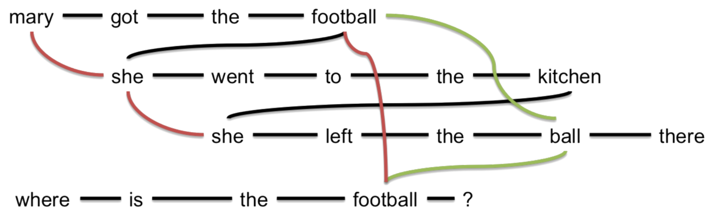

Introduction to NLP
====================

======================
Main approaches in NLP
======================

1. Rule-based methods

    * Regular expressions
    * Context-free grammers

2. Probabilistic modeling and machine learning

    * Likelihood maximization
    * Linear classifiers

3. Deep learning

    * Recurrent neural networks
    * Convolutional neural networks

===========================
Semantic slot filling
===========================

**Context-Free Grammer (CFG)**

    * Context-free grammar:
        * SHOW -> show me | i want | can i see | ...
        * FLIGHTS -> (a) flight | flights
        * ORIGIN -> from CITY
        * DESTINATION -> to CITY
        * CITY -> Boston | San Francisco | Denver | Washington
    * Parsing:
        * Figure 01
    * Pros and cons
        * Accuracy ↑
        * Manual -> Time ↑ -> Efficiency ↓

**Condition Random Field (CRF)**

    * Training courpus:
        * Show me flights from Boston to San Francisco on Tuesday
        * ORIG: from Boston, DEST: to San Francisco, DATE: on Tuesday
    * Feature engineering:
        * Is the word capitalized?
        * Is the word in a list of city names?
        * What is the previous word?
        * ...
    * CRF is a probabilistic graphical model
        * p(tags|words) = ... <- features, parameters
    * Training:
        * p(tags|words) -> max Θ
    * Inference:
        * tags* = argmax p(tags|words)

**Condition Random Field (CRF)**

    * Big training corpus
    * No feature generation
    * Defining the model
    * Training and Inference

.. figure:: img/lstm.png
    :align: center
    :scale: 40%

=================================
Deep larning vs. Traditional NLP
=================================

**Why do we need to study traditional NLP?**

    * Perform good enough in many tasks
        * Example: Sequence labeling
    * Allow us not to be blinded with the hype
        * Example: Word2vec / Distributional semantics
    * Can help to further imporve DL models
        * Example: Word alignment priors in machine translation

**Why do we need to study DL in NLP?**

    * Provide state-of-the-art performance in many tasks
        * Example: Machine translation, Attention network
    * This is where most of research in NLP is now happening
        * Example: Papers from ACL, EMNLP, and so on
    * Look fancy and everyone wants to know them
    

=========
Overview
=========

**Text classification tasks**

    * Predict some tags or categories
    * Predict sentiment for a review
    * Filter spam e-mails

**How to predict word sequences?**

    * Language models are needed in chat-bots, speech recognition, machine translation, summarization ...

**How to predict tags for the word sequences?**

    * Part-of-speech tags
    * Named entities
    * Semantic slots

**How to represent a meaning of word, a sentence, or a text?**

    * Word embeddings
    * Sentence embeddings
    * Topic models

**Where do we need that?**

    * Search, question answering, and any ranking
    * Any label propagation on a word similarity graph

**Sequence to sequence tasks**

    * Machine translation
    * Summarization, Simplification
    * Conversational chat-bot

**Dialogue agents become more and more popular**

    * Goal-oriented (e.g. Help in a call-center)
    * Conversational (e.g. Entertainment)

============================
Linguistic knowledge in NLP
============================

**NLP pyramid**

.. figure:: img/nlp_pyramid.png
    :align: center
    :scale: 40%

* Pragmatics (화용론): 언어 사용자와 발화 맥락(context)을 고려하는 양상 연구
* Semantics (의미론): 언어표현과 그 지시체와의 관계를 분석
* Syntax (통사론): 언어표현들 사이의 관계를 기술
    *Dependency trees, Constituency trees, ...
* Morphology (형태론): 한 언어에서 형태소들이 결합하여 낱말을 형성하는 체계 또는 규칙

.. figure:: img/dependency_trees.png
    :align: center
    :scale: 40%

.. figure:: img/constituency_trees.png
    :align: center
    :scale: 40%

.. figure:: img/sentiment_analysis.png
    :align: center
    :scale: 40%

**Libraries and tools**

* NLTK
    * Small but useful datasets with markup
    * Preprocessing tools: tokenization, normalization, ...
    * Pre-trained models for POS-tagging, parsing, ...
* Standford parser
* spaCy
    * Python and cpython library for NLP
* Gensim
    * Python library for text analysis
    * e.g. Word embeddings and topic modeling
* MALLET
    * Java-based library
    * e.g. Classification, sequence tagging, topic modeling

**Linguistic knowledge**

* Ideas and evaluation
* External resources
    * WordNet, BabelNet, etc.
* Linguistic knowledge + Deep learning
    * Task: Question answering / Reasoning
    * Linguistic links: Co-reference (Red), Hypernyms (green)
    * Method: DAG-LSTM

**Sentiment analysis**

.. figure:: img/sentiment_analysis.png
    :align: center
    :scale: 40%

===========
References
===========

* https://www.coursera.org/learn/language-processing
* https://terms.naver.com/entry.nhn?docId=3557825&cid=40942&categoryId=31528
* https://terms.naver.com/entry.nhn?docId=384318&cid=50306&categoryId=50306