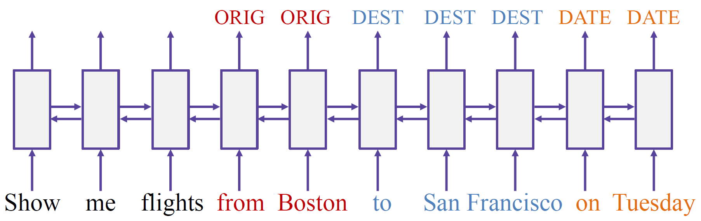
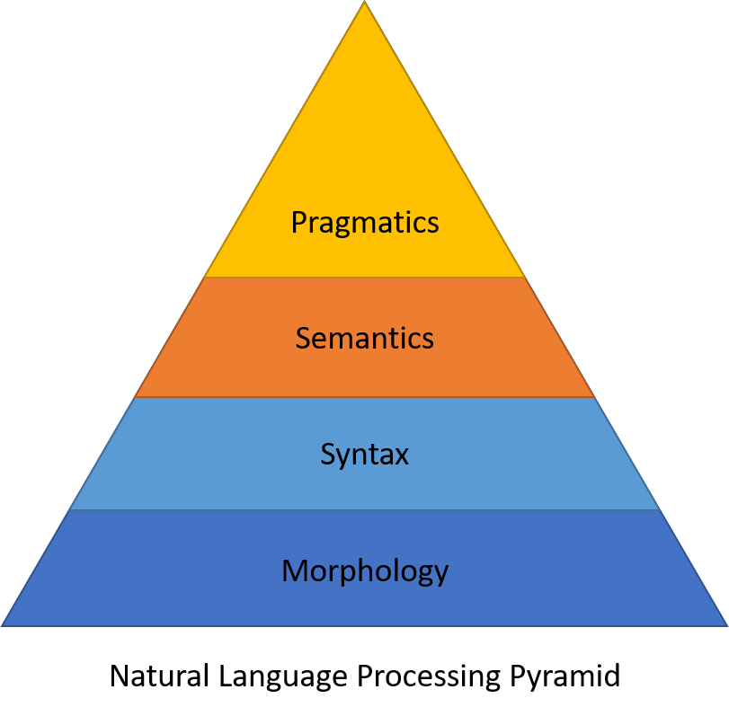
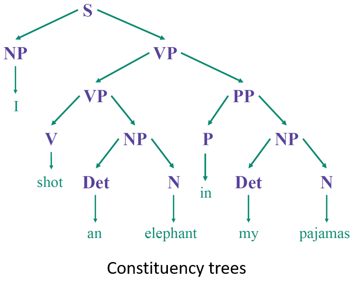
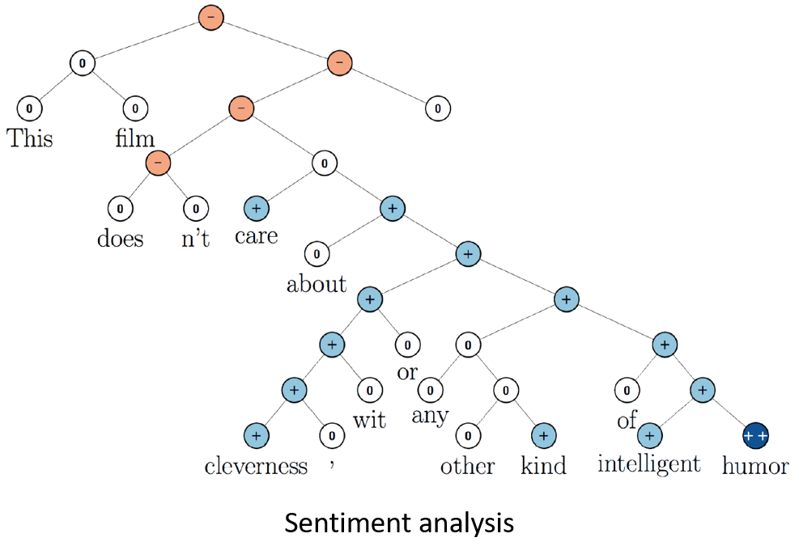

====================
Introduction to NLP
====================

There are three main approaches in NLP:

* Rule-based methods

    * Regular expressions
    * Context-free grammers

* Probabilistic modeling and machine learning

    * Likelihood maximization
    * Linear classifiers

* Deep learning

    * Recurrent neural networks
    * Convolutional neural networks

Example: Semantic slot filling
==============================

Semantic slot filling is the way to make sense of a piece of text by tagging the words or tokens which carry meaning to the sentences. Given the piece of text, we have to find some slots which may be Destination, City, Date and so on.

Context-Free Grammer (CFG)
***************************

Context-Free Grammer (CFG)는 Terminal (생성된 Grammar에 종속되는 Symbol)과 Nonterminal (얼마든지 Rule을 선택하고 위치를 바꿀 수 있는 요소)의 상관관계를 표현한 문법 중 하나이다. 여기서 Context-Free라는 것은 어떤 Nonterminal이 들어와도 해당 Symbol에 대한 Production Rule이 성립한다는 뜻에 나온 것이다 (참조: `생각많은 소심남 <https://talkingaboutme.tistory.com/entry/Study-Context-Free-Grammar-CFG>`_).

* Context-free grammar:

    * SHOW -> show me | i want | can i see | ...
    * FLIGHTS -> (a) flight | flights
    * ORIGIN -> from CITY
    * DESTINATION -> to CITY
    * CITY -> Boston | San Francisco | Denver | Washington

* Parsing:

    .. figure:: img/intro/parsing.png
        :align: center
        :scale: 30%

* Pros and cons

  * Accuracy ↑
  * Manual -> Time ↑ -> Efficiency ↓

Condition Random Field (CRF)
*****************************

Conditional Random Fields are a discriminative model, used for predicting sequences. They use contextual information from previous labels, thus increasing the amount of information the model has to make a good prediction (Ref.: `https://medium.com/ml2vec <https://medium.com/ml2vec/overview-of-conditional-random-fields-68a2a20fa541>`_).

* Training courpus:

    .. figure:: img/intro/training_corpus.png
        :align: center
        :scale: 30%

* Feature engineering:

    * Is the word capitalized?
    * Is the word in a list of city names?
    * What is the previous word?
    * ...

* CRF is a probabilistic graphical model

    * :math:`p(tags|words) = \cdots` <- features, parameters :math:`\theta`

* Training:

    * :math:`p(tags|words) \rightarrow \max\limits_{\theta}`

* Inference:

    * :math:`tags^* = \operatorname{arg\,max} p(tags|words)`

Long Short-Term Memory (LSTM)
*****************************

Long short-term memory (LSTM) is an artificial recurrent neural network (RNN) architecture used in the field of deep learning. Unlike standard feedforward neural networks, LSTM has feedback connections that make it a "general purpose computer" (Ref.: `Wikipedia <https://en.wikipedia.org/wiki/Long_short-term_memory>`_).

There are four features in LSTM:

* Big training corpus
* No feature generation
* Defining the model
* Training and Inference

Traditional NLP vs. Deep larning
=================================

Why do we need to study traditional NLP?
*****************************************

* Perform good enough in many tasks

    * Example: Sequence labeling

* Allow us not to be blinded with the hype

    * Example: Word2vec / Distributional semantics

* Can help to further imporve DL models

    * Example: Word alignment priors in machine translation

Why do we need to study DL in NLP?
***********************************

* Provide state-of-the-art performance in many tasks

    * Example: Machine translation, Attention network

* This is where most of research in NLP is now happening

    * Example: Papers from ACL, EMNLP, and so on

* Look fancy and everyone wants to know them
    

Overview of NLP
================

* Text classification tasks (:doc:`Link <text_classification>`)

    * Predict some tags or categories
    * Predict sentiment for a review
    * Filter spam e-mails

* Language models to predict word sequences (:doc:`Link <lm>`)

    * They are needed in:
        
        * Chat-bots
        * Speech recognition
        * Machine translation
        * Summarization
        * ...

* Prediction of tags for the word sequences

    * Part-of-speech tags
    * Named entities (:doc:`Link <sequence_tagging>`)
    * Semantic slots (`Link <#example-semantic-slot-filling>`_)

* Represention of a meaning of word, a sentence, or a text

    * Word and sentence embeddings (:doc:`Link <word_and_sentence_embeddings>`)

    * Topic models (:doc:`Link <topic_models>`)

    * Utilization:

        * Search, question answering, and any ranking
        * Any label propagation on a word similarity graph

* Sequence to sequence tasks

    * Machine translation (:doc:`Link <smt>`)
    * Summarization and simplification (:doc:`Link <summarization_and_simplification_tasks>`)
    * Conversational chat-bot (`WooksChatbot <http://oi.wooks.xyz>`_)

* Dialogue agents (DM) (:doc:`Link <dm>`)

    * Goal-oriented DM
    
        * Example: Help in a call-center
        * Project: StackOverflow assistant (Telegram: @wooks_chatbot)

    * Conversational DM
    
        * Example: Entertainment
        * Project: Custom conversational model (`WooksChatbot <http://oi.wooks.xyz>`_)

Linguistic knowledge in NLP
============================

NLP pyramid
************

* Pragmatics (`화용론 <https://terms.naver.com/entry.nhn?docId=3557825&cid=40942&categoryId=31528>`_): 언어 사용자와 발화 맥락(context)을 고려하는 양상 연구
* Semantics (의미론): 언어표현과 그 지시체와의 관계를 분석
* Syntax (통사론): 언어표현들 사이의 관계를 기술 (e.g. Dependency trees, Constituency trees)
* Morphology (`형태론 <https://terms.naver.com/entry.nhn?docId=384318&cid=50306&categoryId=50306>`_): 한 언어에서 형태소들이 결합하여 낱말을 형성하는 체계 또는 규칙

.. figure:: img/intro/dependency_trees.png
    :align: center
    :scale: 60%

Linguistic knowledge
*********************

* Ideas and evaluation

* External resources

    * WordNet, BabelNet, etc.

* Example: Linguistic knowledge + Deep learning

    * Task: Question answering / Reasoning
    * Linguistic links: Co-reference (Red), Hypernyms (green)
    * Method: DAG-LSTM

.. figure:: img/intro/dag-lstm.png
    :align: center
    :scale: 40%

Libraries and tools
********************

* NLTK

    * Small but useful datasets with markup
    * Preprocessing tools: tokenization, normalization, ...
    * Pre-trained models for POS-tagging, parsing, ...

* Standford parser

* spaCy

    * Python and cpython library for NLP

* Gensim

    * Python library for text analysis
    * e.g. Word embeddings and topic modeling

* MALLET

    * Java-based library
    * e.g. Classification, sequence tagging, topic modeling

References
===========

* https://www.coursera.org/learn/language-processing
