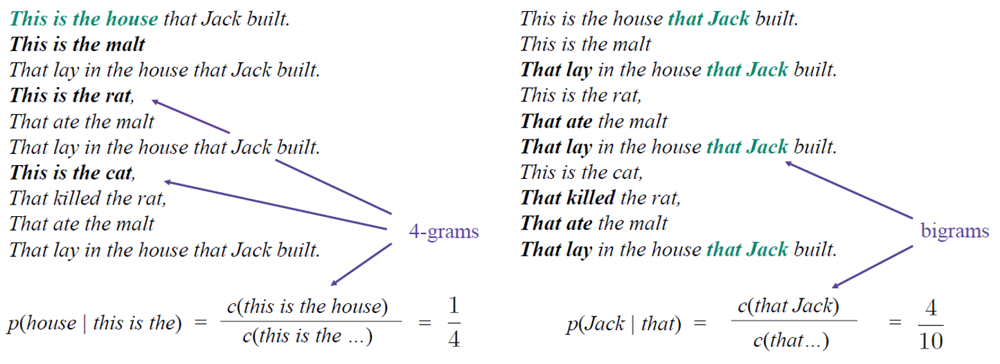
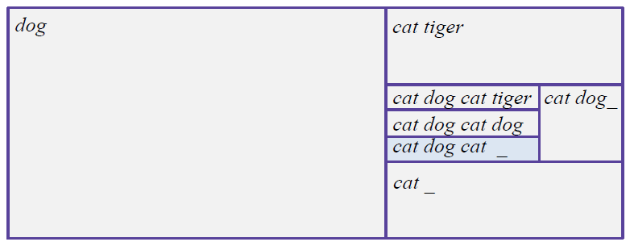

==================
Language modeling
==================

N-gram language models
=======================

A statistical language model is a probability distribution over sequences of words. Given such a sequence, say of length :math:`m`, it assigns a probability :math:`\displaystyle P(w_{1},\ldots ,w_{m})` to the whole sequence. The language model provides context to distinguish between words and phrases that sound similar. For example, in American English, the phrases "recognize speech" and "wreck a nice beach" sound similar, but mean different things (Ref.: `Wikipedia <https://en.wikipedia.org/wiki/Language_model>`_).

한마디로 단어로 구성된 문장들의 확률분포에 대한 통계적 언어모델이라고 할 수 있다.

Probability of the next word
*****************************

For understanding a statistical language model, we should know the probability of the next word. If we have below toy corpus,

* This is the house that Jack built.
* This is the malt
* That lay in the house that Jack built.
* This is the rat,
* That ate the malt
* That lay in the house that Jack built.
* This is the cat,
* That killed the rat,
* That ate the malt
* That lay in the house that Jack built.

an example of the probability of the next word is :math:`p(house|this\ is\ the).` N-gram is usually used to calculate the probability.

N-gram
********

In the fields of computational linguistics and probability, an n-gram is a contiguous sequence of n items from a given sample of text or speech. Below image depicts 4-gram and bi-gram, and describe two next word probabilities (Ref.: `Wikipedia <https://en.wikipedia.org/wiki/N-gram>`_).

한마디로 n개의 단어 묶음을 N-gram으로 이해하면 된다.

Probability of the whole sequence
**********************************

Then, what is the probability of the whole sequence like :math:`p(this\ is\ the\ house)?` To calculate the probability of a sequence based on n-gram, we can used Chain rule and Markov assumption.

Given :math:`w = (w_1 w_2 w_3 ... w_k),`

if we apply Chain rule, then we can get the probability of the whole sequence as

.. rst-class:: centered

    :math:`p(w) = p(w_1)p(w_2 | w_1) ... p(w_k | w_1 ... w_{k-1}).`

Additionally if we apply Markov assumption based on n-gram like

.. rst-class:: centered
    
    :math:`p(w_i | w_1 ... w_{i-1}) = p(w_i | w_{i-n+1} ... w_{i-1}),`

finally we can get the probability of the whole sequence as

.. rst-class:: centered
    
    :math:`p(w) = p(w_1)p(w_2 | w_1) ... p(w_i | w_{i-n+1} ... w_{i-1}).`

한마디로 문장에 구성된 첫 단어부터 마지막 단어까지 n-gram을 기준으로 각 단어가 나타날 확률을 모두 곱하여 한 문장의 확률을 계산한다.

Bigram language model
**********************

If :math:`n = 2`, this model is a bigram language model.

.. rst-class:: centered

  :math:`p(w) = p(w_1)p(w_2 | w_1) ... p(w_k | w_{k-1})`

For example, we have below toy corpus

* This is the malt
* That lay in the hous that Jack built

the probability of "this is the house" is

.. rst-class:: centered

  :math:`\begin{split} p(this\ is\ the\ house) &= p(this) p(is|this) p(the|is) p(house|the) \\ &= \frac{1}{12} \cdot 1 \cdot 1 \cdot \frac{1}{2} \end{split}`

-------------------
Additional changes
-------------------

In the sentence, "this" is at the first position, so it is better to change :math:`p(w)` to :math:`p(w_1 | start)`

.. rst-class:: centered
  
  :math:`p(w) = p(w_1 | start)p(w_2 | w_1) ... p(w_k | w_{k-1})`

  :math:`\begin{split} p(this\ is\ the\ house) &= p(this) p(is|this) p(the|is) p(house|the) \\ &= \frac{1}{2} \cdot 1 \cdot 1 \cdot \frac{1}{2} \end{split}`

If the sentence has the last word, then we just add the last probability.

.. rst-class:: centered
  
  :math:`p(w) = p(w_1)p(w_2 | w_1) ... p(w_k | w_{k-1}) p(end | w_k)`

Also, it's normalized separately for each sequence length!

.. rst-class:: centered

  :math:`p(this) + p(that) = 1.0`

  :math:`p(this\ this) + p(this\ is) + \cdots + p(built\ built) = 1.0`

----------------------
Let's check the model
----------------------

.. rst-class:: centered

  :math:`p(cat\ dog\ cat) = p(cat | \_) p(dog | cat) p(cat | dog) p(\_ | cat)`

----------------------------
Final Bigram language model
----------------------------

This is the final birgram language model.

.. rst-class:: centered

  :math:`p(w) = \prod\limits_{i=1}^{k+1} p(w_i | w_{i-1})`
  
Each word probability is

.. rst-class:: centered

  :math:`p(w_i | w_{i-1}) = \frac{c(w_{i-1} w_i)}{\sum_{w_i} c(w_{i-1} w_i)} = \frac{c(w_{i-1} w_i)}{c(w_{i-1})}.`

Also, we can extend bigram language model to n-gram language model.

.. rst-class:: centered

  :math:`p(w) = \prod\limits_{i=1}^{k+1} p(w_i | w_{i-n+1}^{i-1}),\ (w_{i-n+1}^{i-1} = w_{i-n+1} \cdots  w_{i-1})`

  :math:`p(w_i | w_{i-n+1}^{i-1}) = \frac{c(w_{i-n+1}^i w_i)}{\sum_{w_i} c(w_{i-n+1} w_i)} = \frac{c(w_{i-n+1} w_i)}{c(w_{i-n+1}^{i-1})}`

In conclusion, it's all about **counting**!!

Where do we need LM?
***********************

* Suggestions in messengers
* Spelling correction
* Machine translation
* Speech recognition
* Handwriting recognition
* ...

Perplexity
===========

We can get n-gram language model and should train the model to make the model understand n-grams of text well.

.. rst-class:: centered

  :math:`p(w) = \prod\limits_{i=1}^{k+1} p(w_i | w_{i-n+1}^{i-1})`

To train the model, log-likelihood maximization can be used.

.. rst-class:: centered

    :math:`\log p(w_{train}) = \sum\limits_{i=1}^{N+1} \log p(w_i | w_{i-n+1}^{i-1}) \rightarrow \max,\ N: \text{train corpus length}`

Here, the meaning of training is to find a probabilistic distribution of sequences in the text.

Then, which n is better? The best n might depend on how much data you have and 3-gram or 4-gram model are probably better than bigram or 7-gram model.

After training, we can evaluate the model. There are mainly two methods for the evaluation.

* Extrinsic evaluation

    * It is evaluation method through a quality of a downstream
    * Examples: Machine translation, Speech recognition, Spelling correction, ...

* Intrinsic evaluation

    * **Hold-out (text) perplexity**

        * The perplexity is calculated based on Likelihood

        * All words of the corpus are concatenated and indexed in the range from 1 to N which is the length of the test corpus

        * The tokens out of the range are fake start/end tokens (Check yourself: how many start and end tokens do we have in a trigram model?)

        * Likelihood:

            .. rst-class:: centered

                :math:`\mathcal{L} = p(w_{test}) = \prod\limits_{i=1}^{k+1} p(w_i | w_{i-n+1}^{i-1})`
  
        * Perplexity:

            .. rst-class:: centered

                :math:`\mathcal{P} = \mathcal{L}^{-\frac{1}{N}} = p(w_{test})^{-\frac{1}{N}} = \frac{1}{\sqrt[N]{p(w_{test})}}`

However, there are several problems when the likelihood is 0 because the perplexity will be infinity.

Problem: Out-of vocabulary (OOV) words
***************************************

**Toy train corpus:**

This is the house that Jack built.

**Toy test corpus:**

This is the malt.

When the n-gram contains one of out-of-vocabulary (OOV) words, the perpelxity of the bigram LM is:

.. rst-class:: centered

    :math:`p(malt|the) = \frac{c(the\ malt)}{c(the)} = 0 \rightarrow p(w_{test}) = 0 \rightarrow \mathcal{P} = inf`

----------------
Simple solutions
----------------

* Build a vocabulary by word frequencies or other methods
* Substitute OOV words by <UNK> in the train and test
* Compute counts as usual for for all tokens

But still there is a problem.

Problem: Zero probabilities
****************************

If the n-gram doesn't contain OOV words, the perplexity can be zero when the n-gram doesn't exist in the train.

**Toy train corpus:**

This is the house that Jack built.

**Toy test corpus:**

This is Jack.

.. rst-class:: centered

    :math:`p(Jack|the) = \frac{c(is\ Jack)}{c(is)} = 0 \rightarrow p(w_{test}) = 0 \rightarrow \mathcal{P} = inf`

There are several solutions for this problem.

-------------------
Laplacian smoothing
-------------------

The idea is to pull some probability from frequent bigrams to infrequent ones.

* Add-one smoothing

    * Just add 1 to the counts

    * :math:`V` is the number of possible continuations of the sequence :math:`w_{i-n+1}^{i-1}` , so :math:`V` is the number of unique unigrams in the train corpus plus 1

    * :math:`V` include the fake end token because the model tries to predict it each time, just us as any other word

    * But :math:`V` do not include the start tokens, because they serve only as a prefix for the first probabilities

    .. rst-class:: centered
    
        :math:`\hat{p}(w_i | w_{i-n+1}^{i-1}) = \frac{c(w_{i-n+1} w_i) + 1}{c(w_{i-n+1}^{i-1}) + V}`

    * Example

        * Task:

            * Apply add-one smoothing to the trigram language model trained on the sentence:

                * "This is the cat that killed the rat that ate the malt that lay in the house that Jack built."
            
            * Find the perplexity of this smoothed model on the test sentence:

                * "This is the house that Jack built."

        * Solution:

            * train: <s1> <s2> This is the cat that killed the rat that ate the malt that lay in the house that Jack built <end>
            * test: <s1> <s2> This is the house that Jack built <end>
            * :math:`V = 14 + 1 = 15`
            * :math:`N = 7`
            
            .. rst-class:: centered
            
                :math:`\mathcal{P} = p(w_{test})^{-\frac{1}{N}},\ where\ p(w_{test}) = \prod\limits_{i=1}^8 p(w_i | w_{i-2}^{i-1}) = \prod\limits_{i=1}^8 \frac{c(w_{i-2} w_{i-1} w_i) + 1}{c(w_{i-2}^{i-1}) + 15}`

            * "is the house" is the only trigram from the test sentence that is not present in the train sentence and the corresponding probability is :math:`p(house | is the) = (0 + 1) / (1 + 15) = 0.0625`

            * All other trigrams from the test sentence occur in the train sentence exactly once, so their conditional probabilities will be equal to :math:`(1 + 1) / (1 + 15) = 0.125`

            * In this way, the perplexity is:

                .. rst-class:: centered
                    
                    :math:`perplexity = (0.0625 \times 0.125^7)^{-\frac{1}{7}} = 11.89`

* Add-k smoothing

    * Tune a parameter

    .. rst-class:: centered
    
        :math:`\hat{p}(w_i | w_{i-n+1}^{i-1}) = \frac{c(w_{i-n+1} w_i) + k}{c(w_{i-n+1}^{i-1}) + Vk}`

------------
Katz backoff
------------

Longer n-grams are better, but data is not always enough. Try a longer n-gram and back off to shorter if needed.

.. rst-class:: centered

    :math:`\hat{p}(w_i | w_{i-n+1}^{i-1}) = \begin{cases} \tilde{p}(w_i | w_{i-n+1}^{i-1}), \\ \alpha (w_i | w_{i-n+1}^{i-1})\hat{p}(w_i | w_{i-n+2}^{i-1}) \end{cases}`

where :math:`\tilde{p}` and :math:`\alpha` are choesn to ensure normalization.

-----------------------
Interpolation smoothing
-----------------------

This method is a mixture of several n-gram models and this it an example for a mixture of trigram, bigram and unigram model:

.. rst-class:: centered

    :math:`\hat{p}(w_i | w_{i-2}^{i-1}) = \lambda_1 p(w_i | w_{i-2}w_{i-1}) + \lambda_2 p(w_i | w_{i-1}) + \lambda_3 p(w_i)`

    :math:`\lambda_1 + \lambda_2 + \lambda_3 = 1`

The weights can be optimized on a test set and they can depend on the context.

---------------------
Absolute discounting
---------------------

When comparing the counts for bigram in train and test sets, subtracting 0.75 get a goood estimate for the test count (`Experiment, Church and Gale, 1991 <https://web.stanford.edu/~jurafsky/slp3/4.pdf>`_).

================== =================
Train bigram count Test bigram count
================== =================
2                  1.25
3                  2.24
4                  3.23
5                  4.21
6                  5.23
7                  6.21
8                  7.21
================== =================

.. rst-class:: centered

    :math:`\hat{p}(w_i | w_{i-1}) = \frac{c(w_{i-1}w_i) - d}{\sum_x c(w_{i-1})x} + \lambda (w_{i-1}) p(w_i),\ where\ d = 0.75`

In this case, they use unigram model for infrequent n-grams but there is a better way.

---------------------
Kneser-Ney smoothing
---------------------

This method captures the diversity of contexts for the word instaed of just using the unigram distribution which captures the word frequecy (Ref.: `Speech and Language Processing <https://web.stanford.edu/~jurafsky/slp3/4.pdf>`_).

.. rst-class:: centered

    :math:`\hat{p}(w) \propto |x : c(x w) > 0|`

N-gram models + Kneser-Ney smoothing is a strong baseline in Language Modeling!

Quiz: Language modeling
=======================

.. toggle-header::
    :header: **Quiz list**

    |
    **Question 1**
    
        Given the corpus of three sentences:

        * This is the house that Jack built.
        * This is the malt that lay in the house that Jack built.
        * This is the rat that ate the malt that lay in the house that Jack built.

        calculate the probability :math:`p(lay | that)` using maximum likelihood estimation.

        \[　\] 1/3

        \[　\] 1/2

        \[　\] 3

        \[　\] 2/3

    **Question 2**

        Consider the bigram language model trained on the sentence:

        * This is the cow with the crumpled horn that tossed the dog that worried the cat that killed the rat that ate the malt that lay in the house that Jack built.

        Find the probability of the sentence:

        * This is the rat that worried the dog that Jack built.

        \[　\] :math:`\frac1{2} \cdot \frac1{3} \cdot \frac1{6} \cdot \frac1{2} \cdot \frac1{7} \cdot \frac1{2} \cdot \frac1{6} \cdot \frac1{2} \cdot \frac1{7} \cdot \frac1{3} \cdot \frac1{5} \cdot \frac1{4}`

        \[　\] :math:`\infty`

        \[　\] 0

        \[　\] 1/8

        \[　\] :math:`\frac1{6} \cdot \frac1{7} \cdot \frac1{6} \cdot \frac1{7}`

    **Question 3**
            
        Consider the trigram language model trained on the sentence:

        * This is the cat that killed the rat that ate the malt that lay in the house that Jack built.

        Find the perplexity of this model on the test sentence:

        * This is the house that Jack built.

        \[　\] :math:`\frac{1}{\sqrt[7] {\frac{1}{3} \cdot \frac{1}{3}}} = \sqrt[7]{9}`

        \[　\] 0

        \[　\] :math:`\infty`

        \[　\] 1

    **Question 4**
            
        Apply add-one smoothing to the trigram language model trained on the sentence:

        * This is the rat that ate the malt that lay in the house that Jack built.

        Find the perplexity of this smoothed model on the test sentence:

        * This is the house that Jack built.

        Write the answer with precision of 3 digits after the decimal point.

        Enter answer here: 

    **Question 5**
            
        Find one incorrect statement below:

        \[　\] If a test corpus does not have out-of-vocabulary words, smoothing is not needed.

        \[　\] N-gram language models cannot capture distant contexts.

        \[　\] The smaller holdout perplexity is - the better the model.

        \[　\] End-of-sentence tokens are necessary for modelling probabilities of sentences of different lengths.

        \[　\] Trigram language models can have a larger perplexity than bigram language models.

|

References
===========

* https://www.coursera.org/learn/language-processing
