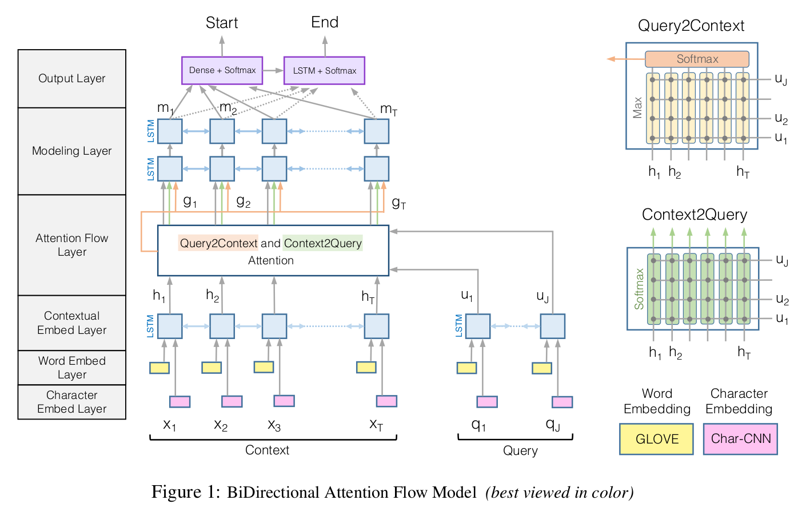

===============================================================
Bi-directional attention flow for machine comprehension (BIDAF)
===============================================================

Introduction
=============

Related studies
****************

---------------------------
Machine comprehension (MC)
---------------------------

--------------------------------
Visual question answering (VQA)
--------------------------------

Dataset
=======

Stanford Question Answering Dataset (SQuAD)
********************************************

Stanford Question Answering Dataset (SQuAD) is a reading comprehension dataset, consisting of questions posed by crowdworkers on a set of Wikipedia articles, where the answer to every question is a segment of text, or span, from the corresponding reading passage, or the question might be unanswerable.

CNN/Daily Mail cloze test
**************************

Preprocessing
==============

Model
======

This is BIDAF model structure and it consists of 6 types of layers:

Character embedding layer
**************************

Word embedding layer
*********************

Contextual embedding layer
***************************

Attention flow layer
*********************

Modeling layer
***************

Output layer
*************

Experiments
============

SQuAD
******

CNN/DailyMail
**************

Conclusion
===========

In the future, performances will be improved if BIDAF model involves incoporate multiple hops of the attention layer.

Reference
===========

* `Bi-Directional Attention Flow for Machine Comprehension, Minjoon Seo et al, 2017. <https://arxiv.org/pdf/1611.01603.pdf>`_
* `BIDAF github <https://github.com/allenai/bi-att-flow>`_
* `SquAD <https://rajpurkar.github.io/SQuAD-explorer/>`_
