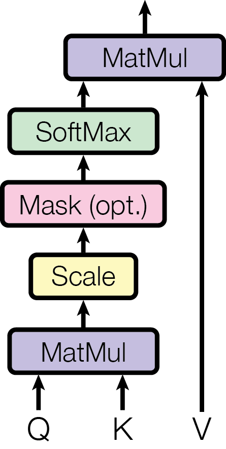

============
Transformer
============

Transformer는 2017년에 Google에서 작성한 "Attention Is All You Need"라는 논문에서 제안한 모델이고, 이 모델은 기존 Translation 문제를 RNN, CNN을 활용하지 않고 Attention만 이용하여 해결했다.

Previous model: Seq2seq + Attention
====================================

이전 Translation 문제를 해결하는데 사용한 대표적인 모델은 Seq2seq 이다. 그 내용은 :doc:`링크 <../encoder-decoder-attention_architecture>` 에서 확인할 수 있다.

.. figure:: ../img/encoder-decoder-attention_architecture/seq2seq.png
    :align: center
    :scale: 40%

    Seq2seq

.. figure:: ../img/encoder-decoder-attention_architecture/seq2seq_using_rnn.png
    :align: center
    :scale: 40%
    
    Seq2seq with RNN

Seq2seq 모델의 Encoder, Decoder로 RNN과 CNN이 활용될 수 있다. 그리고 Seq2seq 모델에서 Gradient vanishing 문제를 해결하기 위해 추후에 Attention 개념을 도입했다. 어쨌든 이러한 모델들은 그 연산량이 많다.

이러한 문제를 Google에서 Attention만을 활용한 Transformer 모델을 만들었다. Transformer는 RNN, CNN을 활용하지 않고 가벼우면서도 성능이 좋은 모델이고, 이를 여러가지 실험으로 밝혔다. 특히, 기존에 연속적인 정보 전달로 병렬 처리가 어려웠던 RNN의 문제점을 해결했다.

Model architecture
===================

.. figure:: ../img/paper/transformer/architecture.png
    :align: center
    :scale: 25%

위 그림에서 좌측이 Encoder, 우측이 Decoder 부분이라고 생각하면 된다. 기존 Seq2seq에서는 연속적인 여러 개 시점의 정보를 전달하는 과정으로 진행됐다면, Transformer는 기존 각 시점에 해당하는 Encoder, Decoder가 모두 따로 있다고 생각하면 된다.

.. figure:: ../img/paper/transformer/tf_architecture_01.png
    :align: center
    :scale: 100%

그래서 아래 그림과 같이 각 Input에 대해 Encoder와 Decoder가 존재하는 것을 알 수 있다.

.. figure:: ../img/paper/transformer/tf_architecture_02.png
    :align: center
    :scale: 100%

기존과 다르게 이러한 형태로 만든 이유는 병렬적으로 처리하여 더 짧은 시간에 연산을 진행하기 위해서이다.

어쨌든, 지금부터는 각 구조를 하나씩 살펴보려고 한다.

Token embedding
****************

우선, 주어진 문장들을 토큰화하는 작업이 필요하다. 길이가 같은 Tensor를 이용해야 하기 때문에 Sequence의 최대 길이를 정해야 하고, Encoder와 Decoder에 해당하는 Vocabulary가 각각 필요하다. 이 때, Vocabulary에 추가적으로 <PAD>, <UNK>, <EOS>, <BOS> 토큰을 추가해야 한다.

<PAD>는 최대 Sequence 길이보다 작은 경우 빈 곳에 채울 때 사용하고, <UNK>는 Vocabulary에 존재하지 않는 토큰을 대체할 때 사용한다. 그리고 <EOS>와 <BOS>는 Sequence의 시작과 끝을 표현할 때 사용한다.

다음은 Token embedding 예제이다.

.. figure:: ../img/paper/transformer/token_embedding.png
    :align: center
    :scale: 60%

    Token embedding 예제

Input embedding
****************

.. figure:: ../img/paper/transformer/input_embedding.png
    :align: center
    :scale: 60%

    Input embedding 과정

이제 이렇게 토큰화된 Token embedding을 기반으로 Input embedding을 만들 수 있다.

Input embedding은 각 Token에 대한 One-hot vetor를 만든 후, 원하는 임베딩 사이즈에 해당하는 Weight matrix를 곱해서 Dense한 Vector로 표현한다. 그리고 추가적으로 Embedding vector를 :math:`\sqrt{Embed\ size}` 로 나누어 스케일링 한다 (Gradient vanishing 방지 목적).

Positional encoding
********************

Transformer는 문장의 단어 순서대로 학습이 진행되는 구조가 아니기 때문에 Positional encoding을 통해 위치 정보를 추가해 줘야 한다. 그 방법에는 크게 2가지가 있다.

-------------------
Xavier initializer
-------------------

Xavier initializer는 단순히 해당 위치 정보를 원핫 벡터로 표현한 후 Embed size 크기로 변환한 벡터를 생성하는 방법이다.

.. figure:: ../img/paper/transformer/xavier_initializer.png
    :align: center
    :scale: 60%

    Xavier initializer

---------------------
Sinusoid initializer
---------------------

Sinusoid initializer는 sin과 cos을 이용하여 전체 Sequence의 길이 중 상대적 위치에 따라 고유 벡터를 생성하는 방법이다. 관련 수식과 코드는 아래와 같다.

.. rst-class:: centered

    :math:`PE_{(pos,2i)} = sin(pos/10000^{2i/d_{model}})`

    :math:`PE_{(pos,2i+1}) = cos(pos/10000^{2i/d_{model}})`

.. code-block:: python

    import numpy as np
    
    max_length = 512
    embed_size = 1024
    position_enc = np.array([
        [pos / np.power(10000, 2*i/embed_size) for i in range(embed_size)]
        if pos != 0 else np.zeros(embed_size) for pos in range(max_length)])

    position_enc[1:, 0::2] = np.sin(position_enc[1:, 0::2]) # dim 2i
    position_enc[1:, 1::2] = np.cos(position_enc[1:, 0::2]) # dim 2i+1

정리하면, 위 방법을 통해서 얻은 Position encoding 정보와 이전에 Token embedding을 기반으로 만든 Input embeding을 이용해서 최종적인 Embedding vector를 생성할 수 있다 (마지막에 Dropout 사용).

.. figure:: ../img/paper/transformer/tf_pos_emb_01.png
    :align: center
    :scale: 100%

.. figure:: ../img/paper/transformer/tf_pos_emb_02.png
    :align: center
    :scale: 100%

Encoder
********

지금부터는 이렇게 생성한 Embedding vector를 어떻게 Encoding 하는지 그 과정을 살펴보려고 한다. Encoder는 크게 Multi-head attention과 Feed-forward network로 구성되어 있다.

---------------------
Multi-head attention
---------------------

.. figure:: ../img/paper/transformer/attention.png
    :align: center
    :scale: 100%

기존의 Attention 개념은 여기에 정리되어 있다. 위 그림처럼 Query와 Key의 Attention을 계산한 후 Value에 Attention 정보를 반영하는 방법이 Attention mechnism이다. Transformer에서는 Self-attention을 사용했는데, 기존 Attention과 차이점은 Self-attention은 Attention을 자기 자신에게 적용한다는 점이다.

.. figure:: ../img/paper/transformer/self-attention.png
    :align: center
    :scale: 100%

결국 현재 문장에서 각 단어와의 연관성을 파악하여 현재 단어의 벡터에 반영하겠다는 것이다. 이러한 작업을 Scaled dot-product를 통해 진행했고, 그 과정은 아래 그림과 같다.

Masked multi-head attention
****************************

.. figure:: ../img/paper/transformer/mha.png
    :align: center
    :scale: 25%

Position-wise feed forward
***************************

왜 하는지 아직 이해 못함...

Add & Norm
***********

Feed forward 결과와 Feed forward 이전을 더하고 Normalization 한다. 이 때 Layer normalization을 이용한다 (추후 정리 예정).

Linear and softmax
********************

Linear를 통해 출력 단어 종류로 맞추고, Softmax를 이용하여 단어를 분류한다.

정리 필요
========

그리고 Transformer의 특징은 다음과 같다.

* Scaled dot-product attention과 Multi-head attention 사용
* 병렬 계산에 용이함
* 단어의 위치를 표현하기 위해 Positional encoding 사용

지금부터는 각 구조를 하나씩 살펴보려고 한다.

Inputs and outputs
*******************

Input과 Output은 모두 각 Sequence를 Word 기반으로 One-hot encoding한 Vector이다.

Input and output embedding
***************************

One-hot encoding vector들을 Embedding vector로 변경한다 (차원 축소).

Reference
==========

* `Attention Is All You Need <https://arxiv.org/abs/1706.03762>`_
* `WikiDocs, Transformer <https://wikidocs.net/31379>`_
* `Youtube, 김동화 - Transformer & BERT <https://www.youtube.com/watch?v=xhY7m8QVKjo>`_
