==========================================
Sequence tagging with probabilistic models
==========================================

Sequence labeling
==================

Sequence labeling is to infer the most probable sequence of labels for these tokens given a sequence of tokens.

There are some approaches for tagging:

* Part of speech tagging

    * Tokens are words, and labels are PoS tags.
    
        * I (PRON) saw (VERB) a (DET) Heffalump (PRON) today (NOUN)

    * PoS tags from universal dependencies project

        * Open class words

            ===== ============
            Tag   Description
            ===== ============
            ADJ   adjective
            ADV   adverb
            INTJ  interjection
            NOUN  noun
            PROPN proper noun
            VERB  verb
            ===== ============

        * Closed class words

            ===== ==============
            Tag   Description
            ===== ==============
            ADP   adposition
            AUX   auxiliary verb
            CCONJ interjection
                  conjunction
            DET   determiner
            NUM   numeral
            PART  particle
            PRON  pronoun
            SCONJ subordinating
                  conjunction
            ===== ==============

        * Other

            ===== ============
            Tag   Description
            ===== ============
            PUNCT punctuation
            SYM   symbol
            X     other
            ===== ============

* Named entity recognition

    * Example:
    
        * Once upon a time, a very long time ago now, about [last Friday], [Winnie-the-Pooh] lived in a forest all by himself under the name of [Sanders].

    * Types of named entities

        * Any real-word object which may have a proper name: persons, organizations, locations, ...
        * Also named entities usually include: dates and times, units, amounts, ...

* Semantic role labelling

.. _bio-notation:

* BIO-notation (B – beginning, I – inside, O – outside)

    .. figure:: img/sequence_tagging/bio-notation.png
        :align: center
        :scale: 70%

    * Example: `Bi-directional LSTM <#bi-direct-lstm>`_

Anyway, in sequence labeling, there are 4 approaches.

* Rule-based models (example: EngCG tagger)
* Separate label classifiers for each token
* **Sequence models (HMM, MEMM, CRF)**
* Neural networks

Sequence models: Hidden Markov Models (HMM)
===========================================

Hidden Markov Model (HMM)
*************************

-------------
Markov chain
-------------

마코프 체인은 마코프 성질(Markov Property)을 지닌 이산확률과정(discrete-time stochastic process)을 가리키고, 핵심 개념은 한 상태(state)의 확률은 단지 그 이전 상태에만 의존하는 성질을 말합니다.

.. rst-class:: centered

    :math:`P(q_i|q_1, \cdots ,q_{i−1})=P(q_i|q_{i−1})`

----
HMM
----

은닉마코프모델은 각 상태가 마코프체인을 따르되 은닉 (Hidden)되어 있다고 가정합니다. 예컨대 당신이 100년 전 기후를 연구하는 학자인데, 주어진 정보는 당시 아이스크림 소비 기록뿐이라고 칩시다. 이 정보만으로 당시 날씨가 더웠는지, 추웠는지, 따뜻했는지를 알고 싶은 겁니다. 우리는 아이스크림 소비 기록의 연쇄를 관찰할 수 있지만, 해당 날짜의 날씨가 무엇인지는 직접적으로 관측하기 어렵습니다. 은닉마코프모델은 이처럼 관측치 뒤에 은닉되어 있는 상태 (State)를 추정하고자 합니다. 

PoS tagging with HMMs
*********************

:math:`\mathbf{x} = x_1, \cdots , x_T` is a sequence of words (input)

:math:`\mathbf{y} = y_1, \cdots , y_T` is a sequence of their tags (labels)

We need to find the most probable sequence of tags given the sentence:

.. rst-class:: centered

    :math:`\mathbf{y} = \operatorname{arg\,max}_{\mathbf{y}} p(\mathbf{y}|\mathbf{x}) = \operatorname{arg\,max}_{\mathbf{y}} p(\mathbf{x}, \mathbf{y}),\ where\ p(\mathbf{x}):\ constant`

    :math:`p(\mathbf{x}, \mathbf{y}) = p(\mathbf{x}|\mathbf{y}) p(\mathbf{y}),\ where\ \mathbf{x}\text{: observable, } \mathbf{y} \text{: hidden}`

We can apply Markov assumption and output independence to the equeation.

* Markov assumtion:

    * The Markov condition, sometimes called the Markov assumption, is an assumption made in Bayesian probability theory, that every node in a Bayesian network is conditionally independent of its nondescendents, given its parents (Ref.: `Wikipedia <https://en.wikipedia.org/wiki/Causal_Markov_condition>`_)

    * So, the probability of :math:`\mathbf{y}` can be calculated by a series of probability products from first tag to current tag like n-gram models

    * Equation:

        .. rst-class:: centered

            :math:`p(\mathbf{y}) \approx \prod\limits_{t=1}^T p(y_t | y_{t-1})`

* Output independence:

    .. rst-class:: centered

        :math:`p(\mathbf{x}|\mathbf{y}) \approx \prod\limits_{t=1}^T p(x_t | y_t)`

* Final euqation:

    .. rst-class:: centered

        :math:`p(\mathbf{x}, \mathbf{y}) = p(\mathbf{x}|\mathbf{y}) p(\mathbf{y}) \approx \prod\limits_{t=1}^T p(x_t | y_t) p(y_t | y_{t-1})`

Text generation in HMM
***********************

Assume that the text is generated in the following manner:

* One **chooses the next PoS tag** given the previous tag
* Given the current tag, one **generates another word**

Thus, the neighboring words do not depend on each other, but they depend on the underlying tags.

This is an example:

.. figure:: img/sequence_tagging/text_generation_in_hmm_example.png
  :align: center
  :scale: 50%

We can construct the a HMM like above figure and it is specified by:

* The set :math:`S = s_1, s_2, \cdots , s_N` of hidden states
* The start state :math:`s_{0}`
* The matrix :math:`A` of transition probabilities: :math:`a_{ij} = p(s_j | s_i)`
* The set :math:`O` of possible visible outcomes
* The matrix :math:`B` of output probabilities: :math:`b_{kj} = p(o_k | s_j)`

Then, how to train the model?

Training is to cacluate probabilities of each :math:`a_{ij}` by counting tags in the train set.

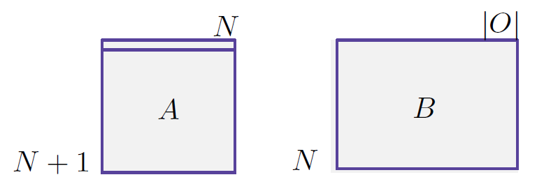

.. rst-class:: centered

    :math:`a_{ij} = p(s_j | s_i) = \frac{c(s_i \rightarrow s_j)}{c(s_i)}`
    
    :math:`b_{ik} = p(o_k | s_i) = \frac{c(s_i \rightarrow o_k)}{c(s_i)}`

We can also represent formula more detaily in MLE.

.. rst-class:: centered

    :math:`a_{ij} = p(s_j|s_i) = \frac{\sum_{t=1}^T [y_{t-1} = s_i, y_t = s_j]}{\sum_{t=1}^T [y_t = s_i]}`

Here, the corpus is considered as a single sequence of length T with special states between the sentences.

However, in real life, we can't see the labels. To solve this problem, there is another method.

------------------------------------
Baum-Welch algorithm (=EM algorithm)
------------------------------------

**E-step:**

* Posterior probabilities for hidden variables:

    .. rst-class:: centered

        :math:`p(y_{t-1} = s_i, y_t = s_j)`

* It can be effectively done with dynamic programming such as forward-backward algorithm

**M-step:**

* Maximum likelihood updates for the parameters:

    .. rst-class:: centered

        :math:`a_{ij} = p(s_j|s_i) = \frac{\sum_{t=1}^T [y_{t-1} = s_i, y_t = s_j]}{\sum_{t=1}^T [y_t = s_i]}`

Viterbi algorithm: what are the most probable tags?
***************************************************

In generating tags, the same output sentence can be generated by different sequences of hidden states.

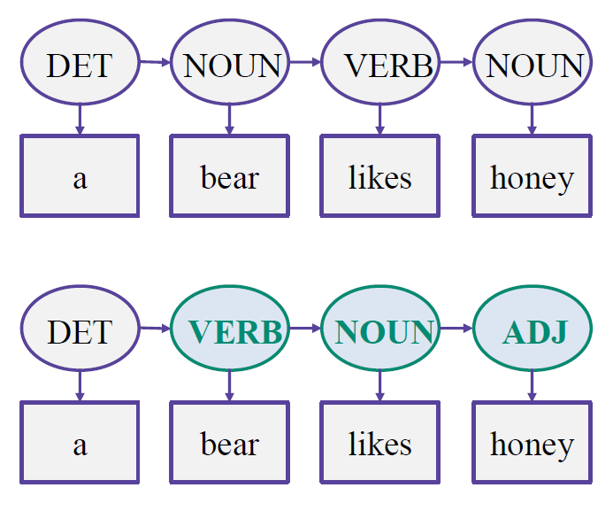

So, we should calculate which one is the most probable sequence of hidden states and can solve this problem efficiently using dynamic programming.

----------------
Viterbi decoding
----------------

Let :math:`Q_{t,s}` be the most probable sequence of hidden states of length :math:`t` that finished in the state :math:`s` and generates :math:`o_{1}, \cdots , o_{t}`.

Let :math:`q_{t,s}` be the probability of this sequence.

Then :math:`q_{t,s}` can be computed dynamically:

.. rst-class:: centered

    :math:`q_{t,s} = \max\limits_{s'} q_{t-1,s'} p(s|s') p(o_t|s)`

* :math:`p(s|s')` : Transition probabilities
* :math:`p(o_t|s)` : Output probabilities

:math:`Q_{t,s}` can be determined by remembering the :math:`\operatorname{arg\,max}.`

--------
Example
--------

Initial transition and output probabilities
--------------------------------------------

Suppose that we have the following PoS tags, the transition probabilities between tags and the output probabilities for the vocabulary. Note that the sum of probabilities in each row is equal to 1.

======= === ==== ====
from\to ADJ NOUN VERB
======= === ==== ====
ADJ     0.4 0.4  0.2
NOUN    0.2 0.4  0.4
VERB    0.1 0.6  0.3
======= === ==== ====

======== === ==== === ===== ===== =====
tag\word a   bear fly honey likes sweet
======== === ==== === ===== ===== =====
ADJ      0.2 0.1  0.1 0.1   0.1   0.4
NOUN     0.1 0.2  0.2 0.2   0.2   0.1
VERB     0.1 0.2  0.2 0.1   0.3   0.1
======== === ==== === ===== ===== =====

Calculate the best transitions
------------------------------

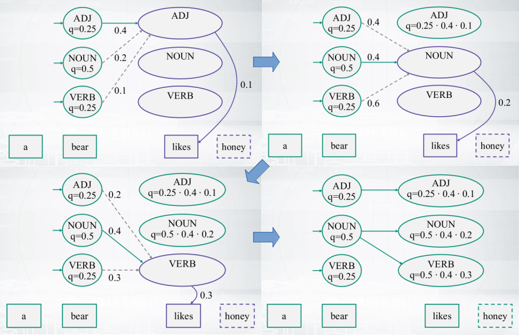

Backtrace
----------

We can know the transition path for tags using bactrace.

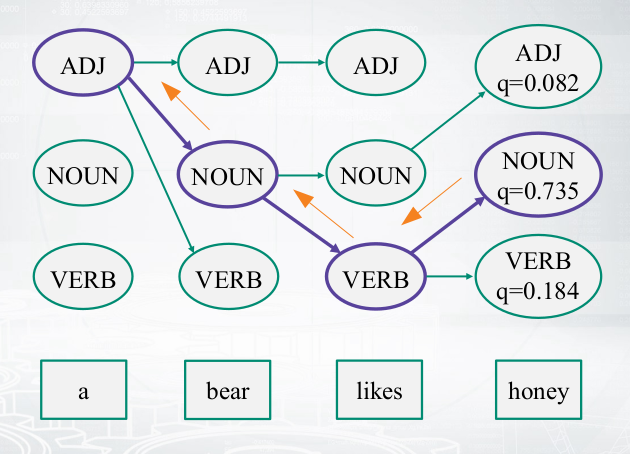

------------------
Viterbi algorithm
------------------

This is a Viterbi algorithm applied from above.

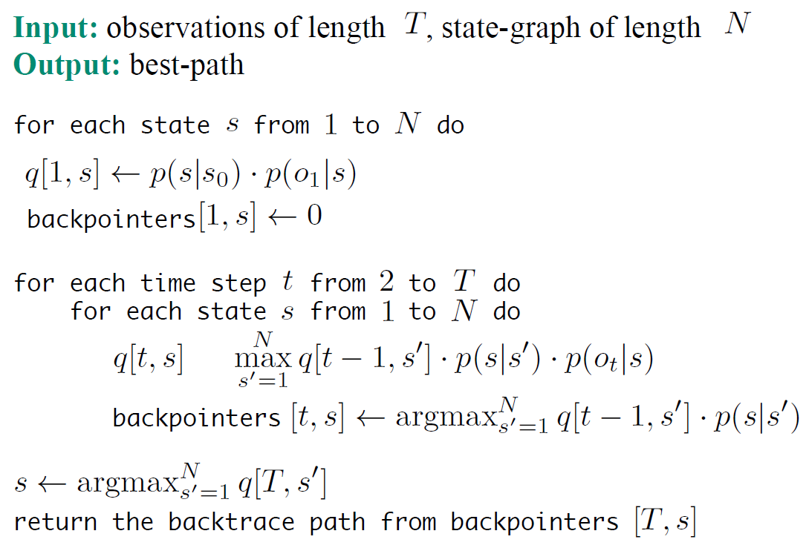
  

Sequential model: Others
=========================

Maximum Entropy Markov Model (MEMM)
************************************

Maximum Entropy Markov Model (MEMM) is similar with HMM but there is a different. First, HMM is a **generative model** but MEMM is a **discriminative model**. Second, MEMM uses outputs for transitions but HMM is not.

**HMM:**

.. rst-class:: centered

        :math:`p(\mathbf{x}, \mathbf{y}) = \prod\limits_{t=1}^T p(y_t | y_{t-1}) p(x_t | y_t)`

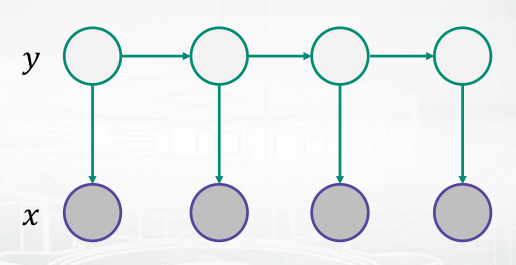

**MEMM:**

.. rst-class:: centered

        :math:`p(\mathbf{y}|\mathbf{x}) = \prod\limits_{t=1}^T p(y_t | y_{t-1}, x_t)`

        :math:`\prod\limits_{t=1}^T p(y_t | y_{t-1}, x_t) = \frac{1}{Z_t(y_{t-1}, x_t)} \operatorname{exp} \bigg( \sum\limits_{k=1}^K \theta_k f_k (y_t, y_{t-1}, x_t) \bigg),`

        :math:`where\ \frac{1}{Z_t(y_{t-1}, x_t)}:\ Normalization\ constant,\ \theta_k:\ Weight,\ f_k (y_t, y_{t-1}, x_t):\ Feature`

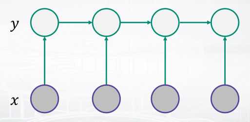

Conditional Random Field (CRF)
******************************

Modified way of MEMM is Conditional Random Field (CRF) and the difference is the position of a normalization factor. In CRF, we do normalize only one time. But it is actually complecated because we sums many different sequences to one.

------------
Linear chain
------------

Here, we consider just two types of features; transition and output features.

.. rst-class:: centered

        :math:`p(\mathbf{y}|\mathbf{x}) = \frac{1}{Z(x)} \prod\limits_{t=1}^T \operatorname{exp} \bigg( \sum\limits_{k=1}^K \theta_k f_k (y_t, y_{t-1}, x_t) \bigg)`

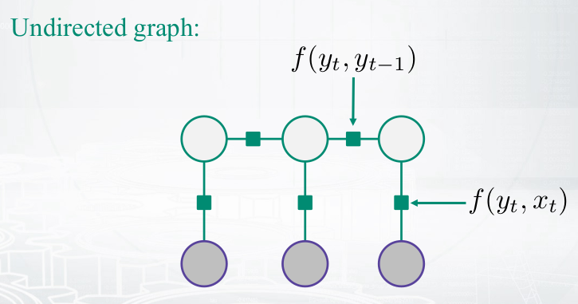

------------
General form
------------

But it is possible to have other features and this is a general form of CRF.

.. rst-class:: centered

        :math:`p(\mathbf{y}|\mathbf{x}) = \frac{1}{Z(x)} \prod\limits_{a=1}^A \Psi_a (y_a, x_a),\ \Psi_a:\ Arbitrary\ factors`

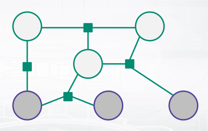

--------------------------
Black-box implementations
--------------------------

* CRF++ https://sourceforge.net/projects/crfpp/
* MALLET http://mallet.cs.umass.edu/
* GRMM http://mallet.cs.umass.edu/grmm/
* CRFSuite http://www.chokkan.org/software/crfsuite/
* FACTORIE http://www.factorie.cc

--------------------
Feature engineering
--------------------

To use these models, we should generate the features. From the formulas, you might remember that those "f" features can depend on three things; the current tag, the previous tag, and the current output. There is a very nice common technique for feature engineering which is called label observation features.

Label-observation features
--------------------------

* :math:`f(y_t, y_{t-1}, x_t) = {\color{green}{[y_t = y]}} {\color{red}{g_m(x_t)}}`
* :math:`f (y_t, y_{t-1}, x_t) = {\color{green}{[y_t = y][y_{t-1} = y']}}`
* :math:`f (y_t, y_{t-1}, x_t) = {\color{green}{[y_t = y][y_{t-1} = y]}} {\color{red}{g_m(x_t)}}`

The observation part is about something that depends on the output andnd the labeled part which is colored by green is about indicators.

In the case of the first line, you just check whether you have the current label equal to y, and you check it for all possible labels. It means that you have as many features as many labels you have multiplied by the number of different observation functions that you invent.

In the case of the second and the third line, you will have even more features because there, you check these indicators for the current and for the previous tags.

=========== =============================================== ==============================
　          :math:`w_t = v`                                  :math:`\forall v \in`	
　          part-of-speech tag for :math:`w_t` is :math:`j`  :math:`\forall \text{tags } j`
　          :math:`w_t` is in a phrase of syntactic type j   :math:`\forall \text{tags } j`
Capitalized :math:`w_t` matches [A-Z][a-z]+
AllCaps     :math:`w_t` matches [A-Z]+
EndsInDot   :math:`w_t` matches [^\.]+.*\.
　          :math:`w_t` matches a dash
　          :math:`w_t` appears in a list of stop words
　          :math:`w_t` appears in list of capitals
=========== =============================================== ==============================

These are just some examples of how those observation parts will look like.

First, you can check that your current word is equal to some predefined word. And you can check it for all the words in the vocabulary.

Second you will have let's say plus 100,000 features just by the first line. Then, you may want to check your part-of-speech tag for the current word defined by some extrinsic part-of-speech tager, and you will have again many features, many binary features here that tell you whether your tag is equal to noun or whether it is equal to a verb and so on and so on for all possible tags.

And you can have lots of other ways to define your features.

----------------------
Dependencies on input
----------------------

Pretend the current input :math:`x_t` contains not only the current word :math:`w_t` , but also :math:`w_{t-1}` and :math:`w_{t+1}` and build observation functions for them as well. The model is discriminative, so we can use the whole input like below figure. In other words, every feature can actually have access to all words in our sentence.

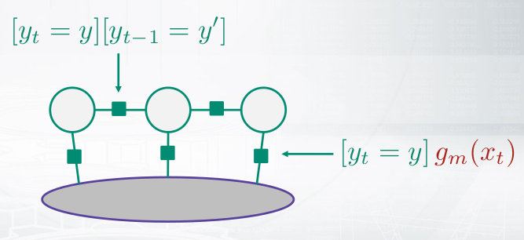

Example: how to compute probabilities of tag sequences and re-estimate parameters
==================================================================================

Hidden Markov Model
********************

Consider the following rhyme from "Jabberwocky" by Lewis Caroll:

* Twas brillig, and the slithy toves
* Did gyre and gimble in the wabe;
* All mimsy were the borogoves,
* And the mome raths outgrabe.

Let's take the last phrase, "**the mome raths outgrabe**", as an example. Let's build a hidden Markov model for predicting part of speech tags in this sentence. For simplicity, suppose that we have just three tags: :math`N` (noun), :math:`V` (verb) and :math:`D` (determiner). We need to specify initial probabilities of these tags and transition probabilities from one tag to another. Surely, these probabilities may be estimated using some annotated corpus. But let's suppose for now that all tags and all transitions are equiprobable:

.. rst-class:: centered

    :math:`p(N | start) = p(O | start) = p(D | start) = 1/3`

    :math:`p(N| N) = p(V | N) = p(D | N) = 1/3`

and so on.

Dealing with HMMs, we also need to specify output probabilities of words given the tag. For simplicity, we consider the following outcomes:

* N: mome | raths | outgrabe
* V: raths
* D: the | a

Let all these outcomes be also equiprobable, i. e,

.. rst-class:: centered

    :math:`p(mome | N) = p(raths | N) = p(outgrabe | N) = 1/3`

    :math:`p(raths | V) = 1`

    :math:`p(the | D) = p (a | D) = 1/2`

Note that some words like "raths" may be generated from different tags (otherwise, the tagging is trivial). Note also, that our test phrase does not have to contain all of these words. For example, "a" is absent in the test sentence.

Probabilities of tag sequences
******************************

Given this toy model, let's find the probabilities of possible tag sequences for the phrase "**the mome raths outgrabe**". In other words, these are the conditional probabilities: :math:`p(XXXX | phrase)`, where each tag :math:`X` is either :math:`N`, or :math:`V`, or :math:`D`.

First question for you: how many different tag sequences exist? Second question: which of them could happen in our case with the transition and output probabilities defined above?

Answers: there are :math:`3^4 = 81` sequences, but only two of them are possible in our case. "the" can be generated only from :math:`D`, "mome" and "outgrabe" can be generated only from :math:`N`, and "raths" can be generated wither from :math:`N` or :math:`V`. So we can have either :math:`\boldsymbol{DNNN}` or :math:`\boldsymbol{DNVN}` .

So we have just seen, that probabilities of 79 tag sequences are equal to 0, and we need to compute these two: :math:`p(DNNN | phrase)` and :math:`p(DNVN | phrase)`. According to the HMM model, the joint probabilities are:

.. rst-class:: centered

    :math:`p(DNVN, phrase) = p(D | start)\, p(the | D)\, p(N | D)\, p(mome | N)\, p(V | N)\, p(raths |V)\, p(N |V) \, p(outgrabe | N)`

    :math:`p(DNNN,phrase)=p(D|start)p(the|D)p(N|D)p(mome|N)\boldsymbol{p(N|N)p(raths|N)p(N|N)}p(outgrabe|N)`

At this point, you could just use the given values above to compute these expressions. After that, you would need to normalize them in such a way that they sum into 1, since it should be a **distribution**, and all other 79 values are known to be 0.

But let's reduce our calculations and look closer into the two formulas above. The only term that differs there is this one: :math:`p(raths |N) = 1/3` while :math:`p(raths|V) = 1`. So, for some multiplier :math:`x`,

.. rst-class:: centered

    :math:`p(DNNN | phrase) = x \cdot 1/3`

    :math:`p(DNVN | phrase) = x \cdot 1`

Since these probabilities must sum into one, we find that they are equal to :math:`1/4` and :math:`3/4`, and we are done.

Baum-Welch probability re-estimation
************************************

Now let's see how to re-estimate transition or output probabilities in our model, given the same sentence "**the mome raths outgrabe**". It means performing one iteration of Baum-Welch algorithm (= EM-algorithm). Actually, we have just done E-step by computing probabilities of tag sequences. Now let's see how the M-step works. For example, let's re-estimate the transition probability :math:`p(V|N)` , that used to be one-third.

We need to find **the expectation of the number of transitions from** :math:`\boldsymbol{N}` **to** :math:`\boldsymbol{V}` and divide it to **the expectation of the number of transitions from** :math:`\boldsymbol{N}` **to any tag**. The expectation is taken with respect to the probabilities of tag sequences (computed above).

Remember, there are only two possible sequences. We have 0 transitions from :math:`N` to :math:`V` in the :math:`DNNN` sequence and exactly one such transition in the :math:`DNVN` sequence. So the expectation for (:math:`N \rightarrow V`) transitions is :math:`1/4 \cdot 0 + 3/4 \cdot 1 = 3/4` .

Similarly, we have two transitions from :math:`N` to some tag in :math:`DNNN` and 1 such transition in :math:`DNVN` . The expectation for (:math:`N \rightarrow ?`) transitions is :math:`1/4 \cdot 2 + 3/4 \cdot 1 = 5/4` .

Thus, the new estimation for the transition probability :math:`p(V | N)` is :math:`3/5`. This is exactly the probability, that would be assigned to the corresponding HMM parameter if we were training it with Baum-Welch on this one phrase.

In real examples though, the flow of computations in Baum-Welch is a bit different. First, usually you have too many tag sequences. So it's impossible to compute there probabilities and take the expectation with respect to them. E.g. imagine you have 20 possible tags and a sequence of length 10. Then you would have :math:`20^{10}` tag sequences! So instead of the probabilities of the whole sequences, you would compute the probabilities of two sequential tags (see the slides). These probabilities would be enough to perform M-step. Second, it is hard to compute even these tag pair probabilities, so here a so called Forward-Backward algorithm is used. It's a dynamic programming algorithm that allows efficient computations.

Quiz: Sequence tagging with probabilistic models
================================================

.. toggle-header::
    :header: **Quiz list**

    |
    **Question 1**

        Which of these models are discriminative, i.e., which of them model the distribution :math:`p(y|x)`?

        \[　\] Conditional Random Fields

        \[　\] Hidden Markov Models

        \[　\] Maximum Entropy Markov Models

    **Question 2**

        Let :math:`x = x_1, \cdots ,x_n` be visible words and :math:`y = y_1, \cdots , y_n` be corresponding hidden tags. Find the correct formula for Hidden Markov Model:

        \[　\] :math:`p(x,y) = \prod_{t=1}^T p(x_t|x_{t−1}) p(y_t|y_{t−1})`

        \[　\] :math:`p(y|x) = \prod_{t=1}^T p(y_t|y_{t−1}, x_t)`

        \[　\] :math:`p(x,y) = p(x|y)p(y) = \prod_{t=1}^T p(x_t|y_t) p(y_t|y_{t−1})`

        \[　\] :math:`p(x,y) = p(y|x)p(x) = \prod_{t=1}^T p(x_t|x_{t−1}) p(y_t|x_t)`

    **Question 3**
            
        Find the correct statements about Viterbi algorithm.

        \[　\] At the :math:`t`-th time step of Viterbi algorithm we just choose the state :math:`y_t` such that the value :math:`p(y_t | y_{t-1}) p(x_t | y_t)` is maximal. We do not take into account best paths computed at the previous steps.

        \[　\] At each time step of the Viterbi algorithm, for each state the probability of the best tag sequence ending in this state is computed. This probability is estimated using the similar probabilities from the previous step and the current word.

        \[　\] Viterbi algorithm has exponential time complexity.

        \[　\] Viterbi algorithm can find dynamically the most probable sequence of hidden tags in :math:`O(N^2 T)` operations. The brute force search of this solution would take an exponential time on :math:`T`.

    **Question 4**
            
        Consider a Hidden Markov Model with three hidden states: :math:`N` (noun), :math:`V` (verb) and :math:`O` (other). Let all transitions between states be equiprobable. Consider the following possible outputs:

        * :math:`N`: mimsy | borogoves

        * :math:`V`: were | borogoves

        * :math:`O`: All | mimsy | the

        Let all these outputs be also equiprobable.

        Consider the sentence "**All mimsy were the borogoves**" and choose the correct statement.

        There are four possible best tag sequences: :math:`ONVON, ONVOV, OOVON, OOVOV`. All of them are equiprobable.

        \[　\] The best tag sequence is :math:`OOVON`.

        \[　\] The best tag sequence is :math:`ONVOV`.

        \[　\] There are two possible best tag sequences: :math:`ONVON` and :math:`ONVOV`. They are equiprobable.

        \[　\] The best tag sequence is :math:`OOVOV`.

        \[　\] The best tag sequence is :math:`ONVON`.

    **Question 5**
            
        As before, consider a Hidden Markov Model with three hidden states: N (noun), V (verb) and O (other). Let all transitions between states be equiprobable. Consider the following possible outputs:

        N: mimsy | borogoves

        V: were | borogoves

        O: All | mimsy | the

        Let all these outputs be also equiprobable.

        The probability :math:`p (V | O)` of a transition from :math:`O` to :math:`V` is :math:`\frac{1}{3}` in this model. Let's reestimate it on the sentence "**All mimsy were the borogoves**" using one iteration of Baum-Welch algorithm.

        Find the new value of this probability and write it with precision of 3 digits after the decimal point.

        Hint: there are four possible tag sequences: ONVON, ONVOV, OOVON, OOVOV. The first and the second sequences have the same probability, and so do the third and the fourth ones. You need to estimate these probabilities and find the ratio of the expectations for (:math:`O \rightarrow V`) and (:math:`O \rightarrow ?`) transition counts.

        Answer: 0.333...

|

Sequence tagging with deep learning
===================================

In language modeling, if we don't have a word we can solve it using smoothing teqnique but there is a problem.

Imagine that you have seen "Have a good day" but you've not seen "Have a great day". Here, we can use smoothing then what is happend? "good" and "great" words are located at different position in feature vectors.

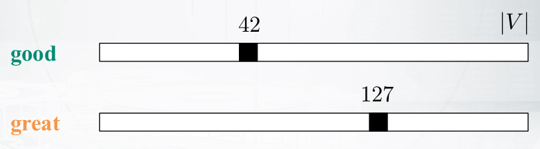

Probabilistic Neural language model
************************************

To solve this problem, we can use distributed representations for words which express probabilities of sequences.

.. figure:: img/sequence_tagging/distributed_representation_for_words.png
  :align: center
  :scale: 70%

.. rst-class:: centered

    :math:`C^{|V| \times m}: \text{ matrix of distributed word representations}`

Using these distributed representations, we can calculate the probability of :math:`p(w_i=v|context)` and these are equations:

* Distributed representation of contexts words:

.. rst-class:: centered

    :math:`x = [C(w_{i-n+1}), \cdots C(w_{i-1})]^T`

* Feed-forward NN with tons of parameters:

.. rst-class:: centered

    :math:`y = b + Wx + U tanh(d + Hx)`

* Softmax over components of :math:`y`:

.. rst-class:: centered

    :math:`p(w_i |w_{i-n+1} \cdots w_{i-1}) = \frac{exp(y_{w_i})}{\sum_{w \in V} exp(y_w)}`

This is a whole process of calculationg the probabilties.

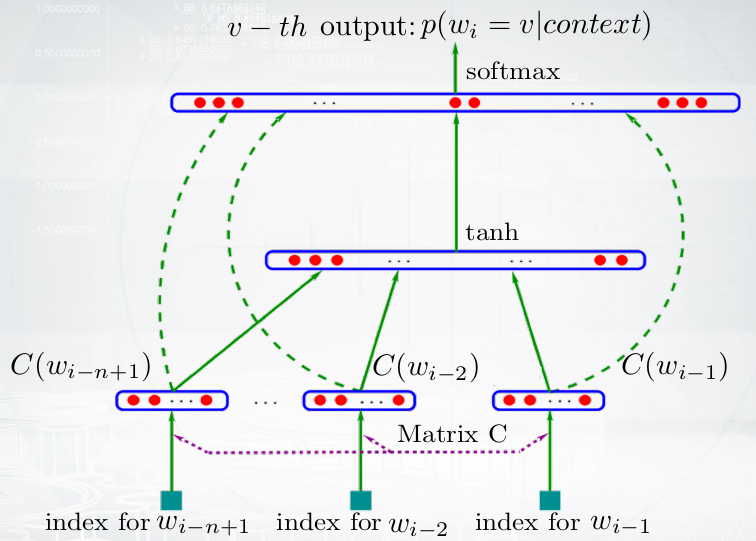

However there is a problem because it's over-complicated.

.. rst-class:: centered

    :math:`y = b + Wx + U tanh(d + Hx)`

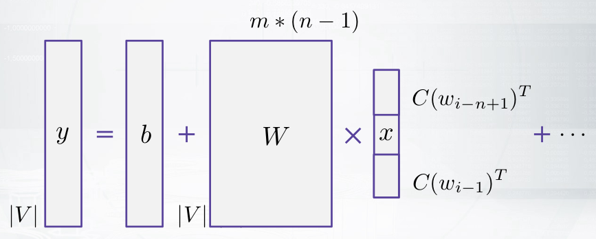

To solve this problem, we can use Log-Bilinear Language Model.

---------------------------
Log-Bilinear Language Model
---------------------------

It has much less parameters and non-linear activations and we can measure similarity between the word and the context:

.. rst-class:: centered

    :math:`p(w_i |w_{i-n+1}, \cdots w_{i-1}) = \frac{exp(\hat{r}^T r_{w_i} + b_{w_i})}{\sum_{w \in V} exp(\hat{r}^T r_w + b_w)}`

* Representation of word:

.. rst-class:: centered

    :math:`r_{w_i} = C(w_i)^T`

* Representation of context:

.. rst-class:: centered

    :math:`\hat{r} = \sum\limits_{k=1}^{n-1} W_k C(w_{i-k})^T`

RNN Language Model
******************

There is a different method to predict sequences given sequences. We can use RNN to predict a next word based on a previous context.

**Architecture:**

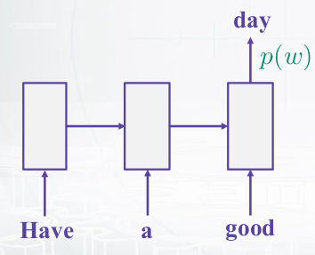

* Use the current state output
* Apply linear layer on top
* Do softmax to get probabilities

**Trainng:**

We can use cross-entropy loss to train the model.

.. rst-class:: centered

    :math:`-log p(w_i) = -\sum\limits_{w \in V} [w = w_i] log p(w),`

    :math:`where\ w_i: target\ word,\ p(w): output\ probability`

**General architecture:**

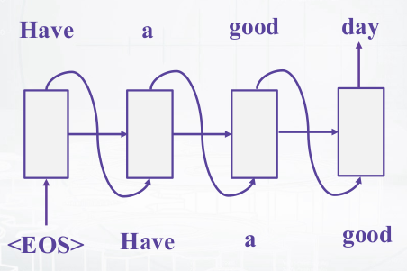

* Feed the previous output as the next input
* Take argmax at each step (greedily) or use beam search

**Performances:**

* RNN-LM has lower perplexity and word error rate than 5-gram model with Knesser-Ney smoothing.

* The experiment is held on Wall Street Journal corpus:

    ================== ======= === ====
    Model              # words PPL WER
    ================== ======= === ====
    KN5 LM             200K    336 16.4
    KN5 LM + RNN 90/2  200K    271 15.4
    KN5 LM             1M      287 15.1
    KN5 LM + RNN 90/2  1M      225 14.0
    KN5 LM             6.4M    221 13.5
    KN5 LM + RNN 250/5 6.4M    156 11.7
    ================== ======= === ====
    
In this experiment, they found that char-level RNNs can be very effective than word-level RNNs.

----------------------
Other language models
----------------------

* Use LSTMs or GRUs, and gradient clipping

    * https://colah.github.io/posts/2015-08-Understanding-LSTMs/

* Start with one layer, then stack 3-4, use skip connections

* Use dropout for regularization:

    * Zaremba, Sutskever, Vinyals. Recurrent Neural Network Regularization, 2014.

* Have a look into TF tutorial for a working model:
    
    * https://www.tensorflow.org/tutorials/recurrent

* Tune learning rate schedule in SGD or use Adam

* Explore state-of-the-art improvements:

    * July 2017: On the State of the Art of Evaluation in Neural Language Models.
    * August 2017: Regularizing and Optimizing LSTM Language Models.

.. _bi-direct-lstm:

* Bi-directional LSTM using `BIO-notations <#bio-notation>`_

    .. figure:: img/sequence_tagging/bi-directional_lstm.png
        :align: center
        :scale: 70%

    * Universal approach for sequence tagging
    * You can stack several layers + add linear layers on top
    * Trained by cross-entropy loss coming from each position

Project: NamedEntityRecognizer
===============================

This project is to create NamedEntityRecognizer. Detail codes are in GitHub (`Link <https://github.com/hwkim89/nlp/tree/master/NamedEntityRecognizer>`_)

References
===========

* https://www.coursera.org/learn/language-processing
* https://ratsgo.github.io/machine%20learning/2017/03/18/HMMs/
