Statistical Machine Translation (SMT)
======================================

==============
Introduction
==============

Machine translation help you understanding other languages by producing a sequence of words in some other language as an output when you have a sequence of words in one language as an input. Also, it can help summarization because it is also a sequence to sequence task.

In real-life, some NLP problems can be solved by good data. So, data is very important and there are some data for machine translation.

Parallel data
**************

**Parallel corpora:**

* Europarl
* Movie subtitles
* Translated new, books
* Wikipedia (comparable, not parallel)
* http://opus.lingfil.uu.se/

**Problems:**

* Noisy
* Specific domain (e.g. movie subtitles → scientific papers, not working)
* Rare language pairs
* Not aligned, not enough

Evaluation
***********

**How to compare two arbitrary translation?**

Problem:

* Low agreement rate even between reviewers

Solution:

* Compare the system with multiple references

* BLUE score

  * A popular automatic technique

**Example: blue score**

* Reference: E-mail was sent on Tuesday.
* System output: The letter was sent on Tuesday.

We can calculate the precision by n-grams:

* 1-grams: :math:`4/6`
* 2-grams: :math:`3/5`
* 3-grams: :math:`2/4`
* 4-grams: :math:`1/3`

Then we can use the mean of 4 precision values as a precision between the reference and the system output.

Problem:

* Short sentences got higher precision values

Solution:

* :math:`\text{BLEU} = 1 \cdot \sqrt[4]{\frac{4}{6} \cdot \frac{3}{5} \cdot \frac{2}{4} \cdot \frac{1}{3}}`

Machine translation system
***************************

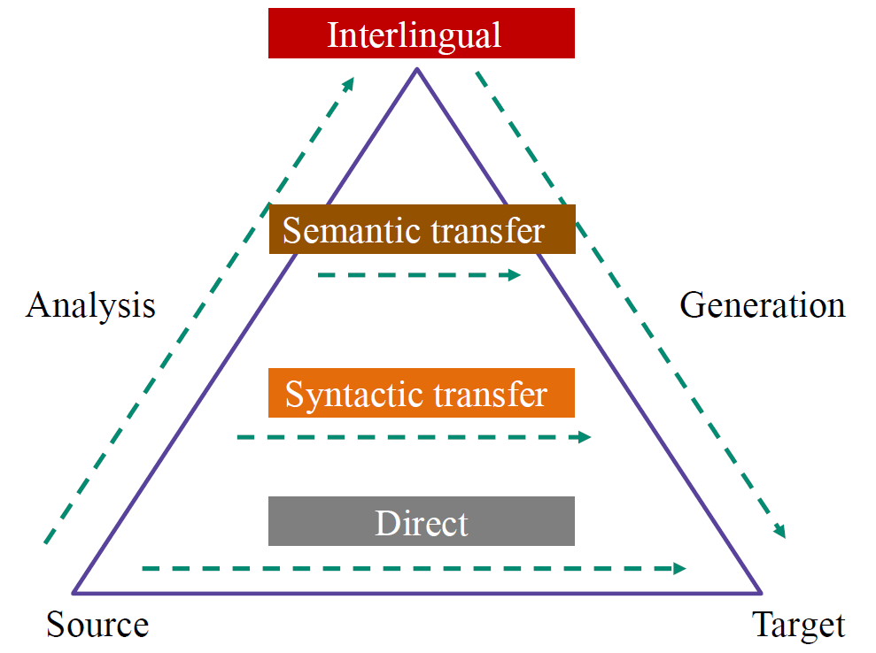

Two main paradigms
******************

Machine translation has roller-coaster history.

* 1954 Georgetown IBM experiment Russian to English:

  * Claimed that MT would be solved within 3-5 years

* 1966 ALPAC report:

  * Concluded that MT was too expensive and ineffective

After silent period, two main paradigms are appeared.

**Statistical Machine Translation (SMT):**

* 1988 –Word-based models (IBM models)
* 2003 – Phrase-based models (Philip Koehn)
* 2006 – Google Translate (and Moses, next year)

**Neural Machine Translation (NMT):**

* 2013 – First papers on pure NMT
* 2015 – NMT enters shared tasks (WMT, IWSLT)
* 2016 – Launched in production in companies

Example: Zero-shot translation
*******************************

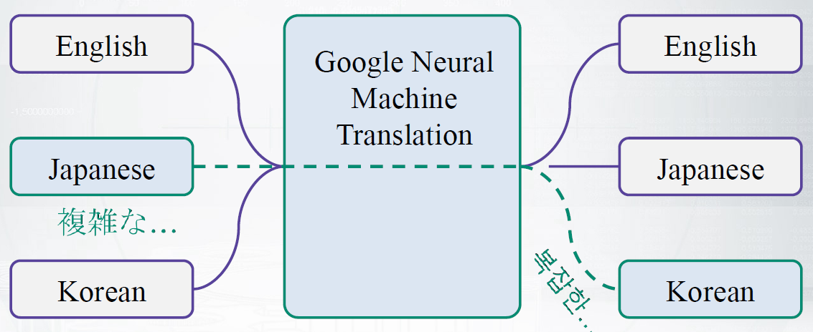

================================
Noisy channel: english → french
================================

How to translate english to french
***********************************

**Equation**

If we want to translate french (foreign) sentence :math:`f` to english translation :math:`e,`

.. rst-class:: centered

  :math:`e^* = \operatorname*{arg\,max}_{e \in E} p(e|f) = \operatorname*{arg\,max}_{e \in E} \frac{p(f|e)p(e)}{p(f)}`

* :math:`p(e)` (Language model) : Models the *fluency* of the translation
* :math:`p(f|e)` (Translation model) : Models the *adequacy* of the translation
* :math:`argmax` : The search problem implemented by a *decoder*

Also we can get rid of the denominator :math:`p(f)` because it does not depend on :math:`e.` .

.. rst-class:: centered

  :math:`e^* = \operatorname*{arg\,max}_{e \in E} p(e|f) = \operatorname*{arg\,max}_{e \in E} \frac{p(f|e)p(e)}{p(f)} = \operatorname*{arg\,max}_{e \in E} p(e)p(f|e)`

**Noisy channel**

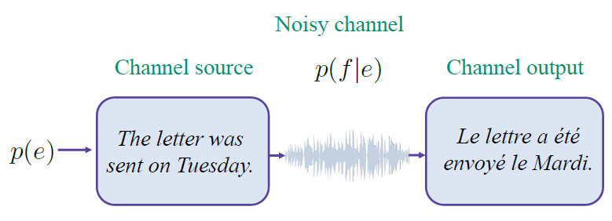

How to model two probabilities: :math:`p(e),\ p(f|e)`
*******************************************************

**Language model:** :math:`p(e)`

.. rst-class:: centered

  :math:`p(e) = p(e_1) p(e_2 | e_1) \cdots p(e_k | e_1 \cdots e_{k-1})`

We can use Markov assuption with n-gram models or neural networks for language model (:doc:`Language modeling <lm>`).

**Translation model:** :math:`p(f|e)`

.. rst-class:: centered

  :math:`p(f|e) = p(f_1, f_2, \cdots f_J | e_1, e_2, \cdots e_I)`

* f (Foreign): Крику много, а шерсти мало.
* e (English): Great cry and little wool.

We could learn translation probabilities for separate words.

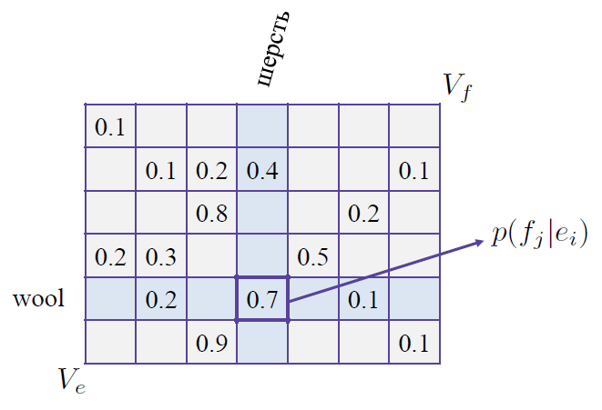

But how to build the probability for the whole sentences?

.. rst-class:: centered

  :math:`p(f|e) = \text{Some Magic Factorization} \Big[ p(f_j | e_i) \Big]`

**Reorderings: Word alignment**

* One-to-many and many-to-one:

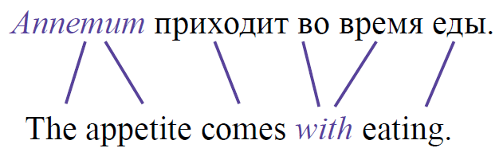

* Words can disappear or appear from nowhere:

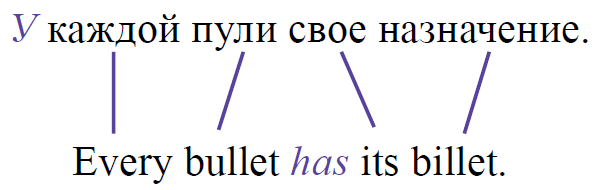

===============
Word alignment
===============

**Given a corpus of** :math:`(e, f)` **sentence pairs:**

* English, soruce: :math:`e = (e_1, e_2, \cdots , e_I)`
* Foreign, target: :math:`f = (f_1, f_2, \cdots , f_J)`

**Predict:**

* Alignments a between :math:`e` and :math:`f` :

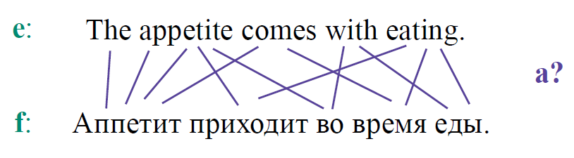

**Recap: Bayes' rule →** `How to translate english to french`_

.. rst-class:: centered

  :math:`e^* = \operatorname*{arg\,max}_{e \in E} p(e|f) = \operatorname*{arg\,max}_{e \in E} \frac{p(f|e)p(e)}{p(f)} = \operatorname*{arg\,max}_{e \in E} p(e)p(f|e)`

* :math:`p(e)` (Language model) : Models the *fluency* of the translation
* :math:`p(f|e)` **(Translation model) : Models the adequacy of the translation**
* :math:`argmax` : The search problem implemented by a *decoder*

Word alignment matrix
**********************

To build the system that translates from f to e, we need to model the probability of f given e and the matrix of word alignments is one nice way to represent the probability. There are too many cases, so each target word is allowed to have only one source!!

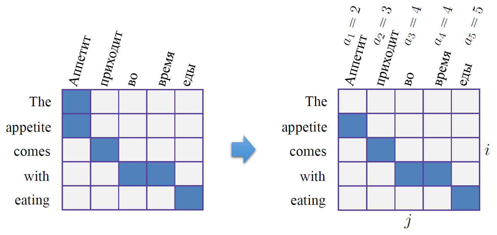

Sketch of learning algorihtm
*****************************

**Probabilistic model (generative story)**

Given :math:`e,` model the generation of :math:`f:`

.. rst-class:: centered

  :math:`p(f, a|e, \Theta) = ?`

* :math:`a:` hidden variables
* :math:`f,\ e:` observable variables
* :math:`\Theta:` parameters

*The most creative step:*

* How do we parametrize the model?
* Is it too complicated or too unrealistic?

**Likelihood maximization for the incomplete data**

.. rst-class:: centered

  :math:`p(f|e, \Theta) = \sum_a p(f, a|e, \Theta) \rightarrow \max_\Theta`

We can model the probabilities of f and a, but we do not see a. That's why we need to sum over all possible word alignments. And on the left-hand side, you have the probability of f given all the rest things, which is called **incomplete data**. Likelihood maximization for incomplete data means that there are some **hidden variables** that you do not see. And this is a very bad situation. So, imagine you have a logarithm. So, you take logarithm and you have logarithm of the sum. And you don't know how to maximize these, how to take derivatives and how to get your maximum likelihood estimations. In this case, we can use EM-algorithm.

EM-algorithm:

* E-step

  * Estimates posterior probabilities (Hidden variables) for alignments
  * It means what are the best alignments that we can produce given parameters

* M-step

  * Updates :math:`\Theta` (Parameters) of the model
  * Given guess about the word alignment, decide what would be the updates for parameters that maximize the likelihood

Generative story
****************

.. rst-class:: centered

  :math:`p(f, a|e, \Theta) = p(J|e) \prod_{j=1}^J p(a_j | a_i^{j-1}, f_1^{j-1}, J, e) \times p(f_j | a_j, a_1^{j-1}, f_1^{j-1}, J, e)`

Process:

* Choose the length of the foreign sentence

  * :math:`p(J|e)`
  * :math:`J:` the length of the target sentence

* Choose an alignment for each word

  * :math:`p(a_j | a_i^{j-1}, f_1^{j-1}, J, e)`
  * Model the alignment for every position, :math:`p(a_j)`

* Choose the word (given lots of things)

  * :math:`p(f_j | a_j, a_1^{j-1}, f_1^{j-1}, J, e)`
  * Extract word given the alignment, :math:`p(f_j | a_j)`

Problem:

* There are too much conditions, so we need to do assumption for reducing parameters

IBM model 1
************

The first IBM model is the first attempt to simplify above generative stroy.

.. rst-class:: centered

  :math:`p(f, a|e, \Theta) = p(J|e) \prod_{j=1}^J p(a_j) \times p(f_j | a_j, e)`

* :math:`p(a_j):` Uniform prior, :math:`\varepsilon`
* :math:`p(f_j | a_j, e):` Translation table, :math:`t(f_j | e_{a_j})`

  .. figure:: img/smt/ibm1_translation_model.png
    :align: center
    :scale: 50%

    Translation table

Advantage:

* The model is simple and has not too many parameters

Problem:

* The alignment prior does not depend on word positions

IBM model 2
************

.. rst-class:: centered

  :math:`p(f, a|e, \Theta) = p(J|e) \prod_{j=1}^J p(a_j | j, I, J) \times p(f_j | a_j, e)`

* :math:`p(a_j | j, I, J):` Position-based prior
* :math:`p(f_j | a_j, e):` Translation table, :math:`t(f_j | e_{a_j})`

**Position-based prior**

* For each pair of the length of the sentence:

  * :math:`I \times J` matrix of probabilities (= No. parameters​​)

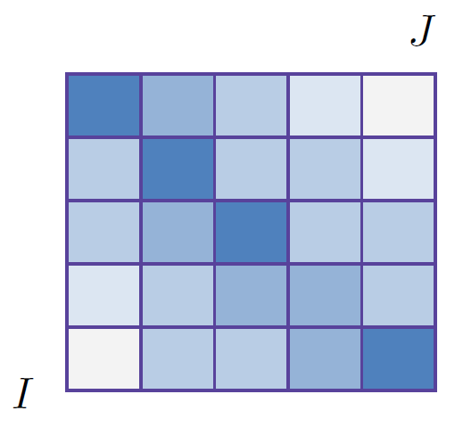

Advantage:

* The alignments depend on position-based prior

Problem:

* Given sentences with different lengths, need to use differnt matrixes
* Quite a lot of parameters for the alignments

**Re-parametrization, Dyer et. al 2013**

* If we know, it’s going to be diagonal – let’s model it diagonal!
* Much less parameters, easier to train on small data

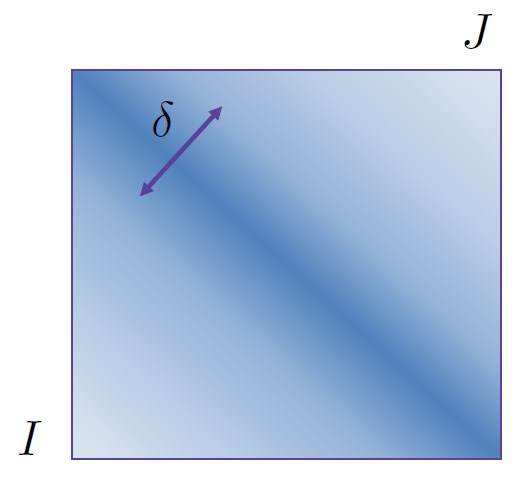

HMM for the prior
******************

.. rst-class:: centered

  :math:`p(f, a|e, \Theta) = p(J|e) \prod_{j=1}^J p(a_j | a_{j-1}, I, J) \times p(f_j | a_j, e)`

* :math:`p(a_j | a_{j-1}, I, J):` Position-based prior
* :math:`p(f_j | a_j, e):` Translation table, :math:`t(f_j | e_{a_j})`

If you use HMM, you model the probability of the next alignment given the previous alignment.

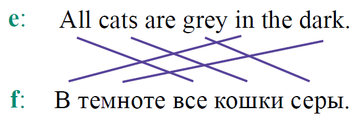

Resume
*******

* IBM models – first working systems of MT

* Lot’s of problems with models 1 and 2:

  * How to deal with *spurious words*
  * How to control *fertility*
  * :math:`\cdots`

* How to do many-to-many alignments?

  * Phrase-based machine translation

===================
Quiz: topic models
===================

.. toggle-header::
  :header: **Quiz list**

  |
  **Question 1**

    Find correct statements below.

    \(O\) Evaluation in Machine Translation is hard, mostly because of many variations in translations.
    
    \(X\) Machine Translation area was developing with gradual advances each year.

    \(X\) "Interlingual" level of transfer provides the best accuracy in statistical machine translation systems. → It's rather a beautiful dream then the reality.

    \(O\) Neural Machine Translation is able to produce translations for language pairs that have never been observed in train.

    \(X\) Recent machine translation systems provide equally good quality for all language pairs.

  **Question 2**

    Compute BLEU score for the following example with 2 digits after decimal point:

    * System output: A friend when needed is a friend indeed.
    * Reference: A friend in need is a friend indeed.

    Answer: 0.41...

  **Question 3**

    Let us say we are building a translation system from Greek (g) to Bulgarian (b). Which of the following statements are correct?

    \(O\) We will need to build language model :math:`p(b).`

    \(X\) Language model here is complicated because different word alignments are possible. -> Language model is built just for the target sentence. So there is nothing to do with a pair of sentences and alignments between them.

    \(O\) The noisy channel concept here corresponds to conditional distribution :math:`p(g|b).`.

    \(X\) We will need to build a translation model :math:`p(b|g).`

  **Question 4**

    Which parametrization for word alignment model would you use, if you know that the source and the target languages are extremely different and have quite irregular word order?

    Notation: :math:`(e, f)` - sentence pair, :math:`(I, J)` - their lengths respectively, :math:`a` - alignment.

    \(O\) Option 1: :math:`p(f, a|e, \Theta) = p(J|e) \prod_{j=1}^J p(a_j) \times p(f_j | a_j, e)`

    \(X\) Option 2: :math:`p(f, a|e, \Theta) = p(J|e) \prod_{j=1}^J p(a_j | j, I, J) \times p(f_j | a_j, e)`

    \(X\) Option 3: :math:`p(f, a|e, \Theta) = p(J|e) \prod_{j=1}^J p(a_j | a_{j-1}, I, J) \times p(f_j | a_j, e)`

===========
References
===========

* https://www.coursera.org/learn/language-processing