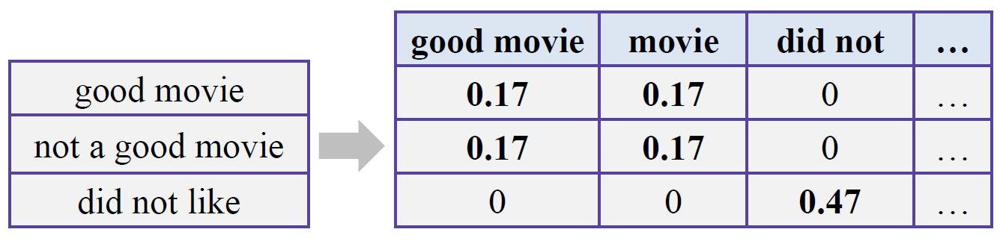
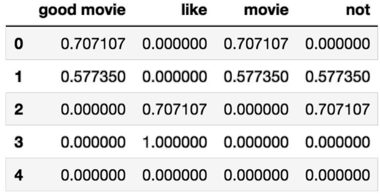
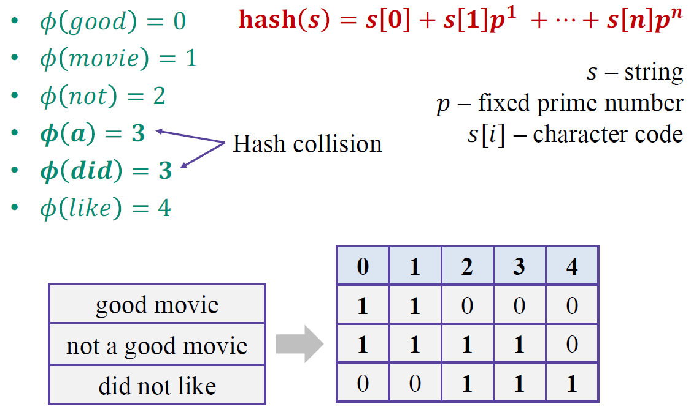
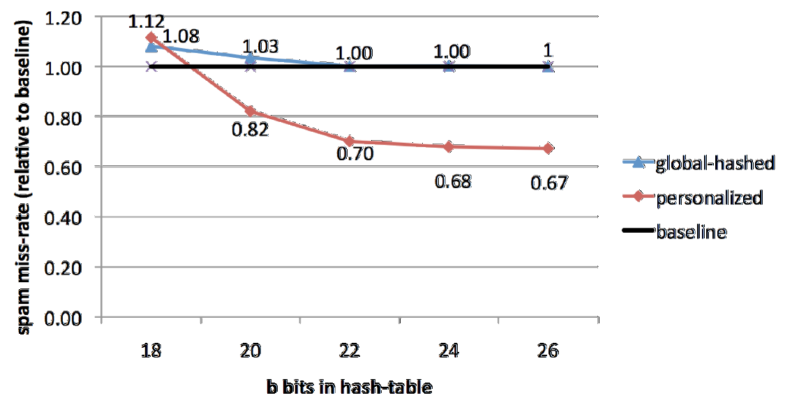
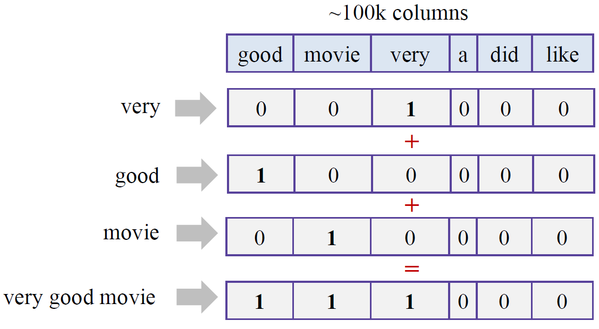
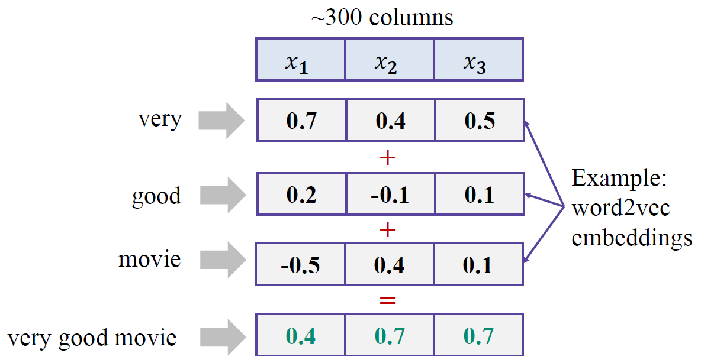
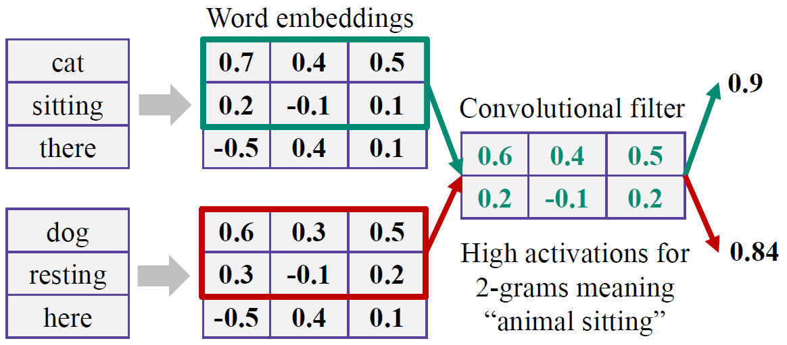

===================
Text classfication
===================

Example: Sentiment analysis
============================

* Input: Text of review

* Output: Class of sentiment

* Examples

    * The hotel is really beautiful. → :blue:`Positive`
    * Very nice and hlepful service at the front desk. → :blue:`Positive`
    * We had problems to get the Wi-Fi working. → :red:`Negative`
    * The pool area was occupied with young party animals. → :red:`Negative`
    * So the area wasn't fun for us. → :red:`Negative`

Text preprocessing
===================

What is text?
**************

We can think of text as a sequence of 

* Character
* **Words**
* Phrases and named entities
* Sentences
* Pharagraphs
* ...

What is a word?
***************

A word is a meaningful sequence of characters. Then, How to find the boundaries of words? We can use spaces or puncations such as . (Dot), , (Comma), ? (Question mark), ! (Exclamation mark), "" (Double quote), '' (Quote), ' (Apostrophe), : (Colon), ;(Semi-colon), () (bracket) and so on.
    
These are examples:

* Input: Friends, Romans, Countrymen, lend me your ears; ← 1 sentence
* Output: Friends Romans Countrymen lend me your ears ← 7 words

In German or Japanese, there are compound words or sentences which are written without spaces.

These are examples:

* German: Rechtsschutzversicherungsgesellschaften
* Japaneses: Butyoucanstillreaditright

Anyway, if we want to get words from the text, we should tokenize the text.

Tokenization
=============

**Tokenization** is a process that splits an input sequence into so-called tokens by a tokenizer. **Token** can be a word, sentence, paragraph, and so on. There are **tokenizers** which are split by

* Whitespace

  * nltk.tokenize.WhitespaceTokenizer
  * Problem: "it" and "it?" are different tokens with same meaningful

* Punctuation

  * nltk.tokenize.WordPunctTokenizer
  * Problem: "s", "isn", "t" are not very meaningful

* A set of rules

  * nltk.tokenize.TreebankWordTokenizer
  * "'s" and "n't" are more meaningful for processing

This is an examples with various toknizers:

.. code-block:: python

  import nltk
  text = "This is Andrew's text, isn't it?"

  tokenizer = nltk.tokenize.WhitespaceTokenizer()
  tokenizer.tokenize(text)

  # Result
  # ['This', 'is', "Andrew's", 'text,', "isn't", 'it?']

  tokenizer = nltk.tokenize.WordPunctTokenizer()
  tokenizer.tokenize(text)

  # Result
  # ['This', 'is', 'Andrew', "'", 's', 'text', ',', 'isn', "'", 't', 'it', '?']

  tokenizer = nltk.tokenize.TreebankWordTokenizer()
  tokenizer.tokenize(text)

  # Result
  # ['This', 'is', 'Andrew', "'s", 'text', ',', 'is', "n't", 'it', '?']

        
Token normalization
====================

We may want the same token for different forms of the word

* wolf, wolves → wolf
* talk, talks → talk

In these cases, we should normalize tokens and there are two main approaches.

Stemming
*********

A process of removing and replacing suffixes to get to the root form of the word, which is called the **stem**. Usually refers to heuristics that chop off suffixes. **Poster's stemmer** is representative stemming method.

-----------------
Poster's stemmer
-----------------

5 heuristic phrases of word reductions are applied sequentially and it can be used by **nltk.stem.PorterStemmer** in Python.

This is an exmple of phase 1 rules:

* SESS → SS, caresses → caress
* IES → I, ponies → poni
* SS → SS, caress → caress
* S → , cats → cat

These are utilization examples:

* feet → feet
* cats → cat
* wolves → wolv
* talked → talk

Problem:

* Fails on irregular forms, produces non-words (But, it is not big deal)

Lemmatization
**************

**Lemmatization** usually refers to doing things properly with the use of a vocabulary and morphological analysis. Returns the base or dictionary form of a word, which is known as the **lemma**. It can be used by **nltk.stem.WordNetLemmatizer** in Python.

-------------------
WordNet lemmatizer
-------------------

It used WordNet Database to lookup lemmas.
  
Examples:

* feet → foot
* cats → cat
* wolves → wolf
* talked → talked

Problems:

* Not all forms are reduced

Takeaway:

* We need to try stemming or lemmatization and choose best for our task

Code example
*************

.. code-block:: python

  import nltk
  text = "feet cats wolves talked"
  tokenizer = nltk.tokenize.TreebankWordTokenizer()
  tokens = tokenizer.tokenize(text)

  stemmer = nltk.stem.PorterStemmer()
  " ".join(stemmer.stem(token) for token in tokens)

  # Result
  # u'feet cat wolv talk'

  stemmer = nltk.stem.WordNetLemmatizer()
  " ".join(stemmer.stem(token) for token in tokens)

  # Result
  # u'feet cat wolf talked'

Further normalization
**********************

* Normalizing capital letters

    * 발음은 같지만 다른 의미인 경우 문제 발생
      
        * Us, us → us (OK)
        * us, US → us (X)

    * Solutions
  
        * Use heuristics:

            * Lowercasing the beginning of the sentence
            * Lowercasing words in titles
            * Leave mid-sentence words as they are (e.g. name)

        * Use machine learning to retrieve true casing → Hard

* Acronyms (두문자어, e.g. AIDS)

    * eta, e.t.a, E.T.A → E.T.A
    * It is hard to write a bunch of regular expressions

Transforming tokens into features
==================================

Bag of words
*************

Let's count occurrences of a particular token in our text.

Motivation:

* We're looking for marker words like "excellent" or "disappointed"

For each token we will have a feature column, this is called **text vectorization**.

  .. figure:: img/text_classification/text_vectorization.png
    :align: center
    :scale: 40%

Problems:

* We loose word order, hence the name "bag of words"
* Counters are not normalized

N-gram
*******

We can count token pairs, triplets, etc. which are known as **n-grams** for preserving some ordering such as 1-grams for tokens, 2-grams for token pairs and so on.

  .. figure:: img/text_classification/2-grams_for_token_pairs.png
    :align: center
    :scale: 40%

Problems:

  * Too many features (Exponentially)

--------------------
Remove some n-grams
--------------------

Let's remove some n-grams from features based on their occurrence frequency in documents of our corpus.

* High frequency n-grams:

    * Articles, prepositions, etc. (e.g. and, a, the)
    * They are called **stop-words**, they won't help us to discriminate texts → Remove them

* Low frequency n-grams:

    * Typos, rare n-grams
    * We don't need them either, otherwise we will likely overfit

* Medium frequency n-grams:

    * Those are good n-grams

There're a lot of medium frequency n-grams. As if it proved to be useful to look at n-gram frequency in our corpus for filtering out bad n-grams, what if we can use the frequency for ranking of medium frequency of n-grams? We can decide which medium frequency n-gram is better or worse based on that freqeuncy.

Idea:

* The n-gram with smaller frequency can be more discriminating because it can capture a specific issue in the review

Example:

* "Wi-Fi breaks often."
* "Wi-Fi breaks" is not frequent in the text but it can acutally highlight a specific issue that we need to closer

TF-IDF
=======

Term frequency (TF)
********************

* :math:`tf(t, d)` : Frequency for term (or n-gram) :math:`t` in document :math:`d`

* Variants:

  .. figure:: img/text_classification/tf_variants.png
    :align: center
    :scale: 40%

* Log normalization can solve the task better

Inverse document frequency (IDF)
*********************************

* :math:`N = |D|` :  Total number of documents in corpus
* :math:`|{d ∈ D: t ∈ d}|` : The number of documents where the term t appears
* :math:`idf(t, D) = \log \frac{N}{|{d ∈ D: t ∈ d}|}`

TF-IDF
*******

* :math:`tfidf(t, d, D) = tf(t, d) \times idf(t, D)`

* A high weight in TF-IDF is reached by

  * A high term frequency (in the given document)
  * A low document frequency of the term in the whole collection of documents

-----------
Better BOW
-----------

* Replace counters with TF-IDF
* Normalize the result row-wise (divide by L2-norm)

--------
Example
--------

.. code-block:: python

  from sklearn.feature_extraction.text import TfidfVectorizer
  import pandas as pd
  texts = ['good movie', 'not a good movie', 'did not like', 'i like it', 'good one']
  tfidf = TfidfVectorizer(min_df=2, max_df=0.5, ngram_range=(1, 2))
  features = tfidf.fit_transform(texts)
  pd.DataFrame(features.todense(), columns=tfidf.get_feature_names())

Sentiment classification model
===============================

IMDB movie reviews dataset
***************************

* http://ai.stanford.edu/~amaas/data/sentiment/

* Contains 25,000 positive and 25,000 negative reviews
      
    * At least 7 stars out of 10 → Positive (Label = 1)
    * At least 4 stasrs out of 10 → negative (Label = 0)

* Contains at most 30 reviews per movie

* 50/50 train/test split

* Evaluation: Accuracy

Features
*********

* Bag of 1-grams with TF-IDF values

    * 25,000 rows, 74,849 columns for training
    * Extremely sparse feature matrix: 99.8% are zeros

* Bag of 1,2-grams with TF-IDF values

    * Add 2-grams to 1-grams
    * Throw away n-grams seen less than 5 times
    * 25,000 rows, 156,821 columns for training

Model
******

* Logistic regression

    * :math:`p(y = 1|x) = \sigma (w^T x)`
    * Linear classification model
    * Can handle sparse data
    * Fast to train

Performances
*************

* Logistic regression over bag of 1-grams with TF-IDF

    * Accuracy: 88.5%

    * Learnt weights:

        .. figure:: img/text_classification/learnt_weights_for_1-grams.png
            :scale: 40%

* Logistic regression over bag of 1,2-grams with TF-IDF

    * Accuracy: 89.9% (+1.5%)

    * Learnt weights:

        .. figure:: img/text_classification/learnt_weights_for_2-grams.png
            :scale: 40%

How to make it even better
***************************

* Play around with tokenization

    * Special tokens like emoji, ":" and "!!!" can help

* Try to normalize tokens

    * Adding stemming or lemmatization

* Try different models

    * SVM, Naive Bayes, ...

* Throw BOW away and use Deep learning

    * https://arxiv.org/pdf/1512.08183.pdf
    * Accuracy on test set in 2016: 92.14% (+2.5%)

Spam filtering task
====================

Mapping n-grams to feature indices
***********************************

If your dataset is small, you can store {n-gram -> feature index} in hash map. But if you have a huge dataset, it can be a problem.

Example: 1TB of texts distributed on 10 computers

* It is hard to vectorize each text and maintain {n-gram -> feature index} mapping

    * May not fit in memory
    * Hard to synchronize

* Solution: Hashing {n-gram -> hash(n-gram) % :math:`2^{20}`}

    * Has collisions but works in practice
    * sklearn.feature_extraction.text.HashingVectorizer
    * Implemented in vowpal wabbit library

Spam filtering is a huge task
******************************

* Spam filtering proprietary dataset
  
    * https://arxiv.org/pdf/0902.2206.pdf
    * 0.4 million users
    * 3.2 million letters
    * 40 million unique words

* Let's say we map each token to index using hash function :math:`\phi`

    * :math:`\phi (x) = hash(x) % 2^b`
    * For :math:`b = 22` , we have 4 million features (originally 40 million features)
    * Huge improvement and same quality

* Hashing example

* Personalized tokens trick

    * :math:`\phi_o (token) = hash(token) % 2^b`
    * :math:`\phi_u (token) = hash(u\ +` '_' :math:`+\ token) % 2^b`
    * 16 trillion pairs (user, word) but still :math:`2^b` features

    .. figure:: img/text_classification/trillion_features_with_hashing.png
        :align: center
        :scale: 50%

Experimental results
********************

* For :math:`b = 22` , global-hashed model performs just like a linear model on original tokens
* Personalized tokens give a huge improvement in miss-rate!!

* Why personalized features work

    * Personalized features capture "local" user-specific preference

        * Some users might consider newsletters a spam but for the majority of the people they are fine

    * How will it work for new users?

        .. figure:: img/text_classification/experimental_results_for_new_users.png
            :align: center
            :scale: 40%

    * It turns out we learn better "global" perference having personalized features which learn "local" user perference

        * We can think of it as a more universal definition of spam

* Why the size matters

    * Models can be learned better using a huge dataset

    * Ad click prediction

        * https://arxiv.org/pdf/1110.4198.pdf
        * Trillions of features, billion of training examples
        * Data sampling hurts the model

        .. figure:: img/text_classification/ad_click_prediction.png
            :align: center
            :scale: 40%

    * Vowpal Wabbit

        * A popluar machine learning library for training linear models
        * Uses feature hashing internally
        * Has lots of features
        * Really fast and scales well
        * https://github.com/JohnLangford/vowpal_wabbit/wiki

Quiz: Classical text mining
============================

.. toggle-header::
    :header: **Quiz list**

    |
    **Question 1**
            
        Choose true statements about text tokens.

        \[　\] Stemming can be done with heuristic rules

        \[　\] Lemmatization is always better than stemming

        \[　\] Lemmatization needs more storage than stemming to work

        \[　\] A model without stemming/lemmatization can be the best

    **Question 2**

        Imagine you have a texts database. Here are stemming and lemmatization results for some of the **words**:

        =========== ==== ===========
        Word        Stem Lemma
        =========== ==== ===========
        operate     oper operate
        operating   oper operating
        operates    oper operates
        operation   oper operation
        operative   oper operative
        operatives  oper operative
        operational oper operational
        =========== ==== ===========
        
        Imagine you want to find results in your texts database using the following queries:

        1. **operating system** (we are looking for articles about OS like Windows or Linux)
        2. **operates in winter** (we are looking for machines that can be operated in winter)
        
        Before execution of our search we apply either stemming or lemmatization to both query and texts. Compare stemming and lemmatization for a given query and choose the correct statements.

        \[　\] Stemming provides higher recall for **operates in winter** query.

        \[　\] Stemming provides higher F1-score for **operating system** query.

        \[　\] Lemmatization provides higher precision for **operates in winter** query.

        \[　\] Stemming provides higher precision for **operating system** query.

    **Question 3**

        Choose correct statements about bag-of-words (or n-grams) features.

        \[　\] We prefer **sparse** storage formats for bag-of-words features.

        \[　\] Classical bag-of-words **vectorizer** (object that does vectorization) needs an amount of RAM at least proportional to :math:`T` , which is the number of unique tokens in the dataset.

        \[　\] For bag-of-words features you need an amount of RAM at least proportional to :math:`N \times T` , where :math:`N` is the number of documents, :math:`T` is the number of unique tokens in the dataset.

        \[　\] Hashing **vectorizer** (object that does vectorization) needs an amount of RAM proportional to vocabulary size to operate.

        \[　\] You get the same vectorization result for any words permutation in your text.

    **Question 4**

        Let's consider the following texts:

        * good movie
        * not a good movie
        * did not like
        * i like it
        * good one
        
        Let's count Term Frequency here as a distribution over tokens in a particular text, for example for text "good one" we have TF = 0.5 for "good" and "one" tokens.

        .. figure:: img/text_classification/quiz_tf.jpg
            :align: center
            :scale: 30%

        .. figure:: img/text_classification/quiz_idf.jpg
            :align: center
            :scale: 30%

        What is the sum of TF-IDF values for 1-grams in "good movie" text?

    **Question 5**

        What models are usable on top of bag-of-words features (for 100000 words)?

        \[　\] Naive Bayes

        \[　\] Decision Tree

        \[　\] SVM

        \[　\] Logistic Regression

        \[　\] Gradient Boosted Trees

|

Neural networks for text
=========================

Problem:

* Bag of words representation is a sum of sparse one-hot-encoded vecotrs

Neural way (Dense)
*******************

* **Word2vec** (:doc:`Link <word2vec>`)

    * Words that have similar context tend to have collinear vectors

* Sum of word2vec vectors can be good text descriptor already!!

A better way: 1D convlutions
*****************************

* This convolution provides high activations for 2-gram with certain meaning

* Word2vec vectors for similar words are simlar in terms of cosine distance (Similar to dot product)

* It can be extended to 3-grams, 4-grams, etc.

    * One filter is not enough, need to track many n-grams
    * They are called 1D because we slide the window only in one direction

    .. figure:: img/text_classification/1d_convolutions_for_3-grams.png
        :align: center
        :scale: 40%

* Let's train many filters

    * 3,4,5-gram windows with 100 filters each
    * MLP on top of these 300 features

* Example: Quality comparison on customer reviews (CR) by accuracy

    * Naive Bayes on top of 1,2-gram: 86.3%
    * 1D convolutions with MLP: 89.6% (+3.8%)

    .. figure:: img/text_classification/1d_convolutions_using_many_filters.png
        :align: center
        :scale: 40%

1D convolutions on characters
******************************

* You can think of text as a sequence of

    * **Characters**
    * Words
    * Phrases and named entities
    * Sentences
    * Paragraphs
    * ...

* 1D convolutions on characters

    .. figure:: img/text_classification/1d_convolutions_on_characters_01.png
        :align: center
        :scale: 40%
    

    .. figure:: img/text_classification/1d_convolutions_on_characters_02.png
        :align: center
        :scale: 40%
  

    .. figure:: img/text_classification/1d_convolutions_on_characters_03.png
        :align: center
        :scale: 40%
    

* Max pooling

    .. figure:: img/text_classification/max_pooling_01.png
        :align: center
        :scale: 40%
    
    .. figure:: img/text_classification/max_pooling_02.png
        :align: center
        :scale: 40%
    
* Repeat 1D convolution + Pooling

    .. figure:: img/text_classification/1d_convolutions_and_pooling.png
        :align: center
        :scale: 40%

* Final architecture

    * Let's take only first 1,014 characters of text

    * Apply 1D convolution + max polling 6 times

        * Kernels widths: 7, 7, 3, 3, 3, 3
        * Filters at each step: 1024

    * After that we have a 1024 X 34 matrix of features

    * Apply MLP for the task

* Experimental datasets

    .. figure:: img/text_classification/1d_convolutions_and_pooling_datasets.png
        :align: center
        :scale: 40%

* Experimental results

    .. figure:: img/text_classification/1d_convolutions_and_pooling_results.png
        :align: center
        :scale: 40%

Quiz: Classical text mining
============================

.. toggle-header::
    :header: **Quiz list**

    |
    **Question 1**

        Let's recall how we treated words as one-hot sparse vectors in BOW and dense embeddings in neural networks:

        .. figure:: img/text_classification/quiz_bow_and_nn.jpg
            :align: center
            :scale: 40%

        Choose correct statements below.

        \[　\] You can replace word2vec embeddings with any random vectors to get a good features descriptor as a sum of vectors corresponding to all text tokens.

        \[　\] Linear model on top of a sum of neural representations can work faster than on top of BOW.

        \[　\] For both word representations we can take a weighted sum of vectors corresponding to tokens of any text to obtain good features for this text for further usage in linear model. The weight for any token can be an IDF value for that token.

        \[　\] For both word representations we can take a sum of vectors corresponding to tokens of any text to obtain good features for this text for further usage in linear model.

    **Question 2**

        Let's recall 1D convolutions for words:
        
        .. figure:: img/text_classification/quiz_word_embeddings.jpg
            :align: center
            :scale: 40%

        What is the result of 1D convolution + maximum pooling over time for the following kernel without padding?

        = =
        1 0
        0 1
        = =

    **Question 3**

        Let's recall 1D convolutions for characters. Choose correct statements.

        \[　\] 1D convolutions work better than BOW for huge datasets.

        \[　\] 1D convolutions for characters consume one-hot encoded vectors for characters.

        \[　\] One 1D convolutional layer for spotting character 3-grams is enough for solving a practical task.

|

References
===========

* https://www.coursera.org/learn/language-processing
