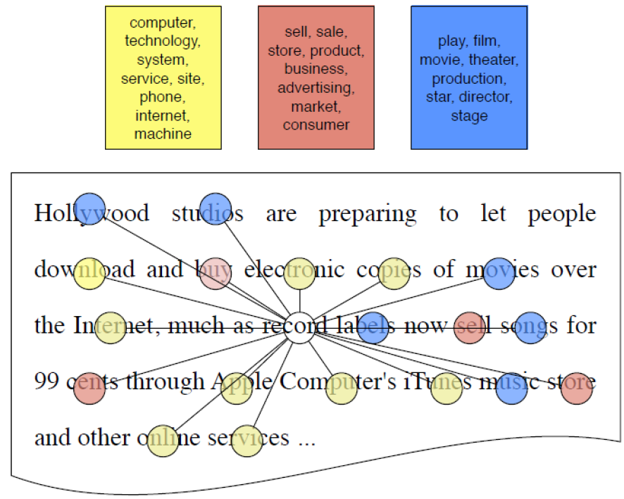

===========
Topic model
===========

A topic model is a type of statistical model for discovering the abstract "topics" that occur in a collection of documents. Topic modeling is a frequently used text-mining tool for discovery of hidden semantic structures in a text body (Ref.: `Wikipedia <https://en.wikipedia.org/wiki/Topic_model>`_).

Topic modeling
==============

Topic modeling is an alternative way to build vector representations for your document collections. Every document is described with some topics and each topic can be described with some words.

.. figure:: img/topic_models/from_texts_to_topics.jpg
    :align: center
    :scale: 40%

Basic model
***********

This is a basic method of topic modeling.

**Given:**

* Collection of texts as bag-of-words:

    * :math:`n_{wd}` is a count of the word :math:`w` in the document :math:`d`

**Find:**

* Probabilities of a word in topics:

    * :math:`\phi_{wt} = p(w|t)` **← Definition of a topic**

* Probabilities of a topic in documents:

    * :math:`\theta_{td} = p(t|d)`

Generative models
*****************

There are generative models for topic modeling and I will explain these later.

* `Latent Dirichlet Allocation`_
* `Probabilistic Latent Semantic Analysis`_
* `Other topic models`_

Utilization
***********

We can use topic models to explorate and navigate through large text collections such as news flows, social media messages, or research papers to get some nice overview of the area, because they provide hidden semantic representation of texts. Some other applications would be social network analysis or even dialog systems. These are applications:

* Categorization and classification of texts

* Document segmentation and summarization

* **News flows aggregation and analysis**

    * When you have some news about politics for example and you want to say that this topic becomes popular nowadays

* Recommender systems

    * **Book recommender system**

* Image captioning

* Bioinformatics (genome annotation)

* **Exploratory search**

    * If you have some documents that I'm interested in, could you please find some similar documents and tell me how they are interconnected? 

    * …

--------------------------------
Example: book recommender system
--------------------------------

Document is a distribution over topics and a topic is a distribution of words. To explain what is a book, first, we need to construct topics by words. And then we can assign topics to texts, in other words, a book is described by topics. So, we can represent the book using probabilities of topics for each book.

.. figure:: img/topic_models/topic_modeling_ex_01.png
    :align: center
    :scale: 50%

So, we can recommend a book by calculating a similarity based on euclidean distance or cosine similarity of topics.

.. figure:: img/topic_models/topic_modeling_ex_02.png
    :align: center
    :scale: 50%

Latent Dirichlet Allocation
===========================

Latent Dirichlet Allocation (LDA)란 주어진 문서에 대하여 각 문서에 어떤 주제들이 존재하는지에 대한 확률모형이다. LDA는 토픽별 단어의 분포, 문서별 토픽의 분포를 모두 추정한다.

.. figure:: img/topic_models/lda_abstract.png
    :align: center
    :scale: 50%

우선 LDA는 특정 토픽에 특정 단어가 나타날 확률을 계산하고, 이러한 단어들로부터 토픽들을 추출해 낼 수 있다. 그리고 문서 관점에서 각 토픽의 확률로 특정 문서의 토픽이 뭔지 알 수 있다. 이 과정은 기본적인 토픽 모델링과 동일하고, LDA는 이 과정을 기반으로 토픽의 단어분포, 문서의 토픽분포를 추정할 수 있고 그 구조는 아래와 같다.

모델 아키텍처
**********

.. figure:: img/topic_models/lda_architecture.png
    :align: center
    :scale: 50%

:math:`D` 는 말뭉치 전체 문서 개수, :math:`K` 는 전체 토픽 수, :math:`N` 은 :math:`d` 번째 문서의 단어 수를 의미한다. 네모칸은 해당 횟수만큼 반복하라는 의미이며 동그라미는 변수를 가리킨다. 화살표가 시작되는 변수는 조건, 화살표가 향하는 변수는 결과에 해당하는 변수이다.

우리가 관찰 가능한 변수는 :math:`d` 번째 문서에 등장한 :math:`n` 번째 단어 :math:`w_{d,n}` 이 유일하다 (음영 표시). 우리는 이 정보만을 가지고 사용자가 지정한 :math:`\alpha, \beta` 를 제외한 모든 잠재 변수를 추정해야 한다.

-------------
LDA 모델의 변수
-------------

* :math:`\phi_k`
    
    * :math:`k` 번째 토픽에 해당하는 벡터
    * :math:`\beta` 에 영향을 받음 (LDA가 토픽의 단어비중 :math:`\phi_k` 이 `Dirichlet distribution <https://ratsgo.github.io/statistics/2017/05/28/binomial/>`_ 을 따른다는 가정을 취하기 때문)

* :math:`\theta_d`

    * :math:`d` 번째 문서가 가진 토픽 비중을 나타내는 벡터
    * 전체 토픽 개수 :math:`K` 만큼의 길이를 가짐
    * :math:`α` 에 영향을 받음 (LDA가 문서의 토픽비중 :math:`\phi_k` 이 Dirichlet distribution을 따른다는 가정을 취하기 때문)

* :math:`z_{d, n}`

    * :math:`d` 번째 문서 :math:`n` 번째 단어가 어떤 토픽에 해당하는지 할당해주는 역할

* :math:`w_{d, n}`

    * 문서에 등장하는 단어를 할당해주는 역할
    * :math:`\phi_k` 와 :math:`z_{d, n}` 에 동시에 영향을 받음

Inference
*********

LDA는 토픽의 단어분포와 문서의 토픽분포의 결합으로 문서 내 단어들이 생성된다고 가정한다. 즉, LDA의 Inference는 실제 관찰가능한 문서 내 단어를 가지고 우리가 알고 싶은 토픽의 단어분포, 문서의 토픽분포를 추정하는 과정이다.

여기에서 LDA가 가정하는 문서생성과정이 합리적이라면 해당 확률과정이 우리가 갖고 있는 말뭉치를 제대로 설명할 수 있을 것이다. 즉, 토픽의 단어분포와 문서의 토픽분포의 결합확률이 커지도록 해야 한다.

.. rst-class:: centered

    :math:`\begin{align*} p(&{ \phi  }_{ 1:K },{ \theta  }_{ 1:D },{ z }_{ 1:D },{ w }_{ 1:D })=\\ &\prod _{ i=1 }^{ K }{ p({ \phi  }_{ i }|\beta ) } \prod _{ d=1 }^{ D }{ p({ \theta  }_{ d }|\alpha ) } \left\{ \prod _{ n=1 }^{ N }{ p({ z }_{ d,n }|{ \theta  }_{ d })p(w_{ d,n }|{ \phi  }_{ 1:K },{ z }_{ d,n }) }  \right\} \end{align*}`

위 수식에서 사용자가 지정한 하이퍼파라메터 :math:`\alpha, \beta` 와 우리가 말뭉치로부터 관찰가능한 :math:`w_{d,n}` 을 제외한 모든 변수가 미지수가 된다. 따라서 우리는 사후확률 (Posterior) :math:`p(z, \phi, \theta | w)` 를 최대로 만드는 :math:`z, \phi, \theta` 를 찾아야 하고, 이것이 LDA의 Inference다.

그런데 사후확률을 계산하려면 분모에 해당하는 :math:`p(w)` 를 반드시 구해야 한다. 이는 베이즈 정리에서 Evidence로 불리는 것으로, :math:`p(w)` 는 잠재변수 :math:`z, \phi, \theta` 의 모든 경우의 수를 고려한 각 단어 (:math:`w`)의 등장 확률을 가리킨다.

그러나 :math:`z, \phi, \theta` 는 우리가 직접 관찰하는 게 불가능할 뿐더러, :math:`p(w)`를 구할 때 :math:`z, \phi, \theta` 의 모든 경우를 감안해야 하기 때문에, 결과적으로 p(w)를 단번에 계산하는 것이 어렵다. 이 때문에 `깁스 샘플링 <https://ratsgo.github.io/statistics/2017/05/31/gibbs/>`_ 같은 기법을 사용하게 된다.

------------------------
Collapsed gibbs sampling
------------------------

LDA에서는 나머지 변수는 고정시킨 채 한 변수만을 변화시키되, 불필요한 일부 변수를 샘플링에서 제외하는 Collapsed gibbs sampling 기법을 쓴다.

.. rst-class:: centered

    :math:`p({ z }_{ i }=j|{ z }_{ -i },w)`

말뭉치가 주어졌기 때문에 :math:`w` 는 우리가 이미 알고 있는 값이고, :math:`z` 는 각 단어가 어떤 토픽에 할당돼 있는지를 나타내는 변수이다. :math:`z_{−i}` 는 :math:`i` 번째 단어의 토픽 정보를 제외한 모든 단어의 토픽 정보를 가리킨다. 즉, :math:`w` 와 :math:`z_{−i}` 가 주어졌을 때 문서의 :math:`i` 번째 단어의 토픽이 :math:`j` 일 확률을 의미한다.

-------
Example
-------

위 그림에서 :math:`z_i` 는 record라는 단어가 속하는 토픽이다. 깁스 샘플링을 위해 토픽 정보를 지웠고, 나머지 단어에 대한 토픽 정보는 그대로 쓴다. 이것이 바로 :math:`z_{−i}` 다. 이 상태의 정보를 토대로 record라는 단어가 어떤 토픽에 속할지 할당하는 것이 LDA의 깁스 샘플링 과정이다.

Probabilistic Latent Semantic Analysis
======================================

Latent Semantic Analysis (LSA)
******************************

말뭉치 행렬 math:`A` 를 다음과 같이 분해하는 걸 말합니다.

.. figure:: img/topic_models/lsa.png
  :align: center
  :scale: 40%

LSA 수행 결과로 :math:`n` 개 문서가 원래 단어 개수보다 훨씬 작은 :math:`q` 차원의 벡터로 표현된 걸 확인할 수 있습니다. 마찬가지로 :math:`m` 개 단어는 원래 문서 수보다 훨씬 작은 :math:`q` 차원 벡터로 변환됐습니다. :math:`q` 가 3이라면 전체 말뭉치가 3개의 토픽으로 분석됐다고도 말할 수 있을 것입니다.

위 그림에서 행렬 :math:`L` 의 열벡터는 각각 해당 토픽에 대한 문서들의 분포 정보를 나타냅니다. :math:`R` 의 행벡터는 각각 해당 토픽에 대한 단어들의 분포 정보를 나타냅니다. 중간에 대각행렬은 :math:`q` 개 토픽 각각이 전체 말뭉치 내에서 얼마나 중요한지 나타내는 가중치가 될 겁니다.

Probabilistic Latent Semantic Analysis (PLSA)
*********************************************

This is a topic model proposed by Thomas Hofmann in 1999 and a very basic model that tries to predict words in documents and it does so by a mixture of topics

.. rst-class:: centered
  
  :math:`p(w|d) = \sum_{t \in T} p(w|t, d) p(t|d) = \sum_{t \in T} p(w|t) p(t|d)`

* Law of total probability:

  * If you don't care about the document, :math:`p(w) = \sum_{t \in T} p(w|t) p(t)`

* Assumtion of conditional independence:

  * :math:`p(w|t, d) = p(w|t)`

* Notations:
  
  * :math:`w\ -\ word,\ d\ -\ document,\ t\ -\ topic`

* Procedure:

  * Decide what would be the topic for the next word
  * Draw a certain word from the probability distribution for this topic
  * Go on through the whole text

  .. figure:: img/topic_models/plsa.PNG
    :align: center
    :scale: 60%

* Matrix way of thinking:
  
  .. rst-class:: centered

    :math:`p(w|d) = \sum_{t \in T} p(w|t) p(t|d) = \sum_{t \in T} \phi_{wt} \theta_{td}`
    
    :math:`where\ \phi_{wt}:\ probability\ of\ word\ \boldsymbol{w}\ in\ topic\ \boldsymbol{t},\ \theta_{td}:\ probability\ of\ topic\ \boldsymbol{t}\ in\ document\ \boldsymbol{d}`

  .. figure:: img/topic_models/plsa_matrix.PNG
    :align: center
    :scale: 40%

How to train PLSA?
******************

----------------------------
Log-likelihood optimization
----------------------------

.. rst-class:: centered

  :math:`\log \prod_{d \in D} p(d) \prod_{w \in d} p(w|d)^{n_{dw}} \rightarrow \max_{\Phi,\Theta} \iff \sum_{d \in D} \sum_{w \in d} n_{dw} \log \sum_{t \in T} \phi_{wt} \theta_{td} \rightarrow \max_{\Phi,\Theta}`

**Given non-negativity and normalization constraints:**

.. rst-class:: centered

  :math:`\sum_{w \in W} \theta_{wt} = 1,\ \theta_{wt} \geq 0`
  :math:`\sum_{t \in T} \theta_{td} = 1,\ \theta_{td} \geq 0`

Example
-------

:math:`{\color{orange}{\text{Pooh}}}` rubbed his nose again, and :math:`{\color{blue}{\text{said that he hadn't thought of that}}}`. And then he brightened again, and :math:`{\color{blue}{\text{said that}}}`, if it were :math:`{\color{red}{\text{raining}}}` already, the :math:`{\color{orange}{\text{Heffalump}}}` would be looking at the :math:`{\color{red}{\text{sky}}}` :math:`{\color{blue}{\text{wondering}}}` if it would :math:`{\color{red}{\text{clear up}}}`, and so he wouldn't see the :math:`{\color{orange}{\text{Very Deep Pit}}}` until he was half-way down…

**Just count:**

* :math:`p(w = sky|t) = \frac{n_wt}{\sum_{w} n_wt} = \frac{1}{4}`

* :math:`p(t = t|d) = \frac{n_td}{\sum_{t} n_td} = \frac{4}{54}`

**Idea: estimate the topic assignment probabilities**

.. rst-class:: centered
  
  :math:`p(t|d,w) = \frac{p(w, t|d)}{p(w|d)} = \frac{p(w|t) p(t|d)}{p(w|d)} \text{ by Bayes rule and Product rule}`

-------------
EM-algorithm
-------------

**E-step:**

.. rst-class:: centered

  :math:`p(t|d, w) = \frac{p(w|t) p(t|d)}{p(w|d)} = \frac{\phi_{wt} \theta_{td}}{\sum_{s \in T} \phi_{ws} \theta_{sd}}`

**M-step:**

.. rst-class:: centered

  :math:`\phi_{wt} = \frac{n_{wt}}{\sum_{w} n_{wt}},\ n_{wt} = \sum_{d} n_{dw} p(t|d, w)`

  :math:`\theta_{td} = \frac{n_{td}}{\sum_{t} n_{td}},\ n_{td} = \sum_{w} n_{dw} p(t|d, w)`

.. toggle-header::
  :header: **Example:**

  Let's see how EM updates work. Consider the following text:

  If it were raining already, the Heffalump would be looking at the sky wondering if it would clear up, and so he would not see the Very Deep Pit until he was half-way down…

  Let us have 3 topics in our topic model. Imagine we start with random initialization for parameters :math:`\Phi` and :math:`\Theta` and after some time we arrive to the following matrices.

  :math:`\Phi` matrix (many rows omitted, every column sums up to 1):

  ======= ======= ======= =======
  word    topic 1 topic 2 topic 3
  ======= ======= ======= =======
  raining 0.01    0.1     0.05
  would   0.1     0.2     0.1
  ...     ...     ...     ...
  ======= ======= ======= =======

  :math:`\Theta` column for the document (sums up to 1):

  ======== ========
  topic    document
  ======== ========
  topic 1	 0.1
  topic 2	 0.5
  topic 3	 0.4
  ======== ========

  The next E-step will compute posterior topic probabilities :math:`p(t|d,w)p(t∣d,w)` for all words in the document. The next M-step will aggregate them to compute counts :math:`n_{wt}` and :math:`n_{td}`. Then it will normalize them to produce probabilities (new matrices :math:`\Phi` and :math:`\Theta`).

  Do computations for :math:`n_{wt}` count for the word **would** and **topic 2**.

  Hints:

  * First, compute :math:`p(t |\, d, w)` for the word **would** and **topic 2**.
  * Recall that :math:`n_{wt} = \sum_d n_{dw} p(t|\, d,w)`, where :math:`n_{dw}` is the number of the word occurrences in the document.
  * Assume that there is only one document in our toy corpus.

  **Answer:**
  
  * :math:`p(t |\, d, w) = \frac{0.2 \cdot 0.5}{0.1 \cdot 0.1 + 0.2 \cdot 0.5 + 0.1 \cdot 0.4} = \frac{2}{3}`
  
  * :math:`n_{wt} = \sum_d n_{dw} p(t|\, d,w) = 3 \cdot \frac{2}{3} = 2`

|

Other topic models
==================

Bayesian methods and graphical models
**************************************

.. figure:: img/topic_models/bayesian_methods_and_graphical_models.png
  :align: center
  :scale: 40%

Hierarchical topic models
**************************

.. figure:: img/topic_models/hierarchical_topic_models.jpg
  :align: center
  :scale: 40%

Dynamic topic models
*********************

* David Blei, Probabilistic Topic Models, 2012:

.. figure:: img/topic_models/dynamic_topic_models_01.jpg
  :align: center
  :scale: 70%

* Topic detection and analysis of news flows:

.. figure:: img/topic_models/dynamic_topic_models_02.jpg
  :align: center
  :scale: 40%

Multilingual topic models
**************************

.. figure:: img/topic_models/multilingual_topic_models.png
  :align: center
  :scale: 40%

Multimodal topic models
************************

.. figure:: img/topic_models/multimodal_topic_models.jpg
  :align: center
  :scale: 40%

Addictive Regularization for Topic Models (ARTM)
=================================================

How to combine all those extensions in one model?

* PLSA:

.. rst-class:: centered
  
  :math:`\mathcal{L} = \sum_{d \in D} \sum_{w \in W} n_{dw} \log \sum_{t \in T} \phi_{wt} \theta_{td} \rightarrow \max_{\Phi, \Theta}`

* ARTM:

.. rst-class:: centered
  
  :math:`\mathcal{L} + \sum_{i=1}^{n} \tau_i R_i (\Phi, \Theta) \rightarrow max_{\Phi, \Theta}`

* Example of a regularizer - diversity of topics:

.. rst-class:: centered

  :math:`R_i (\Phi) = -\sum_{ts} \sum_w \phi_{wt} \phi_{ws}`

Regularized EM algorithm
*************************

**E-step:**

.. rst-class:: centered

  :math:`p(t|d, w) = \frac{p(w|t) p(t|d)}{p(w|d)} = \frac{\phi_{wt} \theta_{td}}{\sum_{s \in T} \phi_{ws} \theta_{sd}}`

**M-step:**

.. rst-class:: centered

  :math:`\phi_{wt} = norm_{w \in W} \big( \sum_{d} n_{dw} p(t|d, w) + \phi_{td} \frac{\partial R}{\partial \phi_{wt}} \big)`

  :math:`\theta_{td} = norm_{w \in W} \big( \sum_{w} n_{dw} p(t|d, w) + \theta_{td} \frac{\partial R}{\partial \theta_{wt}} \big)`

Multi-ARTM
***********

How to incorporate tokens of additional modalities?

* PLSA:

.. rst-class:: centered

  :math:`\mathcal{L} = \sum_{d \in D} \sum_{w \in W} n_{dw} \log \sum_{t \in T} \phi_{wt} \theta_{td} \rightarrow \max_{\Phi, \Theta}`

* Multi-ARTM:

.. rst-class:: centered
  
  :math:`\sum_{m \in M} \lambda_m \sum_{d \in D} \sum_{w \in W} n_{dw} \log \sum_{t \in T} \phi_{wt} \theta_{td} \rightarrow \max_{\Phi, \Theta}`

* Each topic is characterized by several probability distribution
* More parameters, still trained with EM-algorithm

**Inter-modality similarities**

.. figure:: img/topic_models/inter-modality_similarities.png
  :align: center
  :scale: 40%

Libraries 
==========

Topic modeling
***************

* BigARTM is an open-source library for Additive Regularization of Topic Models, bigartm.org

* Gensim is a library of text analysis for Python, radimrehurek.com/gensim

* MALLET is a library of text analysis for Java, mallet.cs.umass.edu

* VowpalWabbit has a fast implementation of online LDA hunch.net/~vw/

Visualization
**************

* A few words about visualization:

.. figure:: img/topic_models/tm_visualization.jpg
  :align: center
  :scale: 70%

* 380 ways to visualize: textvis.lnu.se

.. figure:: img/topic_models/textvis.lnu.se.jpg
  :align: center
  :scale: 60%

Quiz: topic models
===================

.. toggle-header::
  :header: **Quiz list**

  **Quiz 1.**

    How many parameters does PLSA topic model have?

    Let us denote the vocabulary size by :math:`|W|`, the number of documents by :math:`|D|`, the length of the corpus by :math:`|N|`, and the number of topics by :math:`|T|`.

    \(X\) :math:`|T| \cdot |N|`

    \(O\) :math:`|T| \cdot |W| + |T| \cdot |D|`

    \(X\) :math:`|W| \cdot |D|`

  **Quiz 2.**

    Which assumptions are made in PLSA topic model?

    \(O\) Bag of words assumption

    \(X\) Topic distributions are sparse and diverse

    \(X\) Conditional independence: :math:`p(t∣w,d)=p(t∣d)`

    \(X\) Distributions of words in topics have Dirichlet prior

    \(O\) Conditional independence: :math:`p(w∣t,d)=p(w∣t)`

  **Quiz 3.**
  
    Let's see how EM-algorithm for PLSA works.

    Consider the following tiny document: **One fly flies, two flies fly**.

    Before building a topic model, one would usually apply lemmatization and obtain the following: **One fly fly, two fly fly**. So let us use this version of the text below.

    Consider :math:`\Phi` matrix from the latest M-step:

    ======= ======= ======= =======
    word    topic 1 topic 2 topic 3
    ======= ======= ======= =======
    fly     0.1     0.8     0.2
    one     0.4     0.1     0.3
    two     0.5     0.1     0.5
    ======= ======= ======= =======

    And :math:`\Theta` column for the document:

    ======== ========
    topic    document
    ======== ========
    topic 1	 0.2
    topic 2	 0.7
    topic 3	 0.1
    ======== ========

    1) Compute posterior topic probabilities of E-step for the word **fly**.

    2) Compute :math:`n_{wt}` count for the word **fly** and **topic 2**. (Assume there are no other documents in the corpus).

    Enter :math:`n_{wt}` value with 2 digits after the decimal point.

    If you have difficulties with this question, get back to the last in-video question in the corresponding video. There is a full explanation of the solution there.

    **Answer:**

    1) :math:`p(t |\, d, w) = \frac{0.8 \cdot 0.7}{0.1 \cdot 0.2 + 0.8 \cdot 0.7 + 0.2 \cdot 0.1} = \frac{14}{15}`
    
    2) :math:`n_{wt} = \sum_d n_{dw} p(t|\, d,w) = 4 \cdot \frac{14}{15} = 3.7 \dot{3}`

  **Quiz 4.**
  
    Imagine you are analysing news flow for a company. You want to know what topics are being mentioned when people discuss the company, and how they change over time.

    For each news article there are several modalities that you want to use: English text, time, author and category. Your final goal is to track, how topics change over time.

    Which additive regularizers would you add to your topic model?

    \(O\) Multilingual

    \(O\) Dynamic

    \(X\) Visualizable

    \(O\) Multimodal

    \(X\) Hierarchical

|

References
===========

* https://www.coursera.org/learn/language-processing
* https://ratsgo.github.io/from%20frequency%20to%20semantics/2017/06/01/LDA/
* https://ratsgo.github.io/from%20frequency%20to%20semantics/2017/05/25/plsa/
