Topic models
=============

===========================================================
Topic modeling: a way to navigate through text collections
===========================================================

Topic modeling is an alternative way to build vector representations for your document collections.
Every document is described with some topics and each topic can be described with some words.

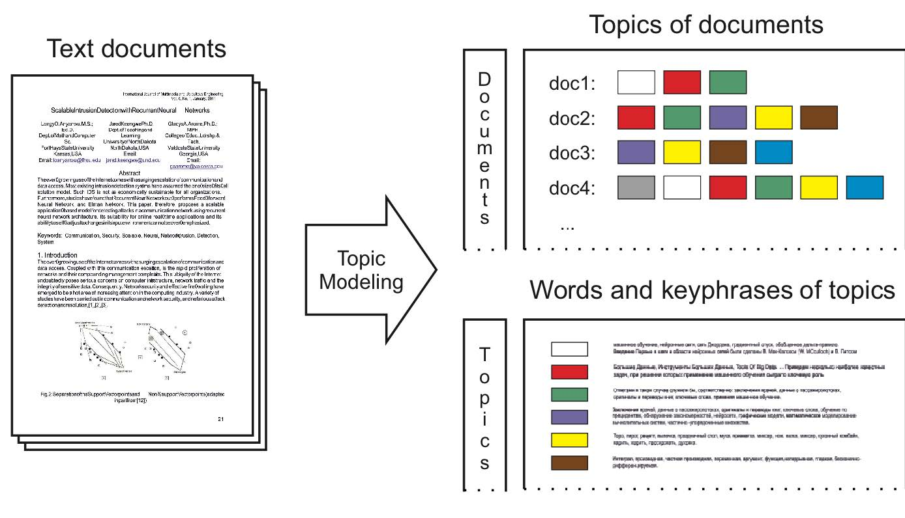

Example: book recommender system
*********************************

* Document is a distribution over topics and topic is a distribution of words.

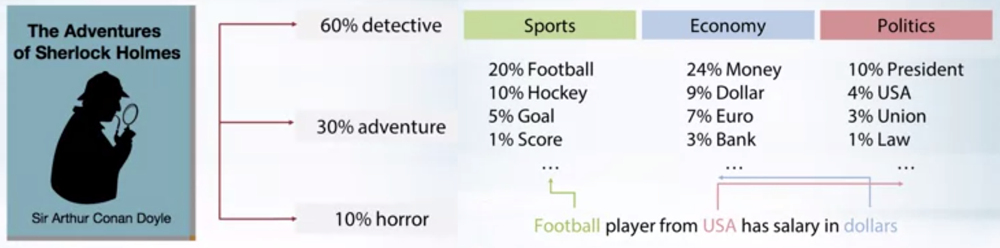

* Calculate similarity by euclidean distance or cosine similarity.

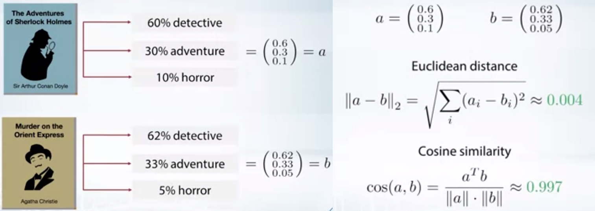

**Summary: topic modeling**

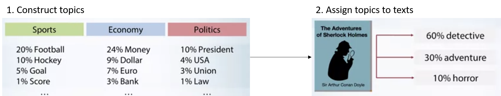

Definition
***********

**Given:**

* Collection of texts as bag-of-words:

  * :math:`n_{wd}` is a count of the word :math:`w` in the document :math:`d`

**Find:**

* Probabilities of a word in topics:

  * :math:`\phi_{wt} = p(w|t)` **← Definition of a topic**

* Probabilities of a topic in documents:

  * :math:`\theta_{td} = p(t|d)`

Where do we need that?
**********************

We can use topic models to explorate and navigate through large text collections such as news flows, social media messages, or research papers to get some nice overview of the area. Some other applications would be social network analysis or even dialog systems.

Why do we need that?
**********************

Topic models provide hidden semantic representation of texts.

**Many more applications:**

* Categorization and classification of texts

* Document segmentation and summarization

* **News flows aggregation and analysis**

  * When you have some news about politics for example and you want to say that this topic becomes popular nowadays

* Recommender systems

* Image captioning

* Bioinformatics (genome annotation)

* **Exploratory search**

  * If you have some documents that I'm interested in, could you please find some similar documents and tell me how they are interconnected? 

  * …

==================================
Latent Dirichlet Allocation (LDA)
==================================

Example: Martha Ballard's diary
********************************

* Diary had daily entries over the course of 27 years

* Topic modeling helps to analyze it

* Revealed topics (the most probable words):

  * GARDENING: garden worked clear beans corn warm planted matters cucumbers potatoes plants
  * CHURCH: meeting attended afternoon reverend worship foren mr famely st lecture discoarst administered
  * DEATH: day yesterday informed morn years death ye hear expired expired weak dead
  * SHOPPING: butter sugar carried candles wheat store flower

* How topics are developing through time:

  .. figure:: img/topic_models/martha_ballard's_diary.png
    :align: center
    :scale: 40%

Dirichlet distribution
***********************

...

Latent Dirichlet Allocation (LDA)
**********************************

Dirichlet priors for :math:`\phi_t = (\phi_{wt})_{w \in W}` and :math:`\theta_d = (\theta_{td})_{t \in T}` :

.. rst-class:: centered

  :math:`Dir(\phi_t | \beta) = \frac{}{} \prod_w \phi_{wt}^{\beta_w - 1} \beta_0 = \sum_w \beta_w , \beta_t > 0`

* Inference:

  * Variational Bayes
  * Gibbs sampling

* Output:

  * Posterior probabilities for parameters (also Dirichlet!)

EM algorithm
*************

**E-step**

**M-step**

Extension of LDA
*****************

...

==============================================
Probabilistic Latent Semantic Analysis (PLSA)
==============================================

Latent Semantic Analysis (LSA)
******************************

말뭉치 행렬 math:`A` 를 다음과 같이 분해하는 걸 말합니다.

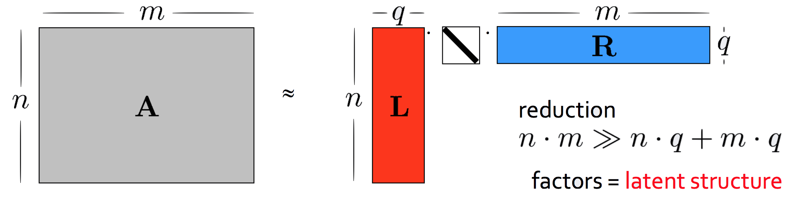

LSA 수행 결과로 :math:`n` 개 문서가 원래 단어 개수보다 훨씬 작은 :math:`q` 차원의 벡터로 표현된 걸 확인할 수 있습니다. 마찬가지로 :math:`m` 개 단어는 원래 문서 수보다 훨씬 작은 :math:`q` 차원 벡터로 변환됐습니다. :math:`q` 가 3이라면 전체 말뭉치가 3개의 토픽으로 분석됐다고도 말할 수 있을 것입니다.

위 그림에서 행렬 :math:`L` 의 열벡터는 각각 해당 토픽에 대한 문서들의 분포 정보를 나타냅니다. :math:`R` 의 행벡터는 각각 해당 토픽에 대한 단어들의 분포 정보를 나타냅니다. 중간에 대각행렬은 :math:`q` 개 토픽 각각이 전체 말뭉치 내에서 얼마나 중요한지 나타내는 가중치가 될 겁니다.

Probabilistic Latent Semantic Analysis (PLSA)
*********************************************

This is a topic model proposed by Thomas Hofmann in 1999 and a very basic model that tries to predict words in documents and it does so by a mixture of topics

.. rst-class:: centered
  
  :math:`p(w|d) = \sum_{t \in T} p(w|t, d) p(t|d) = \sum_{t \in T} p(w|t) p(t|d)`

* Law of total probability:

  * If you don't care about the document, :math:`p(w) = \sum_{t \in T} p(w|t) p(t)`

* Assumtion of conditional independence:

  * :math:`p(w|t, d) = p(w|t)`

* Notations:
  
  * :math:`w\ -\ word,\ d\ -\ document,\ t\ -\ topic`

* Procedure:

  * Decide what would be the topic for the next word
  * Draw a certain word from the probability distribution for this topic
  * Go on through the whole text

  .. figure:: img/topic_models/plsa.png
    :align: center
    :scale: 60%

* Matrix way of thinking:
  
  .. rst-class:: centered

    :math:`p(w|d) = \sum_{t \in T} p(w|t) p(t|d) = \sum_{t \in T} \phi_{wt} \theta_{td}`
    
    :math:`where\ \phi_{wt}:\ probability\ of\ word\ \boldsymbol{w}\ in\ topic\ \boldsymbol{t},\ \theta_{td}:\ probability\ of\ topic\ \boldsymbol{t}\ in\ document\ \boldsymbol{d}`

  .. figure:: img/topic_models/plsa_matrix.png
    :align: center
    :scale: 40%

===================
How to train PLSA?
===================

Log-likelihood optimization
****************************

.. rst-class:: centered

  :math:`\log \prod_{d \in D} p(d) \prod_{w \in d} p(w|d)^{n_{dw}} \rightarrow \max_{\Phi,\Theta} \iff \sum_{d \in D} \sum_{w \in d} n_{dw} \log \sum_{t \in T} \phi_{wt} \theta_{td} \rightarrow \max_{\Phi,\Theta}`

**Given non-negativity and normalization constraints:**

.. rst-class:: centered

  :math:`\sum_{w \in W} \theta_{wt} = 1,\ \theta_{wt} \geq 0`
  :math:`\sum_{t \in T} \theta_{td} = 1,\ \theta_{td} \geq 0`

Example
********

:math:`{\color{orange}{\text{Pooh}}}` rubbed his nose again, and :math:`{\color{blue}{\text{said that he hadn't thought of that}}}`. And then he brightened again, and :math:`{\color{blue}{\text{said that}}}`, if it were :math:`{\color{red}{\text{raining}}}` already, the :math:`{\color{orange}{\text{Heffalump}}}` would be looking at the :math:`{\color{red}{\text{sky}}}` :math:`{\color{blue}{\text{wondering}}}` if it would :math:`{\color{red}{\text{clear up}}}`, and so he wouldn't see the :math:`{\color{orange}{\text{Very Deep Pit}}}` until he was half-way down…

**Just count:**

* :math:`p(w = sky|t) = \frac{n_wt}{\sum_{w} n_wt} = \frac{1}{4}`

* :math:`p(t = t|d) = \frac{n_td}{\sum_{t} n_td} = \frac{4}{54}`

**Idea: estimate the topic assignment probabilities**

.. rst-class:: centered
  
  :math:`p(t|d,w) = \frac{p(w, t|d)}{p(w|d)} = \frac{p(w|t) p(t|d)}{p(w|d)} \text{ by Bayes rule and Product rule}`

EM-algorithm
*************

**E-step:**

.. rst-class:: centered

  :math:`p(t|d, w) = \frac{p(w|t) p(t|d)}{p(w|d)} = \frac{\phi_{wt} \theta_{td}}{\sum_{s \in T} \phi_{ws} \theta_{sd}}`

**M-step:**

.. rst-class:: centered

  :math:`\phi_{wt} = \frac{n_{wt}}{\sum_{w} n_{wt}},\ n_{wt} = \sum_{d} n_{dw} p(t|d, w)`

  :math:`\theta_{td} = \frac{n_{td}}{\sum_{t} n_{td}},\ n_{td} = \sum_{w} n_{dw} p(t|d, w)`

.. toggle-header::
  :header: **Example:**

  Let's see how EM updates work. Consider the following text:

  If it were raining already, the Heffalump would be looking at the sky wondering if it would clear up, and so he would not see the Very Deep Pit until he was half-way down…

  Let us have 3 topics in our topic model. Imagine we start with random initialization for parameters :math:`\Phi` and :math:`\Theta` and after some time we arrive to the following matrices.

  :math:`\Phi` matrix (many rows omitted, every column sums up to 1):

  ======= ======= ======= =======
  word    topic 1 topic 2 topic 3
  ======= ======= ======= =======
  raining 0.01    0.1     0.05
  would   0.1     0.2     0.1
  ...     ...     ...     ...
  ======= ======= ======= =======

  :math:`\Theta` column for the document (sums up to 1):

  ======== ========
  topic    document
  ======== ========
  topic 1	 0.1
  topic 2	 0.5
  topic 3	 0.4
  ======== ========

  The next E-step will compute posterior topic probabilities :math:`p(t|d,w)p(t∣d,w)` for all words in the document. The next M-step will aggregate them to compute counts :math:`n_{wt}` and :math:`n_{td}`. Then it will normalize them to produce probabilities (new matrices :math:`\Phi` and :math:`\Theta`).

  Do computations for :math:`n_{wt}` count for the word **would** and **topic 2**.

  Hints:

  * First, compute :math:`p(t |\, d, w)` for the word **would** and **topic 2**.
  * Recall that :math:`n_{wt} = \sum_d n_{dw} p(t|\, d,w)`, where :math:`n_{dw}` is the number of the word occurrences in the document.
  * Assume that there is only one document in our toy corpus.

  **Answer:**
  
  * :math:`p(t |\, d, w) = \frac{0.2 \cdot 0.5}{0.1 \cdot 0.1 + 0.2 \cdot 0.5 + 0.1 \cdot 0.4} = \frac{2}{3}`
  
  * :math:`n_{wt} = \sum_d n_{dw} p(t|\, d,w) = 3 \cdot \frac{2}{3} = 2`

|

==================
Other topic models
==================

Bayesian methods and graphical models
**************************************

.. figure:: img/topic_models/bayesian_methods_and_graphical_models.png
  :align: center
  :scale: 40%

Hierarchical topic models
**************************

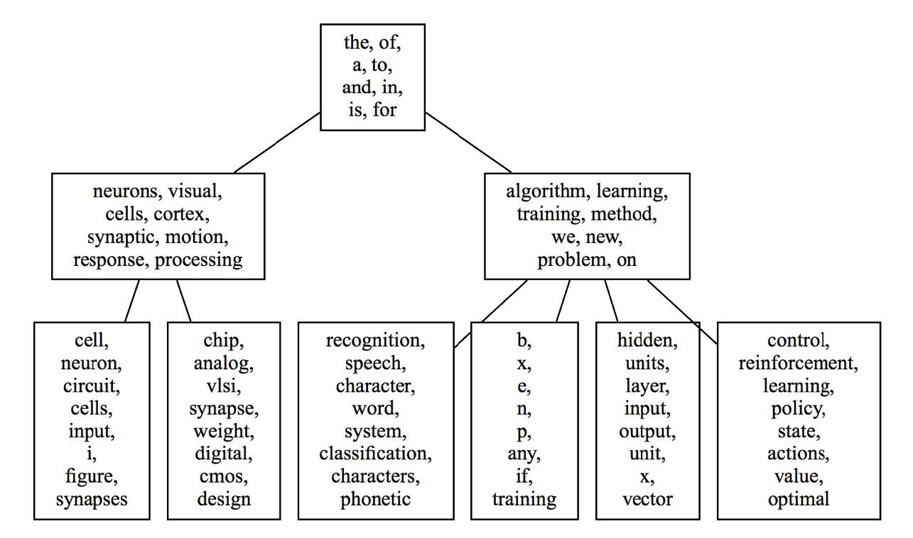

Dynamic topic models
*********************

* David Blei, Probabilistic Topic Models, 2012:

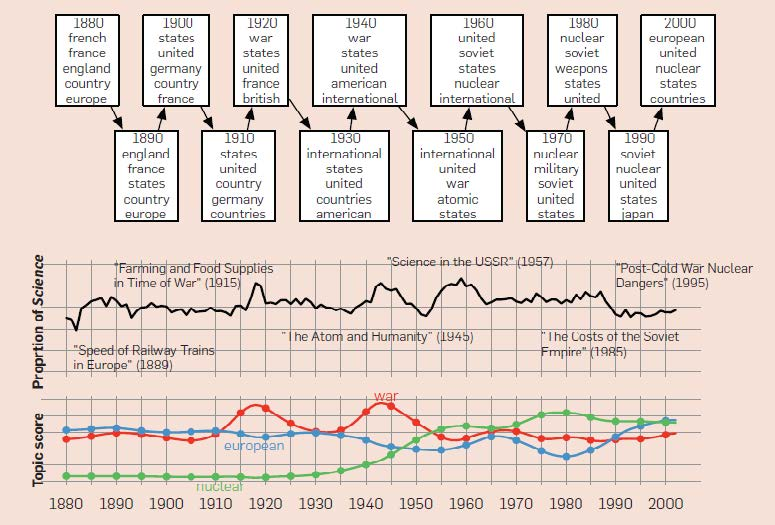

* Topic detection and analysis of news flows:

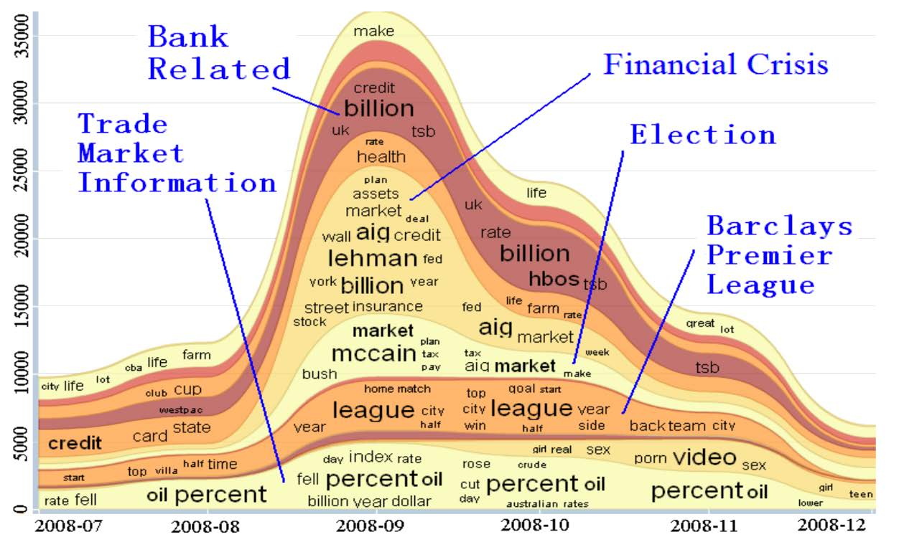

Multilingual topic models
**************************

.. figure:: img/topic_models/multilingual_topic_models.png
  :align: center
  :scale: 40%

Multimodal topic models
************************

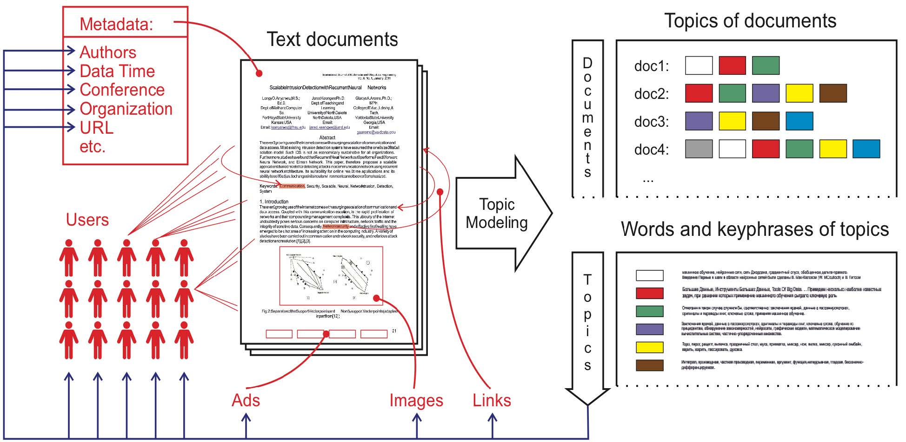

=================================================
Addictive Regularization for Topic Models (ARTM)
=================================================

How to combine all those extensions in one model?

* PLSA:

.. rst-class:: centered
  
  :math:`L = 1`

* ARTM:

.. rst-class:: centered
  
  :math:`L + 1`

* Example of a regularizer - diversity of topics:

.. rst-class:: centered

  :math:`R_i () = -\sum_{ts} \sum_w \phi_{wt} \phi_{ws}`

Regularized EM algorithm
*************************

**E-step:**

.. rst-class:: centered

  :math:`p(t|d, w) = 1`

**M-step:**

.. rst-class:: centered

  :math:`\phi_{wt}`

  :math:`\theta_{td}`

Multi-ARTM
***********

How to incorporate tokens of additional modalities?

* PLSA:

.. rst-class:: centered

  :math:`L = 2`

* Multi-ARTM:

.. rst-class:: centered
  
  :math:`\sum_{m \in M}`

* Each topic is characterized by several probability distribution
* More parameters, still trained with EM-algorithm

**Inter-modality similarities**

.. figure:: img/topic_models/inter-modality_similarities.png
  :align: center
  :scale: 40%

==========
Libraries 
==========

Topic modeling
***************

* BigARTM is an open-source library for Additive Regularization of Topic Models, bigartm.org

* Gensim is a library of text analysis for Python, radimrehurek.com/gensim

* MALLET is a library of text analysis for Java, mallet.cs.umass.edu

* VowpalWabbit has a fast implementation of online LDA hunch.net/~vw/

Visualization
**************

* A few words about visualization:

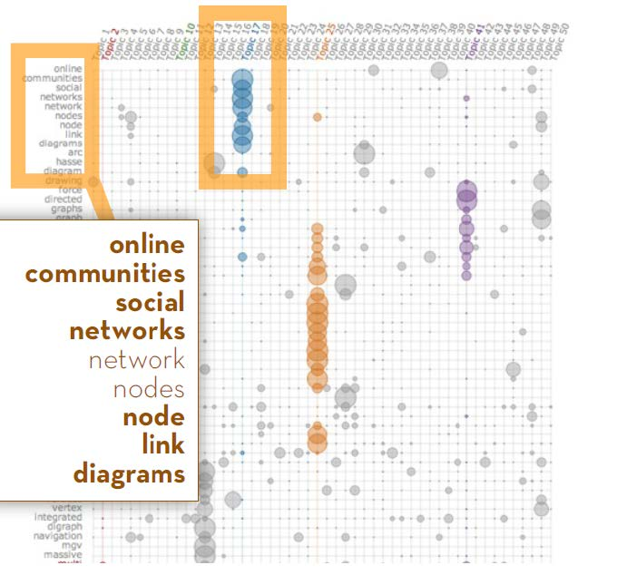

* 380 ways to visualize: textvis.lnu.se

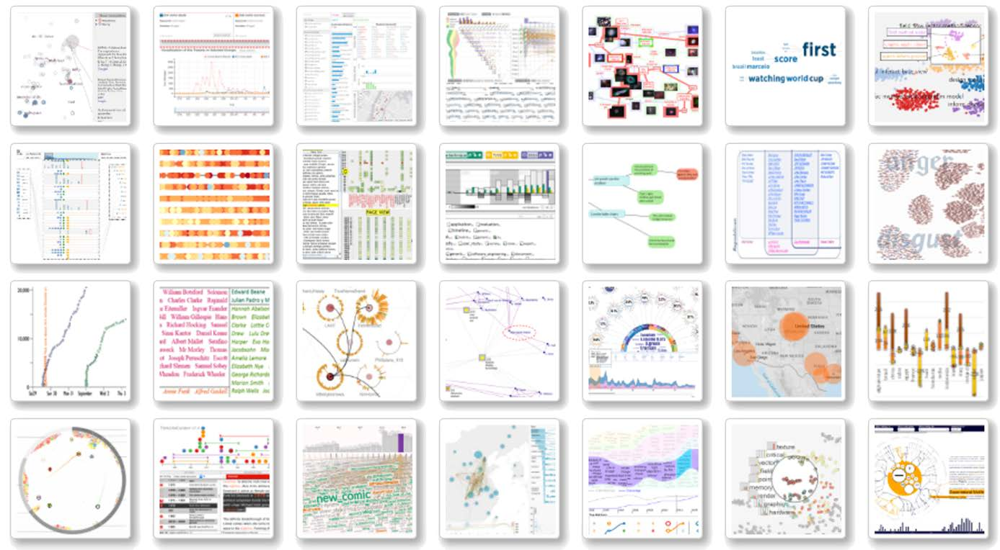

===================
Quiz: topic models
===================

.. toggle-header::
  :header: **Quiz list**

  **Quiz 1.**

    How many parameters does PLSA topic model have?

    Let us denote the vocabulary size by :math:`|W|`, the number of documents by :math:`|D|`, the length of the corpus by :math:`|N|`, and the number of topics by :math:`|T|`.

    \(X\) :math:`|T| \cdot |N|`

    \(O\) :math:`|T| \cdot |W| + |T| \cdot |D|`

    \(X\) :math:`|W| \cdot |D|`

  **Quiz 2.**

    Which assumptions are made in PLSA topic model?

    \(O\) Bag of words assumption

    \(X\) Topic distributions are sparse and diverse

    \(X\) Conditional independence: :math:`p(t∣w,d)=p(t∣d)`

    \(X\) Distributions of words in topics have Dirichlet prior

    \(O\) Conditional independence: :math:`p(w∣t,d)=p(w∣t)`

  **Quiz 3.**
  
    Let's see how EM-algorithm for PLSA works.

    Consider the following tiny document: **One fly flies, two flies fly**.

    Before building a topic model, one would usually apply lemmatization and obtain the following: **One fly fly, two fly fly**. So let us use this version of the text below.

    Consider :math:`\Phi` matrix from the latest M-step:

    ======= ======= ======= =======
    word    topic 1 topic 2 topic 3
    ======= ======= ======= =======
    fly     0.1     0.8     0.2
    one     0.4     0.1     0.3
    two     0.5     0.1     0.5
    ======= ======= ======= =======

    And :math:`\Theta` column for the document:

    ======== ========
    topic    document
    ======== ========
    topic 1	 0.2
    topic 2	 0.7
    topic 3	 0.1
    ======== ========

    1) Compute posterior topic probabilities of E-step for the word **fly**.

    2) Compute :math:`n_{wt}` count for the word **fly** and **topic 2**. (Assume there are no other documents in the corpus).

    Enter :math:`n_{wt}` value with 2 digits after the decimal point.

    If you have difficulties with this question, get back to the last in-video question in the corresponding video. There is a full explanation of the solution there.

    **Answer:**

    1) :math:`p(t |\, d, w) = \frac{0.8 \cdot 0.7}{0.1 \cdot 0.2 + 0.8 \cdot 0.7 + 0.2 \cdot 0.1} = \frac{14}{15}`
    
    2) :math:`n_{wt} = \sum_d n_{dw} p(t|\, d,w) = 4 \cdot \frac{14}{15} = 3.7 \dot{3}`

  **Quiz 4.**
  
    Imagine you are analysing news flow for a company. You want to know what topics are being mentioned when people discuss the company, and how they change over time.

    For each news article there are several modalities that you want to use: English text, time, author and category. Your final goal is to track, how topics change over time.

    Which additive regularizers would you add to your topic model?

    \(O\) Multilingual

    \(O\) Dynamic

    \(X\) Visualizable

    \(O\) Multimodal

    \(X\) Hierarchical

|

===========
References
===========

* https://www.coursera.org/learn/language-processing
* https://ratsgo.github.io/from%20frequency%20to%20semantics/2017/05/25/plsa/