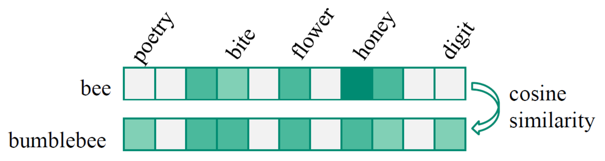
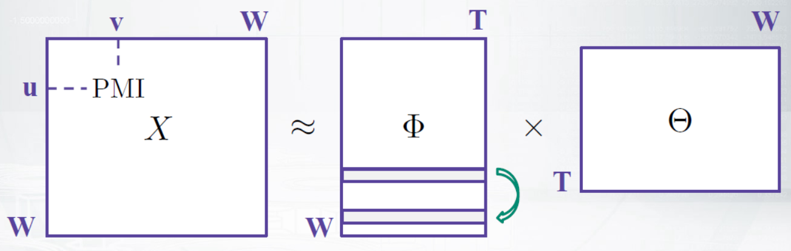
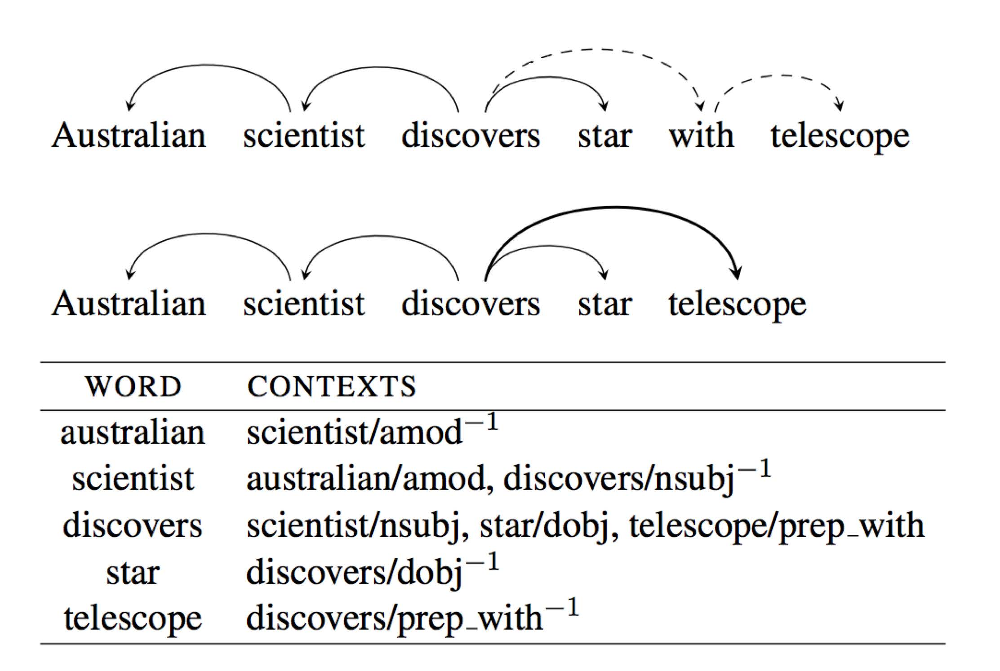
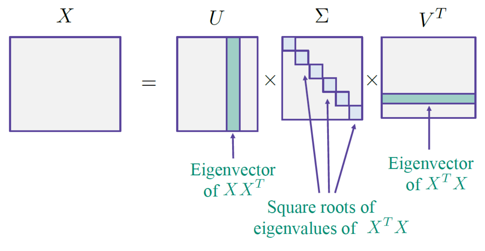
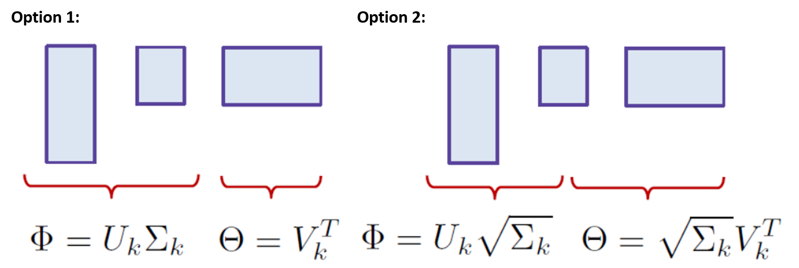
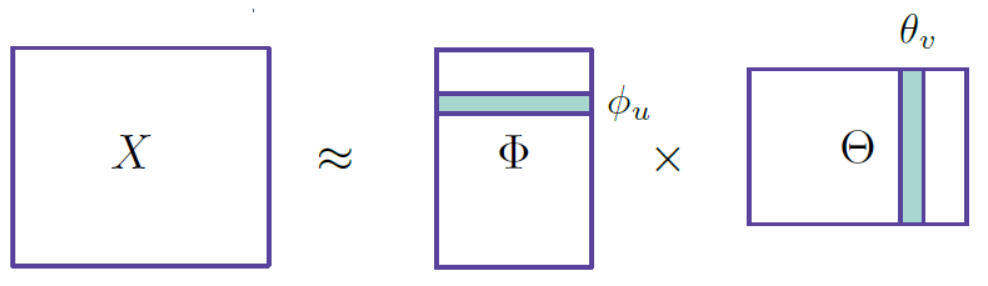
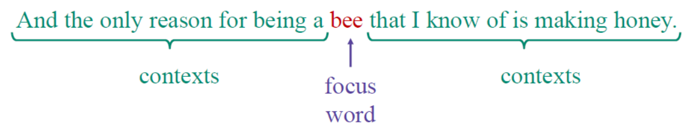

============================
Word and sentence embeddings
============================

Distributional semantics
========================

Word similarity
****************

Word similarity is a value of a co-occurrence and there are two types.

---------------------------------------------
Example: bee and honey vs. bee and bumblebee
---------------------------------------------

* First-order co-occurrences

    * They are **syntagmatic associates** which are relatedness between bee and honey
    * In contexts, find the word which is co-occur with bee and it's count is first-order co-occurrences

* Second order co-occurences

    * They are **paradigmatic parallels** which are similarities between bee and bumblebee (호박벌)
  
--------------------------
Distributional hypothesis
--------------------------

.. rst-class:: centered
  
  *"You shall know a word by the company it keeps." - Firth, 1957*

We can calculate similarities by just counting co-occurences. Simply use a sliding window of a fixed size and compute word co-occurrences :math:`n_{uv}`. But there is a better way for calculate co-occurences called Pointwise Mutual Information (PMI).

Pointwise Mutual Information (PMI)
***********************************

.. rst-class:: centered

  :math:`PMI = \log{\frac{p(u, v)}{p(u)p(v)}} = \log{\frac{n_{uv}}{n_{u}n_{v}}}`

Advantage:

* PMI is a normalization of co-occurrences to reduce influences of a word length

Problem:

* If words have never co-occured, :math:`PMI = -\infty`

**Positive PMI**

.. rst-class:: centered

  :math:`pPMI = max(0, PMI)`

Problem:

* Anyway, vectors too sparse and long to calculate cosine similarities
* So, we need to reduce dimensions o

Vector space models of semantics
*********************************

* Input: word-word co-occurrences (Counts, PMI, ...)
* Method: Dimensionality reduction (SVD, ...)
* Output: Similarity between vector representations of words
* :math:`T` can be 300

-------
Context
-------

We use context for vector space models. Then what is a context?

.. rst-class:: centered

  **Context = Word + Type of relationship**

If we use syntatic dependencies between the words, it is more better becuase **syntax** can really help to understand what is important to **local context**. But we forget above things because it is good to the **general** model.

In below figure, :math:`C` is a vocabulary of contexts (e.g. word/dependency). But usually contexts are words form a sliding window, then :math:`W = C` and :math:`X` is a symmetric matrix

.. figure:: img/word_and_sentence_embeddings/context_02.png
  :align: center
  :scale: 60%

-------------------------------------------
Method: Singular Value Decomposition (SVD)
-------------------------------------------

To get a context we can use singular-value decomposition (SVD). In linear algebra, SVD is a factorization of a real or complex matrix.

Problem:

* SVD is too sparse so we need to reduce dimensions

Reduced SVD
------------

**Thin SVD**

* :math:`M = U_{n} \sum_{n} V^{*}`
* Only the n column vectors of U corresponding to the row vectors of V* are calculated

**Compact SVD**

* :math:`M = U_{n} \sum_{n} V_{r}^{*}`
* Only the r column vectors of U and r row vectors of V* corresponding to the non-zero singular values Σr are calculated

**Truncated SVD**

* Keep only first k components:

    * :math:`\hat{X_{k}} = U_{k} \sum_{k} V_{k}^{T}`

    .. figure:: img/word_and_sentence_embeddings/truncated_svd.png
        :align: center
        :scale: 40%

* It's the best approximation of rank k in terms of Frobenius norm:

    * Frobenius norm: The distance of matrixes
    * :math:`||X - \hat{X}||_{F} = \sqrt{\sum_{i=1}^{n}\sum_{j=1}^{m}(x_{ij} - \hat{x_{ij}})^{2}}`

This is the vector space model of semantics which uses reduced SVD.

--------------
Method: Glove
--------------

Glove is a matrix factorization of log-counts with respect to weighted squared loss. Fill :math:`X` with :math:`\log{n_{uv}}` and try another objectives:

.. rst-class:: centered

  :math:`\sum_{u \in W} \sum_{v \in W} f(n_{uv})(\langle \phi_u, \theta_v \rangle + b_u b'_v - \log{n_uv})^2 \rightarrow \min_{\phi_u, \theta_v, b_u, b'_v}`

This is useful to be overwhelmed with too frequent words.

  .. figure:: img/word_and_sentence_embeddings/glove.jpg
    :align: center
    :scale: 25%

Word2vec and doc2vec
=====================

Word2vec (:doc:`Link <word2vec>`)
*********************************

Word2vec is a group of related models that are used to produce word embeddings (Ref.: `Wikipedia <https://en.wikipedia.org/wiki/Word2vec>`_). There are two main architecture of Word2vec:

* Continous Bag-of-words (CBOW):

.. rst-class:: centered

  :math:`p(w_i | w_{i-h} \cdots w_{i+h})`

* Skip-gram:

.. rst-class:: centered

  :math:`p(w_{i-h} \cdots w_{i+h} | w_i)`

If you want to know source codes of Word2vec, I recommend this link (https://code.google.com/archive/p/word2vec/).

----------------
Skip-gram model
----------------

Skip-gram model predicts context words given a focus word and model each probability with a *softmax*. Also the model is trained by log-likelihood maximization. But still two matrices of parameters exist.

* Probability of context words:

    .. rst-class:: centered

        :math:`p(w_{i-h}, ..., w_{i+h}|w_{i}) = \prod_{\substack{-h \leq k \leq h, k \neq 0}} p(w_{i+k}|w_{i})`

* Softmax:

    .. rst-class:: centered

        :math:`p(u|v) = \frac{exp \langle \phi_{u}, \theta_{v} \rangle }{\sum_{u^{\prime} \in w} exp \langle \phi_{u^{\prime}}, \theta_{v} \rangle}`

* Log-likelihood maximization:

    * Equation:

        .. rst-class:: centered

            :math:`\mathcal{L} = \displaystyle\sum_{u \in W} \displaystyle\sum_{V \in W} n_{uv} \log{p(u|v)}\\ where\ n_{uv}: \text{ word co-occurenece}`

    * Method:

        * SGD, online by word pairs in the corpus

    * Problem:

        * Softmax over vocabulary is slow!!

        * There are two ways to avoid softmax:

            * Negative sampling
            * Hierarchical softmax

Skip-gram Negative Sampling (SGNS)
-----------------------------------

Instead of predicting a word for another word, predict "yes" or "no" for word pairs:

.. rst-class:: centered

  :math:`\displaystyle\sum_{u \in W} \displaystyle\sum_{V \in W} n_{uv} \log{\sigma (\langle \phi_{u}, \theta_{v} \rangle)} + k \mathbb{E}_{\bar{v}} \log{\sigma (-\langle \phi_{u}, \theta_{\bar{v}} \rangle)} \rightarrow \max_{\phi_u \theta_v}`

* Use positive examples from data: :math:`v` co-occurred with :math:`u`

* Sample negative examples: :math:`k` random :math:`\bar{v}` from the vocabulary

Train with SGD to find two matrices of parameters (as usual).

**SGNS as implicit matrix factorization**

SGNS objective is maximized when :math:`\langle \phi_u, \theta_v \rangle` is equal to shifted PMI:

.. rst-class:: centered

  :math:`sPMI = \log{\frac{n_{uv}}{n_u n_v}} - \log k`

------------------------------
Evaluation: Word similarities
------------------------------

How do we test that similar words have similar vectors?

* Linguists know a lot about what is "similar"
* Human judgements for word pairs
* Compare Spearman's correlation between two lists:

.. figure:: img/word_and_sentence_embeddings/word_similarity_list.png
  :align: center
  :scale: 50%

* Performance

    === ====== ============ ============ ================= ====================
    win Method WordSim |br| WordSim |br| Bruni et al. |br| Radinsky et al. |br|
               Similarity   Relatedness  MEN               M. Turk
    === ====== ============ ============ ================= ====================
    2   PPMI   .732         **.699**     .744              .654
    2   SVD    .772         .671         **.777**          .647
    2   SGNS   **.789**     .675         .773              **.661**
    2   GloVe  .720         .605         .728              .606
    5   PPMI   .732         **.706**     .738              **.668**
    5   SVD    .764         .679         **.776**          .639
    5   SGNS   **.772**     .690         .772              .663
    5   GloVe  .745         .617         .746              .631
    === ====== ============ ============ ================= ====================

    * For word similarity task, count-based methods (PPMI, SVD) perform on par with predictive methods (GloVe, SGNS)
    
    * **win** is the width of the window for co-occurrences collection

---------------------------
Evaluation: Word analogies
---------------------------

* Relational similarity in cognitive science (vs. Attributional similarity)

* :math:`a\ :\ a'` is as :math:`b\ :\ b'` (man : woman is as king : ?)

    .. rst-class:: centered

        :math:`\cos (b - a + a^{\prime}, x) \rightarrow max_{x}`

    .. figure:: img/word_and_sentence_embeddings/word_analogy.png
        :align: center
        :scale: 50%

* Performance

    * Word analogy task is solved with 70% average accuracy
    * Add is the way of analogy solving that we discussed
    * Mull is a modification

    .. figure:: img/word_and_sentence_embeddings/word_analogy_evaluation.png
        :align: center
        :scale: 50%

Paragraph2vec aka Doc2vec
**************************

Paragraph2vec (= Doc2vec) which is extension of Word2vec is a group of related models that are used to produce document embeddings.

There are two ways of Doc2vec:

* Distributed Memory (DM):

    * DM stands for providing the probabilities of focus words, given everything we have
    * :math:`p(w_{i}|w_{i-h}, ..., w_{i+h}, d)`

* Distributed Bag Of Words (DBOW):

    * DBOW stands for providing the probability of the context given the documents
    * :math:`p(w_{i-h}, ..., w_{i+h}|d)`

----------------------------------
Evaluation: Document similarities
----------------------------------

How do we test that similar documents have similar vectors?

* ArXiv triplets: paper A, similar paper B, dissimilar paper C
* Measure the accuracy of guessing the dissimilar paper

Resume
*******

**Methods:**

* Word2vec: SGNS, COBW, ...
* Doc2vec: DBOW, DM, ...
* Python library for both: https://radimrehurek.com/gensim/

**Evaluation:**

* Word similarity and analogy
* Document similarity
* Interpretability of the components
* Geometry of the embeddings space

Count-based and predictive approaches are not so different!!

Quiz: word and sentence embeddings
===================================

.. toggle-header::
  :header: **Quiz list**

  |

  **Quiz1.**
    
    Compute a second-order co-occurrence between the words 'These' and 'So' (the cosine similarity between their first-order co-occurrence vectors). Use the toy corpus:

    These are the wrong sort of bees. Quite the wrong sort. So I should think they would make the wrong sort of honey.

    * Let's define a context of a word as three words to the left and three words to the right from the target word, occurred within the same sentence (if there are any).
    * For the first-order co-occurrence, let's consider pPMI values (the formula was given on slide 5 of the first video).

    Hint: in this question you actually do not need to compute anything... And the answer would be the same for any type of first-order co-occurrence.

    \[　\] 0
    
    \[　\] :math:`\frac{\sqrt{3}}{2}`
    
    \[　\] 1
    
    \[　\] 2
    
    \[　\] :math:`\frac{1}{2}` 

  **Quiz2.**
  
    Choose correct statements about Singular Value Decomposition (SVD), an important notion from the linear algebra. Feel free to consult any additional resource like wiki if needed.

    \[　\] Singular values can be negative.

    \[　\] Squares of singular values of a matrix X are eigenvalues of :math:`X^T X (or X X^T)`.

    \[　\] Singular values decomposition is not unique (for example, the zero matrix can be decomposed in infinitely many ways).

    \[　\] Truncated SVD is the best rank :math:`k` approximation of the original matrix in terms of Frobenius norm.

    \[　\] Any rectangular matrix with real entries has a singular value decomposition.

    \[　\] Singular values of a rectangular matrix are its eigenvalues.

  **Quiz3.**
  
    Find the objective function of the skip-gram negative sampling (SGNS) model.

    \[　\] :math:`\displaystyle\sum_{u \in W} \displaystyle\sum_{V \in W} n_{uv} \log{\sigma (\langle \phi_{u}, \theta_{v} \rangle)} + k \mathbb{E}_{\bar{v}} \log{\sigma (-\langle \phi_{u}, \theta_{\bar{v}} \rangle)}`

    \[　\] :math:`\displaystyle\sum_{u \in W} \displaystyle\sum_{V \in W} n_{uv} \langle \phi_{u}, \theta_{v} \rangle - k \mathbb{E}_{\bar{v}} \langle \phi_{u}, \theta_{\bar{v}} \rangle)`

    \[　\] :math:`\displaystyle\sum_{u \in W} \displaystyle\sum_{V \in W} f(n_{uv}) (\langle \phi_{u}, \theta_{v} \rangle + b_u + b'_v - \log{n_{uv}})^2`

    \[　\] :math:`\displaystyle\sum_{u \in W} \displaystyle\sum_{V \in W} n_{uv} \frac{exp \langle \phi_{u}, \theta_{v} \rangle }{\sum_{u^{\prime} \in w} exp \langle \phi_{u^{\prime}}, \theta_{v} \rangle}`

  **Quiz4.**
  
    How are word embeddings usually evaluated (qualitatively or quantitively)?

    \[　\] By Spearman's correlation (or similar rank correlation measure) with human judgements on word similarity task.

    \[　\] By the accuracy of analogy prediction (using some pre-defined dataset of 4-word analogies).

    \[　\] By the amount of positive components of word vectors.

    \[　\] By the interpretability of the components of the vectors.

    \[　\] By comparing maximal lengths of word vectors (the more is the length, the better is the model).

  **Quiz5.**
  
    Choose the correct statements.

    \[　\] For word similarity tasks, count-based methods perform on par with predictive methods.

    \[　\] Word2vec works fine for word analogies, but there are many concerns with word similarities.

    \[　\] Representations of word or character n-grams may improve the quality of the model.

    \[　\] Skip-gram negative sampling (SGNS) model is too hard to train, and it is often approximated with softmax.

|

Project: DuplicateQueationsFinder
==================================

This project is to create DuplicateQueationsFinder. Detail codes are in GitHub (`Link <https://github.com/hwkim89/nlp/tree/master/DuplicateQueationsFinder>`_)

References
===========

* https://www.coursera.org/learn/language-processing
* https://en.wikipedia.org/wiki/Singular_value_decomposition
