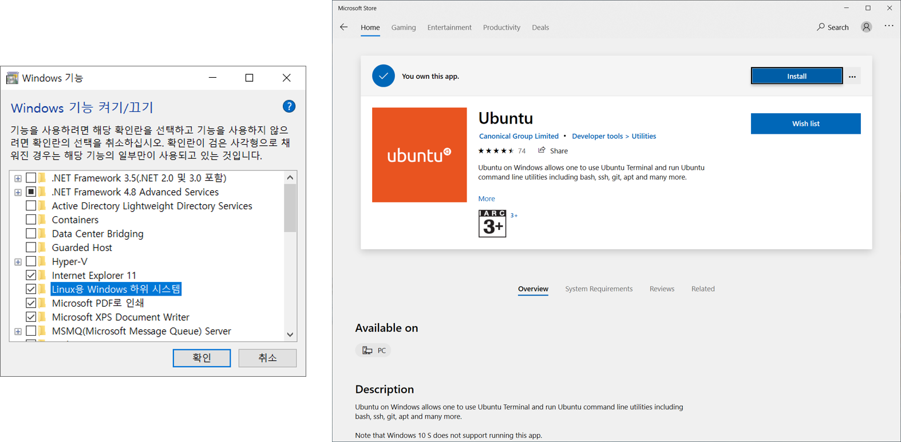
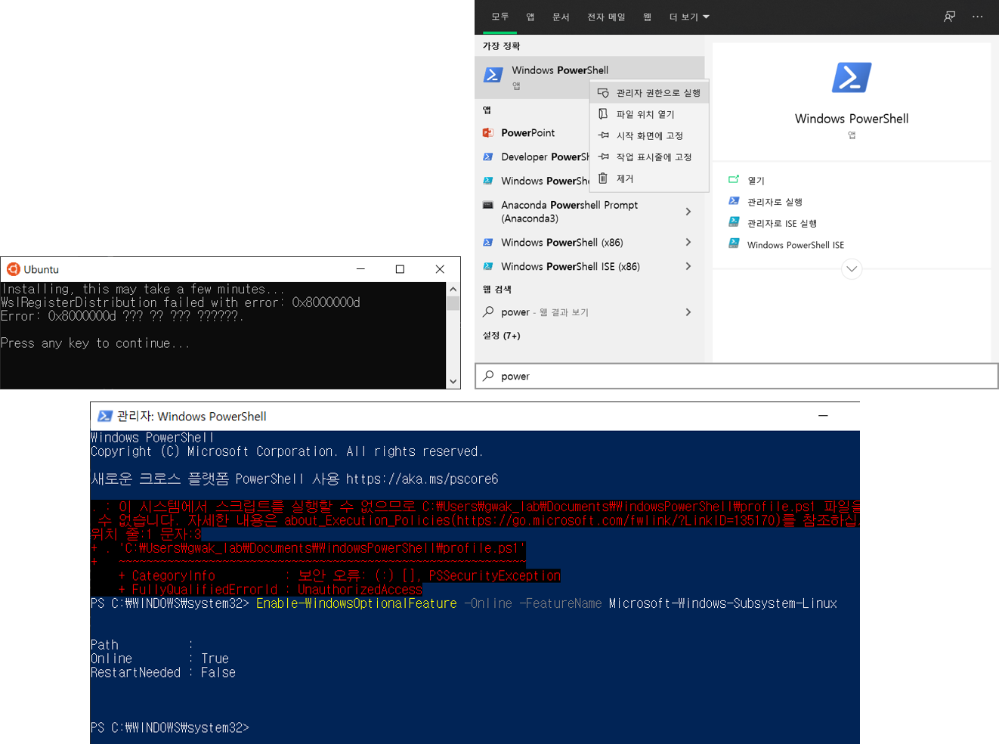

========
Windows
========

Packages
=========

Ubuntu 설치 및 사용
*******************

Windows 기능 켜기/끄기에서 Linux용 Windows 하위 시스템을 체크하고 재부팅을 한다. 그러고나서 Microsoft store에서 Ubuntu를 설치한다.

-----------------
Troubleshooting
-----------------

* WslRegisterDistribution failed with error: 0x8000000d

    * PowerShell을 관리자 권한으로 실행하여 Enable-WindowsOptionalFeature -Online -FeatureName Microsoft-Windows-Subsystem-Linux를 실행하면 해결됨 

:h4:`참조`

* `코코블루의 다락방, [PC] Windows 10에서 Ubuntu 설치 및 사용 <https://m.blog.naver.com/6116949/221244246623>`_

Windows 윈도우 10 에서 .sh bash 파일 실행하기
*********************************************

win-bash를 `다운 <https://sourceforge.net/projects/win-bash/>`_ 받아 압축 풀고 원하는 위치에 배치한다. 그러고나서 그 위치를 환경 변수의 Path에 등록하면 .sh 파일을 실행할 수 있다.

::

    sh xxx.sh

:h4:`참조`

* `WhaReview, Windows 윈도우 10 에서 .sh bash 파일 실행하기 <https://whareview.tistory.com/13>`_
