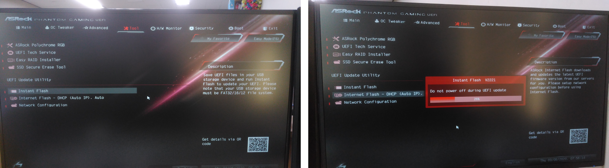

=====
BIOS
=====

BIOS를 업데이트 하는 방법은 여러 가지가 있는데, 여기서는 BIOS에서 직접 인터넷으로 업데이트 하는 방법을 설명하려고 한다. USB로 업데이트 하는 방법은 링크만 공유했다.

Internet flash
===============

위 좌측 그림의 Internet Flash를 선택하면 최신 BIOS를 인터넷에서 자동으로 다운받는다. 다운이 완료되면 위 우측 그림처럼 자동으로 BIOS가 업데이트 되고, 이 때 컴퓨터가 꺼지면 BIOS에 심각한 문제가 생길 수 있으니 주의해야 한다.

Instant flash
==============

USB를 이용하여 BIOS를 업데이트 하는 방법은 `링크 <https://www.youtube.com/watch?v=PbyB-drELXE>`_ 에서 확인할 수 있다.
