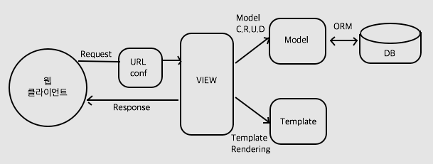

Django
=======

=======================
웹 프로그래밍
=======================

HTTP (HyperText Transfer Protocol) 프로토콜로 통신하는 클라이언트와 서버를 개발하는 작업

.. figure:: img/web_server_architecture.png
    :scale: 70%

========
Django
========

Python으로 만들어진 웹 프레임워크

MTV (Model Template View) 패턴을 따름

MTV 패턴은 MVC (Model View Controller) 패턴과 동일한데 이름만 다른 패턴

.. figure:: img/mvc_pattern.png
    :scale: 80%

**ORM (Object-Relational Mapping)**

Model이라는 객체를 이용하여 관계 테이블을 생성 또는 조작함 (C.R.U.D)

    * Create = insert
    * Read = select
    * Update = update
    * Delete = delete

DB를 SQL문을 작성하여 직접 접근할 필요가 없음

=======
Model
=======

**Django**

Table을 Class로 정의할 수 있고, 각 필드는 변수로 선언하고 파라미터로 제약조건을 추가할 수 있다.

::

    from django.db import models

    class Person(models.Model):
        first_name = models.CharField(max_length=30)
        last_name = models.CharField(max_length=30)

**SQL문**

::

    CREATE TABLE myapp_person (
        "id" serial NOT NULL PRIMARY KEY,
        "first_name" varchar(30) NOT NULL,
        "last_name" varchar(30) NOT NULL
    );

**관련 링크**
    * Model에 대한 상세 설명 (https://docs.djangoproject.com/ko/2.1/topics/db/models/)
    * Model을 활용한 C.R.U.D 관련 설명 (https://docs.djangoproject.com/ko/2.1/topics/db/queries/)

========
Template
========

settings.py에 Template의 위치 지정할 수 있고, 일반적인 HTML, CSS, Javascript 사용 가능

::

    TEMPLATE_DIRS = ['/hom/shkim/pyBook/ch3/templates']

**Template 예시**

::

    
    <!DOCTYPE html>
    <html>
    <head>
        <meta charset="utf-8">
        <title>CODI</title>
        <link rel="stylesheet" type="text/css" href="/static/admin/css/base.css">
    ...
        

            

                <ul class="nav nav-pills" style="display:inline-block;">
                    <li role="presentation"><a href="/" class='h5'>Home</a></li>
                    ...
                    <li role="presentation"><a href="/private_information" class='h5'>개인정보처리방침</a></li>
                </ul>
                 
                Copyright (C) Computational Systems Biology Laboratory 2018 All Rights Reserved
            

        

    </body>
    </html>

View에서 Template에 변수를 전달하여 사용할 수 있고, 사용자 정의 함수를 정의하여 Template에서 사용 가능

**변수 전달 후 사용 예제**

::

    # View
    user = Member.objects.get(username=request.user.username)
    response = render(request, 'standardization/project.html', {"project": user.project})

::

    <!-- Template -->
    

        
        
        
        
        
    

**사용자 정의 함수 정의 및 사용 예제**

::

    # 사용자 정의 함수
    @register.filter(name='process_longer_list')
    def process_longer_list(element):
        # 배열이 긴 경우 축소 시키는 함수
        if isinstance(element, list):
            if len(element) > 3:
                temp_element = element[:3]
                temp_element.append(str(len(element) - 3) + ' others')
                element = str(temp_element) \
                        + ' <a href="#" data-toggle="tooltip" title="' + str(element) + '">more</a>'
        return element

::

    <!--Template-->
    <td id="{{ field }}">{{ element|process_longer_list|safe }}</td>

**관련 링크**
    * 사전 정의된 Template 용 함수 (https://docs.djangoproject.com/en/2.1/ref/templates/builtins/)
    * 사용자 정의 함수 관련 설명 (https://docs.djangoproject.com/en/2.1/ref/templates/builtins/)

========
View
========

**뷰의 3가지 역할**
    * 웹 요청을 받아서 데이터베이스 접속 등 해당 애플리케이션의 로직에 맞는 처리
    * 결과 데이터를 HTML로 변환하기 위하여 템플릿 처리
    * 최종 HTML로 응답 데이터를 웹클라이언트로 반환하는 역할

**함수형 뷰**

::

    # urls.py
    from django.conf.urls import url

    urlpatterns = [url(r'^datetime/', views.current_datetime, name='login'),]

::

    # views.py
    from django.http import HttpResponse
    import datetime

    def current_datetime(request):
        now = datetime.datetime.now()
        html = "<html><body>It is now %s.</body></html>" % now
        return HttpResponse(html)

**클래스형 뷰**

클래스형 뷰를 사용하면 상속과 믹스인 기능을 사용해서 코드를 재사용할 수 있고, 뷰를 체계적으로 구성할 수도 있다.

::

    # urls.py
    from django.conf.urls import patterns
    from myapp.views import MyView

    urlpatterns = patterns('', (r'^about/', MyView.as_view()), )

::

    # views.py
    from django.http import HttpResponse
    from django.views.generic import View

    class MyView(View):
        def get(self, request):
            # 뷰 로직 작성
            return HttpResponse('result')

=======
URLconf
=======

클라이언트가 요청한 URL을 어떤 뷰의 함수 또는 클래스 뷰를 이용하여 처리할 지를 결정해주는 부분

::

    from django.conf.urls import patterns, url
    from . import views

    urlpatterns = patterns('',
        url(r'^articles/2003/$', views.special_case_2003),
    )

========
Database
========

Database와의 연동을 위해 settings.py에 연결정보를 입력하고 Model을 이용하여 Database의 내용을 생성, 조작, 검색한다.

::

    # settings.py
    DATABASES = {
        'default': {
            'ENGINE': 'django.db.backends.postgresql',
            'NAME': 'edsp',
            'USER': 'csbl',
            'PASSWORD': 'xxxxx',
            'HOST': '203.227.34.22',
            'PORT': '5432',
            'CHARSET': 'utf8'
        }
    }

=======
Form
=======

<form> ... </form> 사이에 정의된 element 집합을 통해 데이터를 주고 받는 다양한 기능에 활용된다.
Django에서는 form 태그를 클래스화 하여 Form을 Python으로 체계적으로 정의하여 기능을 함수 형태로 사용 가능하게 했다.
Form에 Model 정보를 포함하여 Form으로 전달된 데이터를 Model을 활용하여 DB에 저장, 수정 등이 가능하다.

::

    class NameForm (form):
        your_name = forms.CharField(max_length=100)

        class Meta:
            model = NameModel

또한, View에서 Form을 다양하게 활용할 수 있다 (P.179).

추가적으로 GenericEditVIew도 있다 (P.188).

**관련 링크**
    * Form 관련 내용 (https://docs.djangoproject.com/en/2.1/topics/forms/)

===========================
프로젝트의 디렉토리 구성
===========================

::

    ch3/
        db.sqlite3
        manage.py
        mysite
            __init__.py
            settings.py
            urls.py
            wsgi.py
        polls
            __init__.py
            migrations
                __init__.py
            models.py
            tests.py
            views.py

**manage.py**

settings.py에 정의된 환경설정을 로딩하고 내부적으로 서버를 생성하여 요청 처리 결과를 커맨드 라인에서 보여주는데 활용되는 파일

::

    #!/usr/bin/env python
    import os
    import sys

    if __name__ == "__main__":
        os.environ.setdefault("DJANGO_SETTINGS_MODULE", "mysite.settings")
        try:
            from django.core.management import execute_from_command_line
        except ImportError:
            # The above import may fail for some other reason. Ensure that the
            # issue is really that Django is missing to avoid masking other
            # exceptions on Python 2.
            try:
                import django
            except ImportError:
                raise ImportError(
                    "Couldn't import Django. Are you sure it's installed and "
                    "available on your PYTHONPATH environment variable? Did you "
                    "forget to activate a virtual environment?"
                )
            raise
        execute_from_command_line(sys.argv)

**App**

Django는 App간의 소통으로 처리를 진행한다. App은 하나의 타입을 처리하는 그룹이라고 볼 수 있다.
예를 들면 검색하는 기능을 하는 App과 로그인이나 회원가입 등을 담당하는 App 등으로 구분할 수 있다.

**settings.py**

Django의 환경설정을 담당하는 부분

::

    """
    Django settings for mysite project.
    Generated by 'django-admin startproject' using Django 1.11.6.
    For more information on this file, see
    https://docs.djangoproject.com/en/1.11/topics/settings/
    For the full list of settings and their values, see
    https://docs.djangoproject.com/en/1.11/ref/settings/
    """

    # Build paths inside the project like this: os.path.join(BASE_DIR, ...)
    BASE_DIR = os.path.dirname(os.path.dirname(os.path.abspath(__file__)))

    # Quick-start development settings - unsuitable for production
    # See https://docs.djangoproject.com/en/1.11/howto/deployment/checklist/

    # SECURITY WARNING: keep the secret key used in production secret!
    SECRET_KEY = '%4l+wp(p6gvt6t+us#maan1!z*nzrszf!y$asq$vrf0vu(e0hq'

    # SECURITY WARNING: don't run with debug turned on in production!
    DEBUG = True
    ALLOWED_HOSTS = ['*']

    # Application definition

    INSTALLED_APPS = [
        'django.contrib.admin',
        'django.contrib.auth',
        'django.contrib.contenttypes',
        'django.contrib.sessions',
        'django.contrib.messages',
        'django.contrib.staticfiles',
    ]

    MIDDLEWARE = [
        'django.middleware.security.SecurityMiddleware',
        'django.contrib.sessions.middleware.SessionMiddleware',
        'django.middleware.common.CommonMiddleware',
        'django.middleware.csrf.CsrfViewMiddleware',
        'django.contrib.auth.middleware.AuthenticationMiddleware',
        'django.contrib.messages.middleware.MessageMiddleware',
        'django.middleware.clickjacking.XFrameOptionsMiddleware',
    ]

    ROOT_URLCONF = 'mysite.urls'

    TEMPLATES = [
        {
            'BACKEND': 'django.template.backends.django.DjangoTemplates',
            'DIRS': [os.path.join(BASE_DIR, 'templates'), os.path.join(BASE_DIR, 'static')],
            'APP_DIRS': True,
            'OPTIONS': {
                'context_processors': [
                    'django.template.context_processors.debug',
                    'django.template.context_processors.request',
                    'django.contrib.auth.context_processors.auth',
                    'django.contrib.messages.context_processors.messages',
                ],
            },
        },
    ]

    WSGI_APPLICATION = 'mysite.wsgi.application'

    # Database
    # https://docs.djangoproject.com/en/1.11/ref/settings/#databases
    DATABASES = {
        'default': {
            'ENGINE': 'django.db.backends.postgresql',
            'NAME': 'mysite',
            'USER': 'test',
            'PASSWORD': 'test1!',
            'HOST': localhost,
            'PORT': '5432',
            'CHARSET': 'utf8'
        },
    }

    AUTH_USER_MODEL = "accounts.Member"

    # Password validation
    # https://docs.djangoproject.com/en/1.11/ref/settings/#auth-password-validators

    AUTH_PASSWORD_VALIDATORS = [
        {
            'NAME': 'django.contrib.auth.password_validation.UserAttributeSimilarityValidator',
        },
        {
            'NAME': 'django.contrib.auth.password_validation.MinimumLengthValidator',
        },
        {
            'NAME': 'django.contrib.auth.password_validation.CommonPasswordValidator',
        },
        {
            'NAME': 'django.contrib.auth.password_validation.NumericPasswordValidator',
        },
    ]

    # Internationalization
    # https://docs.djangoproject.com/en/1.11/topics/i18n/

    LANGUAGE_CODE = 'en-us'

    TIME_ZONE = 'Asia/Seoul'

    USE_I18N = True

    USE_L10N = True

    USE_TZ = True

    # Static files (CSS, JavaScript, Images)
    # https://docs.djangoproject.com/en/1.11/howto/static-files/

    STATIC_URL = '/static/'
    STATICFILES_DIRS = (
        os.path.join(BASE_DIR, 'static'),
    )

**wsgi.py**

::

    """
    WSGI config for edsp project.
    It exposes the WSGI callable as a module-level variable named ``application``.
    For more information on this file, see
    https://docs.djangoproject.com/en/1.11/howto/deployment/wsgi/
    """

    import os

    from django.core.wsgi import get_wsgi_application

    os.environ.setdefault("DJANGO_SETTINGS_MODULE", "edsp.settings")

    application = get_wsgi_application()

**migrations**

Model을 이용한 Database의 Table 구조 변경 시 적용된 결과 History를 남기는 부분이다.
그래서 과거의 Table 구조로 되돌리는 기능도 있다.

===============
Reference
===============

* [Django로 배우는 쉽고 빠른 웹개발] 파이썬 웹 프로그래밍, 김석훈, 2015
* https://wayhome25.github.io/django/2018/03/03/django-deploy-02-nginx-wsgi/
* https://opentutorials.org/course/697/3828
* http://sonej.tistory.com/53
