===========
Git 사용법
===========

새로운 저장소 만들기
====================

저장소는 크게 현재 컴퓨터에서 작업하는 로컬 저장소와 백업과 협업을 위해 다른 컴퓨터에서 코드를 버전 관리하는 원격 저장소로 구분할 수 있다. 여기에서는 먼저 로컬 저장소를 Git으로 다루는 방법을 설명하려고 한다.

Git을 사용하여 프로젝트 코드를 관리하기 위해서는 우선 프로젝트 폴더를 Git 저장소로 만들어야 한다. 아래 그림처럼 먼저 프로젝트 폴더를 만들 위치로 이동하고 :code:`mkdir gitfth` 로 폴더 생성 후 폴더 안으로 이동한다. 그러고 나서 :code:`git init` 이라는 명령어를 실행하면, Git에게 현재 프로젝트 폴더를 버전 관리하겠다고 알리게 된다.

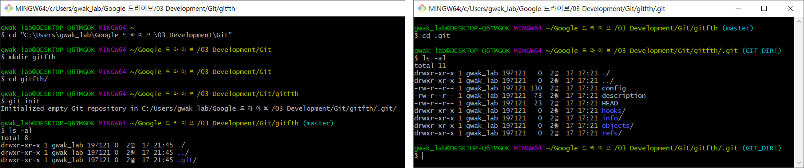

    Git Init

그 결과 위 그림처럼 프로젝트 폴더가 새로운 Git 저장소로 만들어지고 .git 폴더 안에 버전 관리에 필요한 여러 가지 파일들이 생성된다.

버전 만들기
============

버전은 의미있는 변화를 의미하고 특정 작업이 완료된 상태를 의미한다. Git은 버전을 만들기 위해 :code:`add` 와 :code:`commit` 명령어를 사용하고, 이 작업들은 크게 세가지 영역에서 진행된다. 각 영역은 Working directory, Index (Stage), Head이다. 하나씩 살펴보자.

.. figure:: ../img/git/git_workflow.png
    :align: center
    :scale: 60%

    Git Workflow

* Working directory (작업 디렉토리)
    
    * 실제 작업하고 있는 파일들로 구성

* Index (Stage)

    * commit을 대기하고 있는 add로 추가된 파일들의 영역 (준비 영역)

* HEAD (Repository)

    * commit을 통해 최종적으로 확정된 파일들로 구성된 영역

정리하면, 버전 만들기 작업은 작업 디렉토리에서 작업한 내용들을 :code:`add` 로 Stage 영역에 대기시키고, 모든 작업이 끝난 경우에 Stage 영역에서 대기하고 있는 파일들을 최종적으로 :code:`commit` 하여 새로운 버전을 만드는 과정으로 진행된다. 각 영역에 대한 자세한 내용은 `여기 <https://hackernoon.com/understanding-git-index-4821a0765cf>`_ 를 참고하면 좋을 것 같다.

add
****

새로운 버전을 만들기 위해서는 우선 새롭게 추가되거나 수정된 파일을 Git에게 알려주어야 한다. 이를 위해 :code:`git add <파일이름>` 또는 :code:`git add *` 명령어를 사용할 수 있다. :code:`add` 를 하게 되면 추가되거나 수정된 파일들이 :code:`commit` 을 대기하는 파일들의 영역 (Stage)으로 이동한다. 

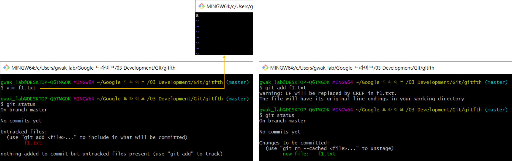

    Git Add

본질적으로 :code:`add` 기능이 필요한 이유는 프로젝트에 핵심적인 파일만 관리하고 개발이나 테스트를 위해 임시로 필요한 파일들은 관리하지 않음을 명확하게 명시하기 위해서이다. 즉, 선택적으로 원하는 파일만 추가할 수 있다는 의미이다 (과거에는 변경된 전체 파일을 새로운 버전을 만들 때 반영해야 했음).

commit
*******

새로운 버전을 만들기 전에 먼저 이 버전을 누가 만들었는지에 대한 정보를 추가해야 한다. 이 작업을 하면 새로운 버전을 누가 만들었는지 다른 사람들이 알 수 있게 된다. 그리고 이제 Stage에 있는 :code:`add` 로 추가한 파일들을 :code:`commit` 으로 확정하여 새로운 버전을 만들려고 한다. :code:`commit` 명령어는 :code:`git commit -m "설명"` 과 같이 사용될 수 있다. 하지만 아직 원격 저장소에 반영된 상태는 아니다.

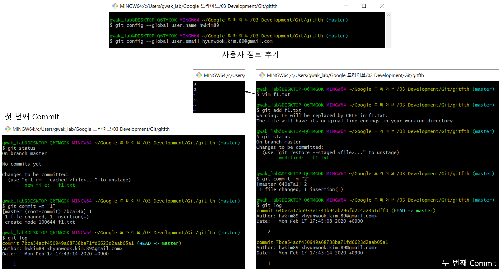

    사용자 정보 추가 (위), Commit (나머지)

위 예시에서는 먼저 :code:`add` 로 추가한 f1.txt을 :code:`commit` 하여 새로운 버전 만든다. 그리고 한번 더 파일을 수정한 후에 :code:`add` → :code:`commit` 을 실행하면 또 새로운 버전이 만들어진다. Git의 현재 상태는 :code:`git status` 로 확인할 수 있고, 지금까지 만든 버전에 대한 기록은 :code:`git log` 로 확인할 수 있다.

log and diff
*************

:code:`log` 와 :code:`diff` 를 이해하기 위해 f1.txt 내용을 3번 더 수정한 후 :code:`add` 와 :code:`commit` 을 반복하여 아래와 같이 만든다. 참고로 :code:`git commit -am "설명"` 에서 :code:`-am` 옵션은 이미 한 번 :code:`add` 한 파일에 대해 :code:`add` 와 :code:`commit` 을 한 번에 할 수 있게 해주는 옵션이다.

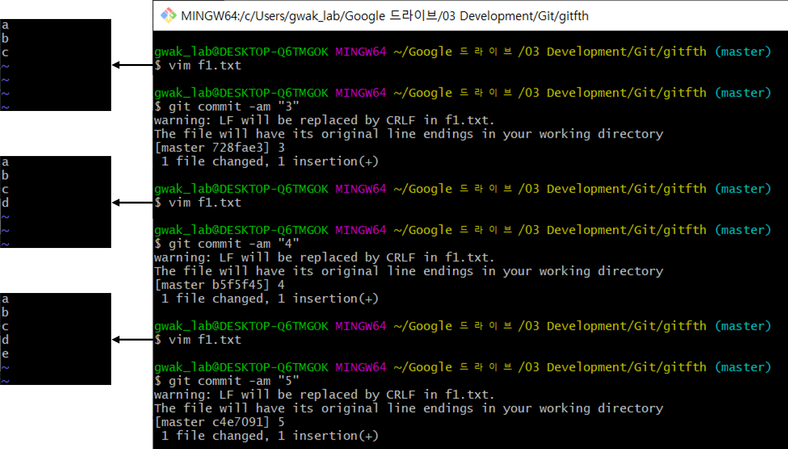

:code:`git log` 는 각 버전의 차이점을 확인할 수 있는 명령어이고, 각 Commit의 소스 코드 차이를 보기 위해서는 :code:`-p` 옵션을 추가하면 된다.

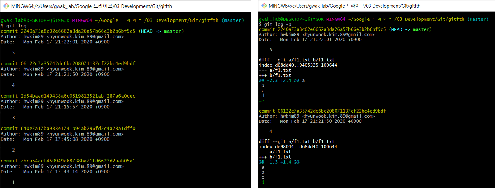

    git log and git log -p

또한, :code:`git log` 뒤에 Commit 식별자를 추가하면 해당 Commit 이전의 Commit만 보여주고, 두 Commit 사이의 차이점을 확인할 때는 :code:`git diff <Commit 식별자1>..<Commit 식별자2>` 를 사용하면 된다. 여기에서는 4번째 Commit과 2번째 Commit 사이의 차이를 확인했다.

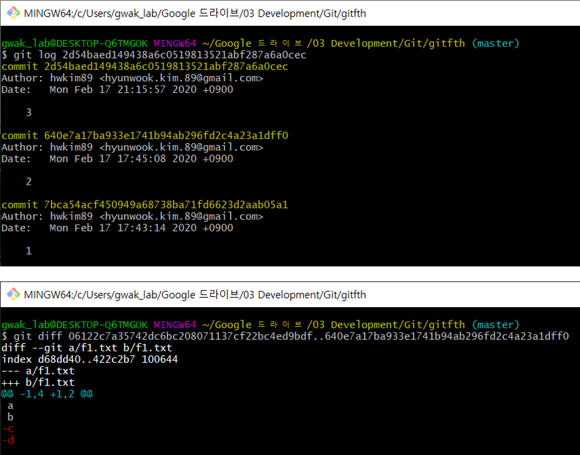

    git log and git diff

reset
******

로컬에서 변경한 내용을 되돌리는 방법에는 크게 reset과 revert가 있다. 여기에서는 reset만 다뤄보려고 한다.

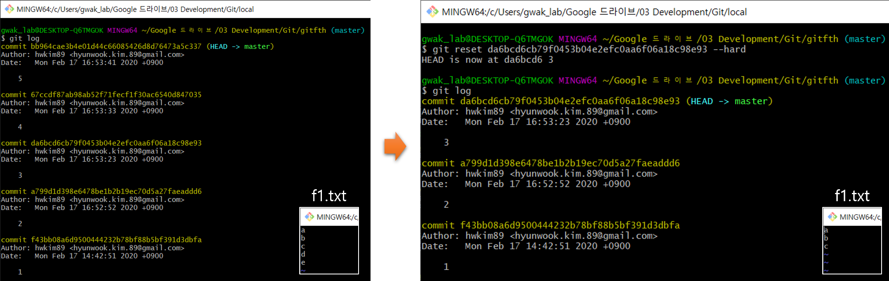

    Git Reset

위 그림처럼 :code:`git reset <commit 식별자> --hard` 명령어를 통해 5번째 commit에서 3번째 commit으로 돌아갈 수 있다. 여기서 :code:`--hard` 옵션은 commit 한 내용을 되돌리는 조금 위험한 방법이고, 이 외에도 soft하게 commit을 되돌리는 방법들이 있다. 하지만 더 많은 내용을 이해해야 하기 때문에 여기서는 단순히 :code:`--hard` 옵션을 사용하면 commit을 되돌릴 수 있다고 이해하면 될 것 같다.

Branch
=======

Branch는 코드를 새로운 목적을 위해 원래 코드와 상관없이 독립적으로 개발할 때 사용하는 방법이다. 예를 들어 아래 그림처럼 face_recognition.py라는 코드를 개발하면서 버전 관리를 하다가 추가 기능 개발을 위해 코드를 복사해서 따로 개발을 한다고 해보자.

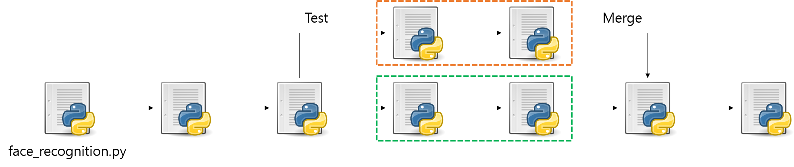

    Branch and Merge

face_recognition.py는 2번 코드가 수정되어 버전 관리가 되고 있었다. 그러다가 새로운 기능을 테스트 하기 위해 2번 수정된 face_recognition.py 코드를 복제한 후 수정할 수 있다 (:orange:`오렌지 박스`). 동시에 2번 수정된 기존 face_recognition.py 코드도 개발되어 새로운 코드로 변경될 수 있다 (:green:`초록 박스`).

그리고 추후에 테스트로 기능 개발했던 코드가 성공적이면, 기존 face_recognition.py에서 수정된 코드와 병합해야 할 수 있다. 그러한 경우에 위와 같이 병합을 하고 병합된 후에도 수정하면서 계속 버전 관리가 진행될 수 있다.

위 그림에서 새로운 목적을 위해 기존 코드를 복제해여 독립적으로 개발하는 것을 새로운 분기 (branch)를 만든다고 이야기하고, 추후 이 내용을 원래 코드와 합치는 부분을 병합 (merge)한다고 말한다. 그러면 지금부터 Git에서 Branch를 어떻게 다룰 수 있는지 살펴보자.

Branch 만들기
**************

우선, 지금까지 다룬 버전 관리 내용은 :code:`rm -rf .git` 명령어로, f1.txt 파일은 :code:`rm f1.txt` 명령어로 삭제하자. 그리고 Branch를 이해하기 위해 Git을 초기화 한 후, 간단하게 몇 개의 파일만 :code:`add` 와 :code:`commit` 을 해보자.

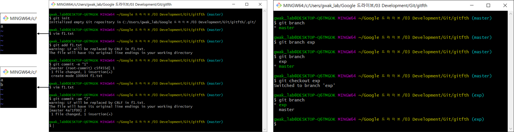

    Git 초기화 후 Add와 Commit (왼쪽), Branch 추가 (오른쪽)

Git은 기본적으로 master branch를 가지고 있고 이는 :code:`git branch` 로 확인할 수 있다. 여기에 새로운 Branch는 :code:`git checkout <새로운 Branch 이름>` 를 통해 만들 수 있고, :code:`git checkout <새로운 Branch 이름>` 를 이용해 새롭게 생성한 Branch로 이동할 수 있다.

또한, 각 Branch는 아래 그림처럼 독립적으로 개발될 수 있다.

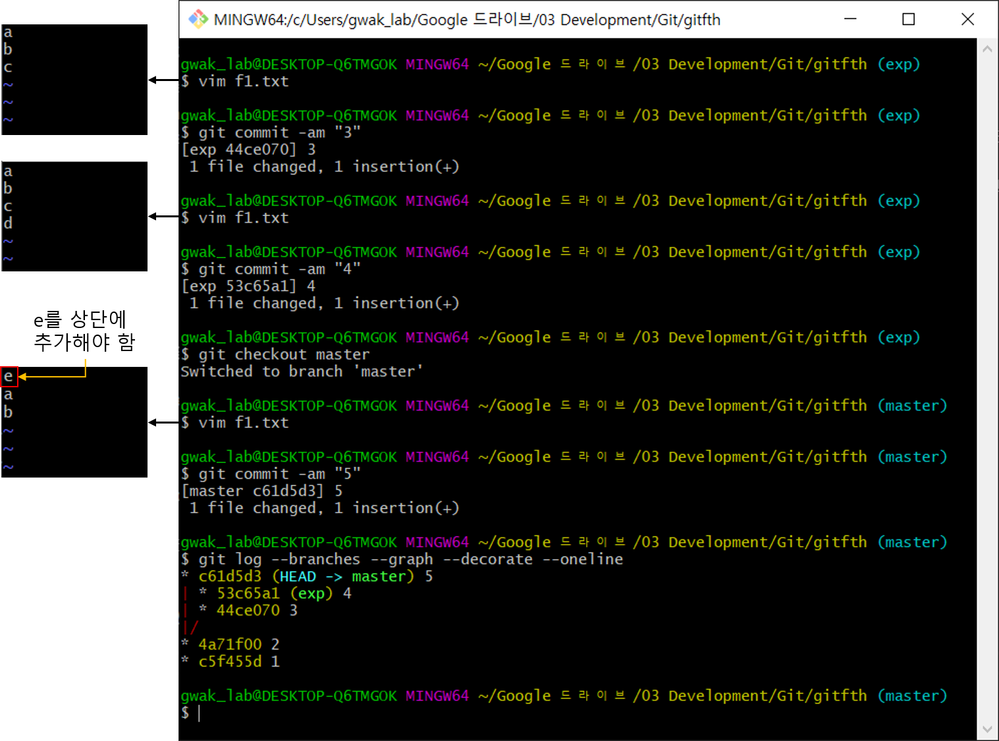

    두 Branch를 독립적으로 수정함
    
여기서 master, exp branch의 f1.txt 파일을 각각 수정하고 :code:`commit` 하면, master와 exp branch는 같은 파일이 다른 내용을 가지게 된다. 이처럼 새로운 목적으로 Branch를 만들고 원래 Branch와 새로운 Branch를 독립적으로 개발할 수 있으며 이것이 Branch의 목적이다. 참고로 :code:`git log --branches --graph --decorate --oneline` 은 Git의 History를 간단한 Graph 형태로 보여주는 명령어이다.

Branch 병합
************

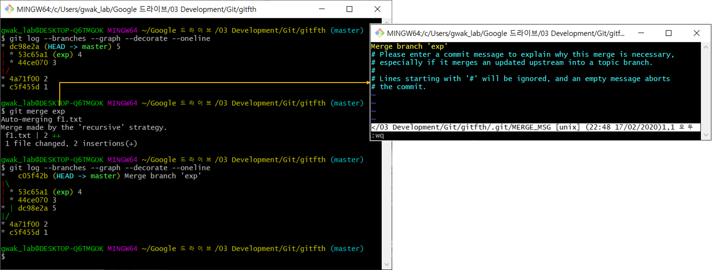

    master branch → exp branch

두 Branch를 병합할 때는 방향이 2가지 있다. 위 예제에서는 master → exp 로 병합하는 경우와 exp → master 로 병합하는 경우이다. 첫 번째 경우는 :code:`git checkout master` 로 master branch로 checkout 하고 (위 그림에서는 이미 master로 checkout 되어 있음), :code:`git merge exp` 를 실행하여 exp branch가 master branch로 병합되는 경우이다. :code:`git merge exp` 를 했을 때 위 오른쪽 그림의 내용이 나오는 경우, :code:`:wq` 를 입력하고 엔터를 치면 exp branch가 master branch로 병합된다.

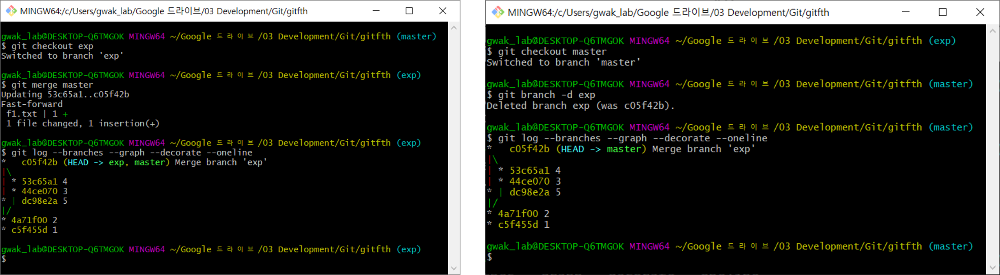

    exp branch → master branch (왼쪽), exp branch 삭제 (오른쪽)

두 번째 경우도 유사하게 :code:`git checkout exp` 로 exp branch로 checkout 하고, :code:`git merge master` 를 실행하면 master branch가 exp branch로 병합된다. 추가로 Branch가 더 이상 필요없는 경우에는 먼저 삭제하고 싶은 Branch가 아닌 다른 Branch로 checkout 하고, :code:`git branch -d exp` 를 통해 삭제할 수 있다.

Branch 충돌 해결
****************

Branch를 병합할 때 같은 파일을 수정하는 경우 충돌이 발생할 수 있다. 아래 예제는 같은 파일을 수정하지만 그 위치가 다른 경우이다.

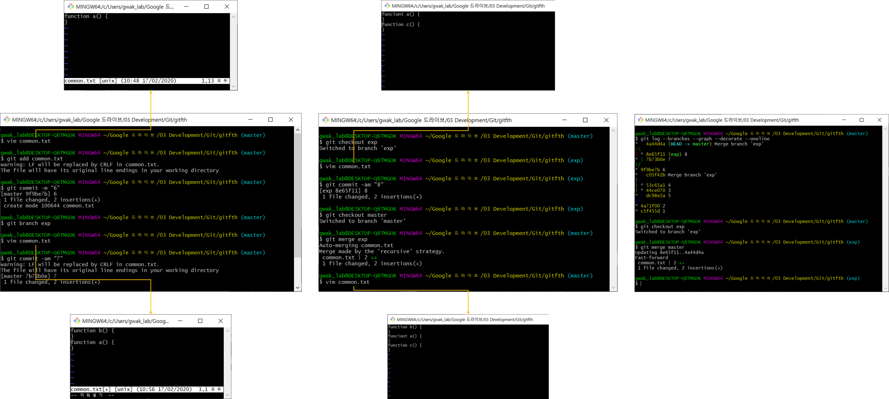

    두 Branch를 자동으로 병합함

위 예제는 아래와 같은 단계로 Branch를 병합했다.

* master branch에서 vim으로 내용이 "function a() {}"인 common.txt 파일을 생성한 후 :code:`add` 와 :code:`commit` 하기
* exp branch를 생성한 후 master branch에서 common.txt의 상단에 "function b() {}" 내용을 추가하고 :code:`add` 와 :code:`commit` 하기
* exp branch로 checkout 한 후 common.txt의 하단에 "function c() {}" 내용을 추가하고 :code:`add` 와 :code:`commit` 하기
* master branch로 checkout 하고 exp를 master로 병합한 후 common.txt 내용 확인
* exp branch로 checkout 하고 master를 exp로 병합하기

위 예제처럼 같은 파일을 수정하더라도 그 위치가 다르면 Git이 자동으로 병합해준다. 하지만 아래 예제처럼 같은 파일의 같은 위치를 수정하고 병합하는 경우 충돌이 발생할 수 있다.

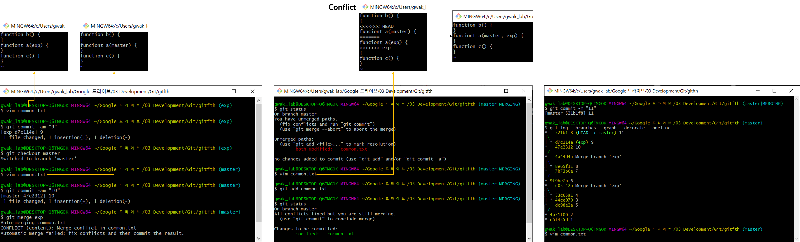

    Merge와 conflict

위 예제는 아래와 같은 단계로 Branch를 병합하고 충돌을 해결했다.

* exp, master branch의 common.txt 파일에 "function a() {}" 의 매개변수로 각각 exp, master를 추가한 후 수정
* 수정한 내용을 각 Branch에서 :code:`add` 와 :code:`commit` 하기
* master branch로 checkout 한 후 merge 했을 때 충돌 발생
* common.txt의 파일 내용 중 충돌이 난 부분을 적절히 수정한 후, :code:`add` 와 :code:`commit` 하여 병합 (충돌 해결)

Git은 병합 시 충돌이 날 경우 파일 내에서 충돌난 부분을 표시하여 사용자가 수작업으로 수정할 수 있게 한다 (위 그림에서 Conflict 부분 확인). 충돌이 난 부분을 수작업으로 수정한 후 :code:`add` 와 :code:`commit` 하면 충돌이 해결된 파일이 반영되어 정상적으로 병합된다.

:h2:`참조`

* `지옥에서 온 Git <https://www.youtube.com/playlist?list=PLuHgQVnccGMA8iwZwrGyNXCGy2LAAsTXk>`_
* `git - 간편 안내서 <https://rogerdudler.github.io/git-guide/index.ko.html>`_
