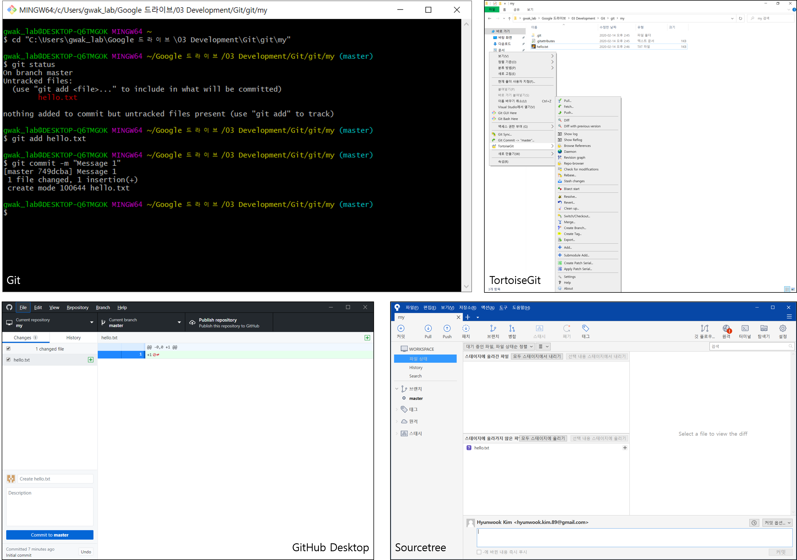
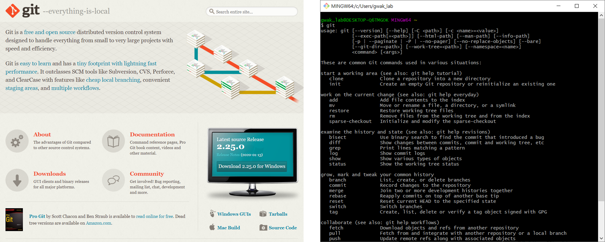

==========
Git 소개
==========

Git의 목적
==========

Git을 사용하는 목적은 다음과 같다.

* 버전 관리 (Version)

    * 버전 관리는 여러 파일이 변경될 때마다 파일의 이름을 변경하지 않고 각 버전을 관리하는 것

* 백업 (Backup)과 복구 (Recovery)

    * 백업은 로컬 저장소에 있는 내용을 원격 저장소에 저장하는 것 (push)
    * 로컬 저장소에 있는 내용이 유실된 경우 원격 저장소에 있는 내용을 가져와 복구할 수 있음 (pull, clone)

* 협업 (Collaboration)

    * 원격 저장소에 push와 pull 작업을 통해 협업 가능
    * Git은 같은 파일을 처리하는 경우 자동으로 합쳐줌 (merge)
    * Git은 같은 파일 내 같은 행을 처리하는 경우 충돌 (conflit)을 나중에 파일을 수정한 사람에게 처리할 수 있게 알려줌

Git의 종류
===========

버전 관리 시스템에는 Git 외에도 `CVS <https://ko.wikipedia.org/wiki/CVS>`_ 와 `SVN <https://ko.wikipedia.org/wiki/%EC%84%9C%EB%B8%8C%EB%B2%84%EC%A0%84>`_ 이 있고, Git은 CVS와 SVN을 보완하여 만들어진 버전 관리 시스템이라고 보면 된다. 여기서는 Git에 대해 다루려고 하고, Git을 사용할 수 있는 프로그램은 크게 4가지가 있다.

* Git

    * Original 프로그램이고 명령어를 통해 Git을 사용할 수 있음
    * 이 프로그램을 기반으로 아래 3가지 프로그램이 만들어짐

* TortoiseGit

    * Windows에서만 사용할 수 있고, Windows에 기반하여 만들어진 프로그램

* Github Desktop

    * GitHub에서 제공하는 제품으로 Simple 해서 배우기는 좋지만 고급 기능이 부족함

* Sourcetree

    * 복잡하지만 Git의 고급 기능을 사용할 수 있어 자유로움

    Git, TortoiseGit, GitHub Desktop, Sourcetree

Git 설치
========

여기서는 Windows에서 Git을 설치하는 방법만 다룰 예정이다. Git은 Git 공식 홈페이지 (`Link <https://git-scm.com/>`_)에서 다운받아 기본 설정으로 설치를 완료하면 된다.

    Install Git

설치한 후에 Windows 검색 기능을 이용하여 Git Bash를 실행시키면 위 우측 그림과 같은 화면이 나오고, 여기에 git이라고 쳤을 때 관련된 설명이 나오면 설치가 잘 된 것이다.

:h2:`참조`

* `생활코딩, GIT1 <https://opentutorials.org/module/3733>`_
