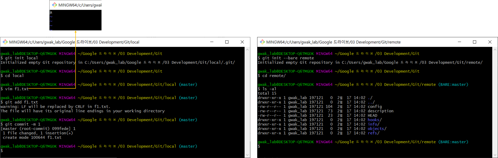
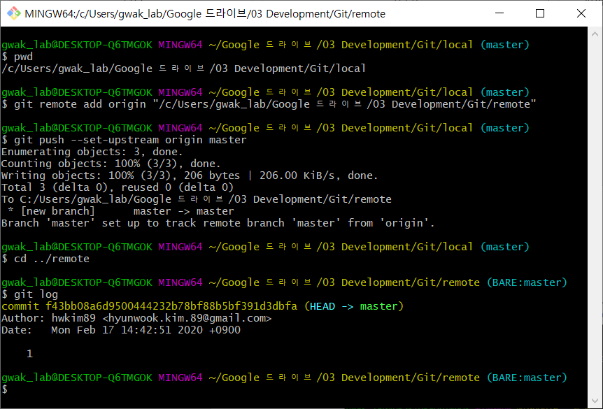
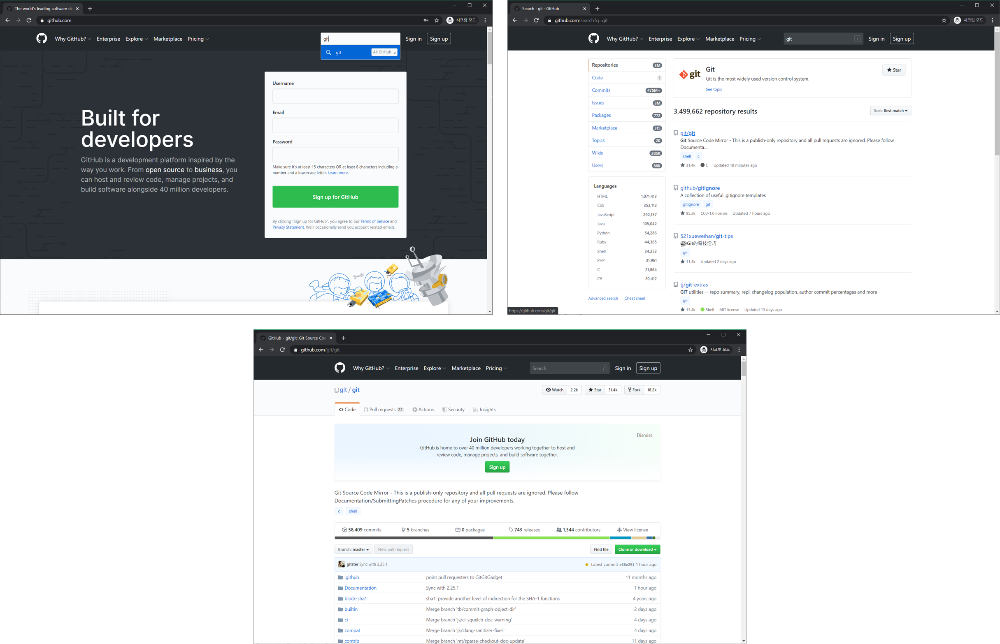
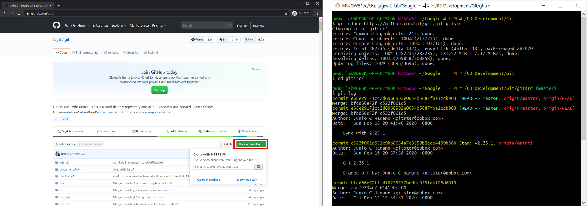
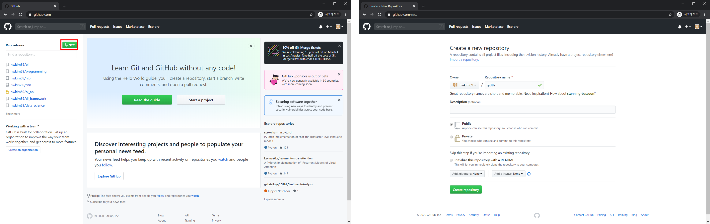
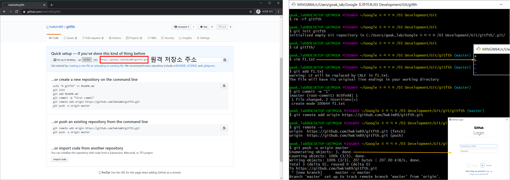
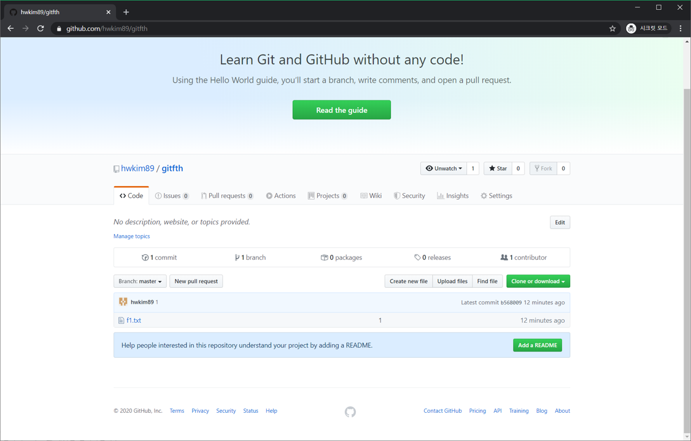
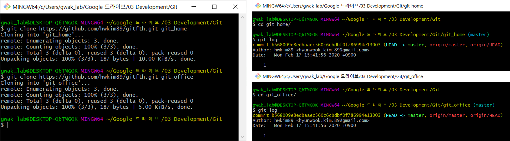
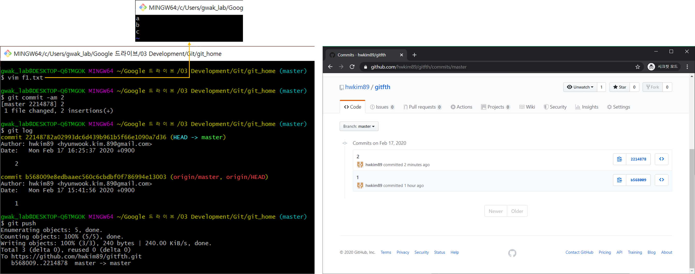
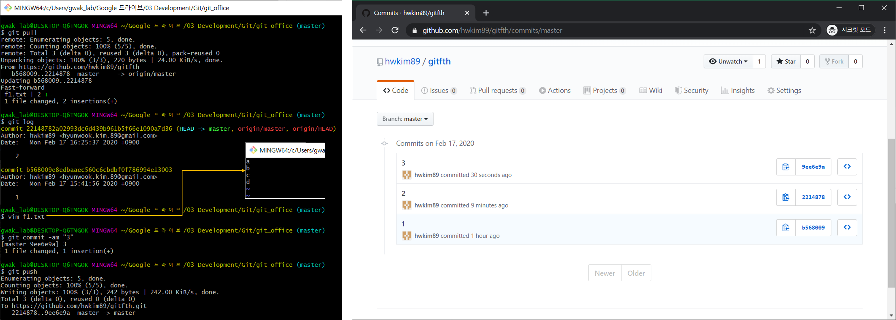

============
원격 저장소
============

원격 저장소 (Remote repository)는 현재 작업하고 있는 컴퓨터의 로컬 저장소 (Local repository)가 아닌 로컬 저장소와 연결된 다른 컴퓨터에 저장된 저장소를 의미한다. 원격 저장소는 크게 소스 코드를 백업하는 의미와 다른 사람과 협업한다는 2가지 의미가 있다.

일반적으로 원격 저장소는 다른 컴퓨터에 있다. 하지만 여기서는 조금 더 간단하게 원격 저장소에 대한 이해를 돕기 위해, 같은 컴퓨터에 원격 저장소를 만들고 테스트를 해보려고 한다. 우선 아래와 같이 로컬 저장소를 만들어주고, 다른 폴더에 원격 저장소를 생성해보자.

    Local and remote repository

위 우측 그림처럼 원격 저장소를 만들 때에는 :code:`git init --bare <원격저장소명>` 처럼 :code:`--bare` 라는 옵션을 붙여줘야 한다. :code:`--bare` 옵션은 원격 저장소가 작업을 할 수 없게 만드는 옵션이다 (Working directory X).

push
=====

로컬 저장소에서 수정한 내용을 원격 저장소에 반영하기 위해서는 먼저 로컬 저장소와 원격 저장소를 연결해야 한다.

    Connect to remote repository and Push

로컬 저장소에서 :code:`git remote add origin <remote 위치>` 명령어로 원격 저장소와 연결할 수 있다. 이 때 origin은 remote의 위치를 가리키는 별명이다. 이렇게 원격 저장소와 연결되면 :code:`push` 명령어로 로컬 저장소의 내용을 원격 저장소에 반영할 수 있다. 여기서 :code:`--set-upstream` 옵션은 앞으로 :code:`push` 명령어 뒤에 origin과 master를 생략해도, 원격 저장소의 master branch에 로컬 저장소의 master branch 내용을 :code:`push` 함을 지정하는 옵션이다.

pull
=====

:code:`pull` 은 원격 저장소에 저장된 내용을 로컬 저장소로 가져오는 방법이다. 실제로 어떻게 사용되는지는 아래의 동기화 방법 예시에서 확인해보자.

GitHub
=======

GitHub는 온라인에서 원격 저장소를 사용할 수 있게 해주는 서비스이다. 

    GitHub

GitHub에서는 본인의 원격 저장소를 만들 수도 있지만 다른 사람의 원격 저장소를 복제해서 기존 코드를 라이센스에 맞게 변경해서 사용할 수 있다. 다른 사람의 원격 저장소를 복제하는 방법은 다음과 같다. 먼저, 아래 좌측 그림과 같은 Clone or download 라는 버튼을 클릭하여 검색한 원격 저장소의 URL을 복사한다. 그리고 복사한 URL을 :code:`git clone <URL> <저장위치>` 명령어를 통해 코드를 복제할 수 있다.

    Clone Git

원격 저장소 만들기
******************

GitHub에 원격 저장소를 만들기 위해서는 먼저 GitHub에 가입한 후 로그인 해야 한다. 그리고 아래 좌측 그림의 좌측 Repository 메뉴 옆에 있는 New 버튼을 이용하여 새로운 원격 저장소를 만들 수 있다.

    Create Remote Repository in GitHub

Repository 이름은 원하는 이름으로 지정할 수 있고, 여기서 원격 저장소의 유형을 Public 또는 Private으로 선택할 수 있다. Public은 모든 사람에게 공개되는 원격 저장소를 만든다는 의미이고, Private은 본인만 볼 수 있는 원격 저장소를 만든다는 의미이다. 이 때 Private 원격 저장소는 일정 비용을 내고 유료로 사용할 수 있다. 마지막으로 Create repository 버튼을 클릭하면 새로운 원격 저장소가 만들어진다.

새롭게 만든 원격 저장소를 초기화하는 방법은 여러 가지가 있는데, 여기서는 로컬 저장소의 내용을 원격 저장소에 초기화하는 방법으로 원격 저장소를 초기화 해보려고 한다. 로컬 저장소는 기존 내용을 삭제하고 초기화 한 후, f1.txt 파일 하나만 생성하여 :code:`add` 와 :code:`commit` 을 해두자.

    Push Local Repository to Remote Repository

먼저, :code:`git remote add origin <원격 저장소 주소>` 로 로컬 저장소와 GitHub에 만든 원격 저장소를 연결시킨다. 그리고 나서 :code:`git push -u origin master` 로 원격 저장소에 :code:`push` 하면 아래 그림처럼 원격 저장소에 로컬 저장소 내용이 업데이트 된 것을 확인할 수 있다. :code:`push` 할 때 원격 저장소의 계정 정보를 요구하면 원격 저장소를 생성한 GitHub 계정 정보를 입력하면 된다.

동기화 방법
***********

원격 저장소는 여러 로컬 저장소의 작업들을 동기화해서 백업과 동시에 협업을 할 수 있는 환경을 만든다. 다음 예시를 통해 로컬 저장소와 원격 저장소를 동기화하는 방법을 이해해보자.

집과 사무실을 이동하며 개발하는 상황이라고 가정하고, 이전에 만든 원격 저장소를 복제하여 git_home, git_office라는 2개의 로컬 저장소를 만들어보자.

    Initialize two local repositories

먼저, 집에서 f1.txt 내용을 변경하고 원격 저장소에 :code:`push` 하면, 아래 우측 그림과 같이 집에서 수정한 내용이 원격 저장소에 반영된다.

    Push at Home

회사에 도착한 후 집에서 했던 작업을 :code:`pull` 로 가져오고, 여기에 f1.txt 내용을 다시 변경해서 :code:`push` 하면 회사에서 했던 내용이 원격 저장소에 반영된다.

    Pull and Push at the Office

이러한 작업을 반복해서 2개의 로컬 저장소에서 작업을 동기화 할 수 있고, 이를 통해 2개의 로컬 저장소와 1개의 원격 저장소에 백업이 되는 효과를 얻을 수 있다.

:h2:`참조`

* `지옥에서 온 Git <https://www.youtube.com/playlist?list=PLuHgQVnccGMA8iwZwrGyNXCGy2LAAsTXk>`_
