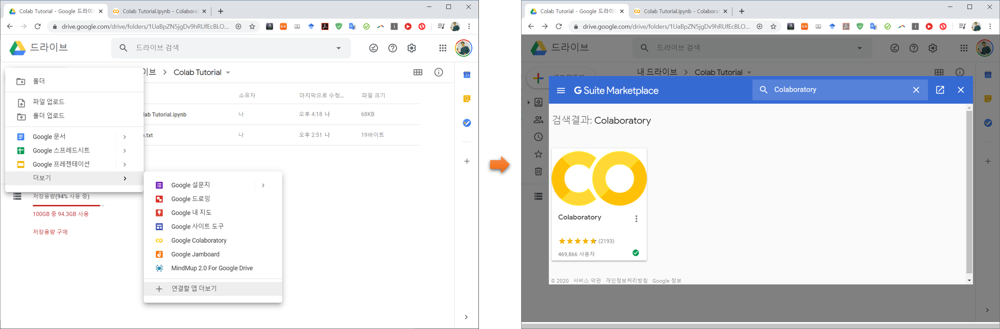
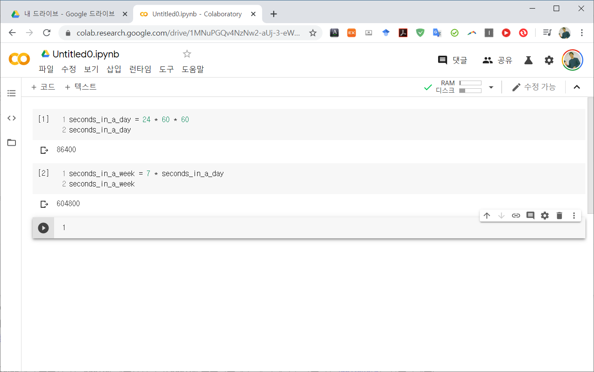
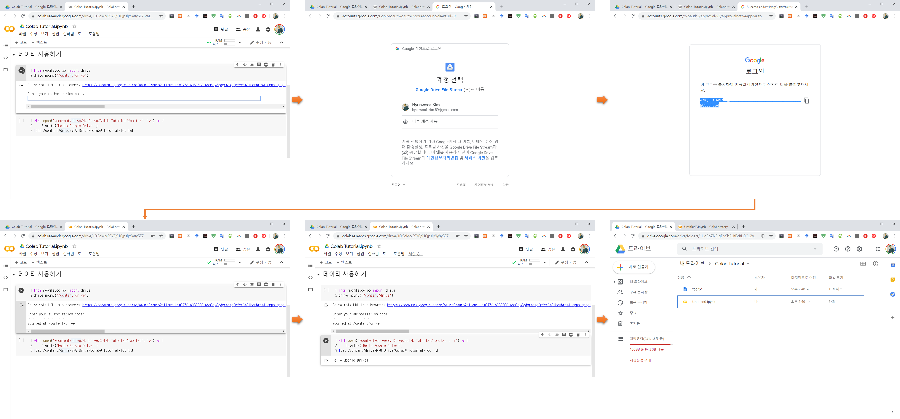
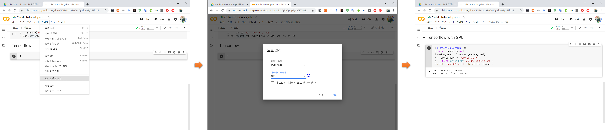
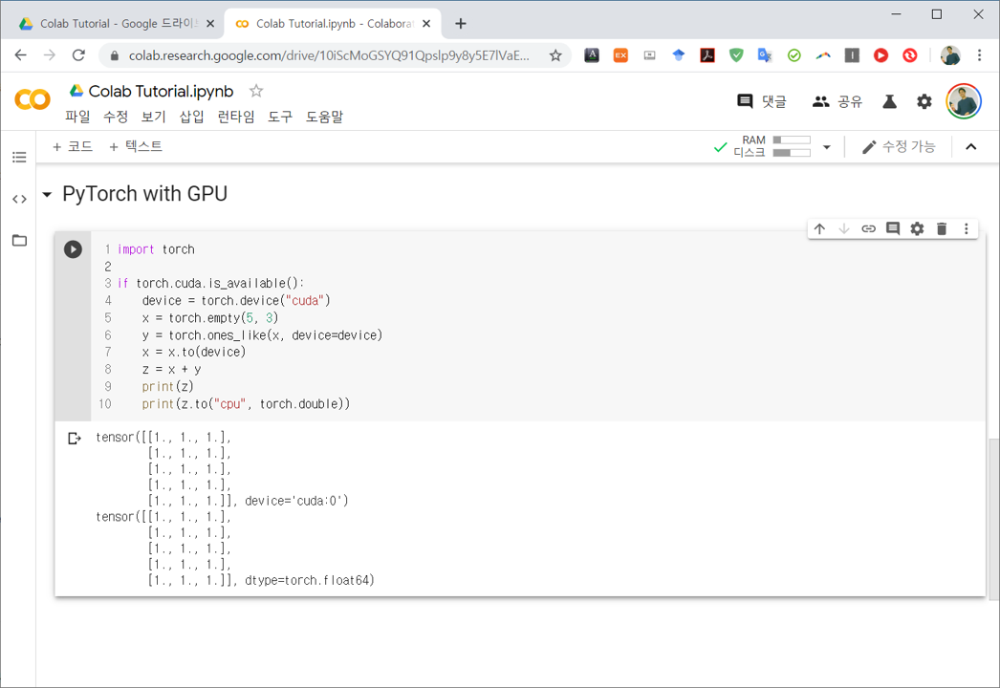

=======
Colab
=======

Colab (Colaboratory)는 브라우저에서 Jupyter notebook처럼 Python을 사용할 수 있게 Google에서 제공하는 클라우드 서비스다. Colab에서는 GPU와 TPU가 장착된 가상 머신 (Virtual Machine, VM)을 무료로 제공하고, Tensorflow, Keras, PyTorch가 사전 설치되어 있어 바로 딥러닝 모델을 개발하고 테스트 할 수 있다. GPU 최대 사용 시간은 12시간이고, 90분 동안 미사용시 VM이 초기화 된다. 또한, Google Docs나 Google Sheets처럼 다른 사람과 공유할 수도 있다. 공식적인 Colab 소개 영상은 `여기 <https://youtu.be/inN8seMm7UI>`_ 에서 확인할 수 있다.

.. figure:: ../img/colab/ui.png
    :align: center
    :scale: 50%

    Colab UI

위 그림이 Colab notebook 화면이다. 좌측에 목차가 있어 문서의 구조를 볼 수 있고, 나머지 부분은 기존 Jupyter notebook과 유사한 형태를 띄고 있는데 지금부터 하나씩 살펴보자.

Colab 시작하기
===============

Colab은 Google Drive에 Colab notebook을 생성하여 사용할 수 있다.

.. figure:: ../img/colab/create_new_colab_page.png
    :align: center
    :scale: 60%

    How to create a new Colab notebook

Google Drive에서 새로운 Colab notebook을 저장하고 싶은 폴더를 생성한 후, 새로 만들기를 클릭해서 Google Colaboratory 항목으로 Colab notebook을 생성한다. 만약 Google Colaboratory가 보이지 않는다면, 아래 그림처럼 연결할 앱 더보기에서 Colaboratory를 검색하여 앱을 추가해주면 된다.

    Add a Colaboratory app

생성한 Colab notebook에서는 Jupyter notebook처럼 Python 코드를 작성하고 실행할 수 있다. 예를 들어 값을 계산하여 변수에 저장하고 출력이 가능하며, 좌측의 실행 버튼이나 Ctrl + Enter를 이용하여 실행할 수 있다.

    Simple Colab example

Colab notebook을 사용하면 실행 코드와 서식 있는 텍스트를 이미지, HTML, LaTeX 등과 함께 하나의 문서로 통합할 수 있다. 그리고 Colab notebook은 Google 드라이브 계정에 저장되고, Google Docs나 Google Sheets처럼 Colab notebook을 간편하게 공유하여 동료나 친구들이 댓글을 달거나 수정하도록 할 수 있다.

만약 새로운 Libarary를 설치하여 사용하고 싶다면, "!"를 이용하여 새로운 Library를 설치할 수 있다.

.. code::

    !pip install -q matplotlib-venn

.. code:: python

    from matplotlib_venn import venn2
    _ = venn2(subsets = (3, 2, 1))

.. figure:: ../img/colab/matplotlib_venn_ex.png
    :scale: 90%

Colab의 다양한 사용법은 아래 목록의 링크를 참고하면 좋을 것 같다.

* `Colaboratory 개요 <https://colab.research.google.com/notebooks/basic_features_overview.ipynb>`_
* `Markdown 가이드 <https://colab.research.google.com/notebooks/markdown_guide.ipynb>`_
* `라이브러리 가져오기 및 종속 항목 설치하기 <https://colab.research.google.com/notebooks/snippets/importing_libraries.ipynb>`_
* `GitHub에서 노트 저장 및 로드하기 <https://colab.research.google.com/github/googlecolab/colabtools/blob/master/notebooks/colab-github-demo.ipynb>`_
* `대화형 양식 <https://colab.research.google.com//notebooks/forms.ipynb>`_
* `대화형 위젯 <https://colab.research.google.com//notebooks/widgets.ipynb>`_

데이터 사용하기
===============

Colab에서 본인이 가지고 있는 데이터를 이용하여 작업하고 싶은 경우, 주로 Google drive를 사용한다. Google drive를 사용하려면 아래 코드를 이용하여 VM에 Mount해야 한다.

.. code:: python

    from google.colab import drive
    drive.mount('/content/drive')

아래 그림처럼 Mount 코드를 실행하면 Google 계정에 대한 인증 코드가 만들어지고, 이 코드를 Colab notebook에 입력하면 Google drive가 Colab VM에 Mount 된다. 실제로 간단한 Text 파일을 만들어보면 위 그림의 마지막 그림처럼 실제 Google drive에 파일이 생성된 것을 확인할 수 있다.

    Mount Google drive to Colab VM

Tensorflow with GPU
====================

지금부터는 Colab notebook에서 GPU로 Tensorflow를 사용하는 방법을 살펴보려고 한다. Tensorflow는 이미 설치되어 있기 때문에 따로 설치할 필요는 없고 하드웨어 가속기를 GPU로 변경해주어야 한다. "메뉴 > 런타임 > 런타임 유형 변경"에서 하드웨어 가속기를 GPU로 변경하면 된다.

    PyTorch with Tensorflow

변경 후 아래의 코드를 실행하면 상단 가장 우측 그림처럼 실제로 Tensorflow가 GPU와 연결되어 있음을 확인할 수 있다.

.. code:: python

    %tensorflow_version 2.x
    import tensorflow as tf
    device_name = tf.test.gpu_device_name()
    if device_name != '/device:GPU:0':
        raise SystemError('GPU device not found')
    print('Found GPU at: {}'.format(device_name))

위 코드에서 :code:`%tensorflow_version 2.x` 라는 부분을 볼 수 있다. 이는 pip로 Tensorflow 2.x를 설치하지 않고 Tensorflow 2.x를 import 하는 방법이다. 현재 Colab은 Tensorflow 1.5를 지원하고 있지만 곧 Tensorflow 2.x로 변경될 예정이므로 위 코드를 tensorflow를 import 하기 전에 사용하는 것이 좋다.

PyTorch with GPU
=================

PyTorch도 이미 설치되어 있고 Tensorflow처럼 하드웨어 가속기를 GPU로 변경하고 사용하면 된다.

.. code:: python

    import torch

    if torch.cuda.is_available():
        device = torch.device("cuda")
        x = torch.empty(5, 3)
        y = torch.ones_like(x, device=device)
        x = x.to(device)
        z = x + y
        print(z)
        print(z.to("cpu", torch.double))

위 코드를 실행해보면 아래 그림처럼 to 함수를 이용하여 tensor가 GPU로 계산되는 것을 확인할 수 있다.

    PyTorch with GPU

Example: Fashion MNIST with Keras
==================================

다음은 Colab에서 Keras를 이용하여 CNN을 기반으로 하는 옷 분류 모델을 학습시키고 테스트 한 예제이다. 데이터는 Fashion MNIST dataset을 사용했고 다음 과정을 통해 모델을 학습시키고 테스트 할 수 있다.

데이터 불러오기
***************

:code:`tf.keras.datasets` 를 이용하여 Fashion MNIST dataset을 다운받아 사용할 수 있다.

.. code:: python

    %tensorflow_version 2.x
    import tensorflow as tf
    import numpy as np

    (x_train, y_train), (x_test, y_test) = tf.keras.datasets.fashion_mnist.load_data()

    # add empty color dimension
    x_train = np.expand_dims(x_train, -1)
    x_test = np.expand_dims(x_test, -1)

모델 정의
*********

모델은 각각 Batch normalization과 Dropout을 가지는 3개의 Layer로 구성된 일반적인 CNN 모델을 사용했다.

.. code:: python

    def create_model():
        model = tf.keras.models.Sequential()
        model.add(tf.keras.layers.BatchNormalization(input_shape=x_train.shape[1:]))
        model.add(tf.keras.layers.Conv2D(64, (5, 5), padding='same', activation='elu'))
        model.add(tf.keras.layers.MaxPooling2D(pool_size=(2, 2), strides=(2,2)))
        model.add(tf.keras.layers.Dropout(0.25))

        model.add(tf.keras.layers.BatchNormalization(input_shape=x_train.shape[1:]))
        model.add(tf.keras.layers.Conv2D(128, (5, 5), padding='same', activation='elu'))
        model.add(tf.keras.layers.MaxPooling2D(pool_size=(2, 2)))
        model.add(tf.keras.layers.Dropout(0.25))

        model.add(tf.keras.layers.BatchNormalization(input_shape=x_train.shape[1:]))
        model.add(tf.keras.layers.Conv2D(256, (5, 5), padding='same', activation='elu'))
        model.add(tf.keras.layers.MaxPooling2D(pool_size=(2, 2), strides=(2,2)))
        model.add(tf.keras.layers.Dropout(0.25))

        model.add(tf.keras.layers.Flatten())
        model.add(tf.keras.layers.Dense(256))
        model.add(tf.keras.layers.Activation('elu'))
        model.add(tf.keras.layers.Dropout(0.5))
        model.add(tf.keras.layers.Dense(10))
        model.add(tf.keras.layers.Activation('softmax'))
        
        return model

GPU로 학습하기
**************

생성한 CNN 모델을 GPU로 학습시켰다.

.. code:: python

    import os

    model = create_model()
    model.compile(
        optimizer=tf.keras.optimizers.Adam(learning_rate=1e-3, ),
        loss='sparse_categorical_crossentropy',
        metrics=['sparse_categorical_accuracy'])

    model.fit(
        x_train.astype(np.float32), y_train.astype(np.float32),
        epochs=17,
        steps_per_epoch=60,
        validation_data=(x_test.astype(np.float32), y_test.astype(np.float32)),
        validation_freq=17
    )

    model.save_weights('./fashion_mnist.h5', overwrite=True)

테스트 및 결과 확인
*******************

마지막으로 학습된 모델을 Test dataset으로 예측하고 그 결과를 :code:`matplotlib` 을 이용하여 시각화했다.

.. code:: python

    from matplotlib import pyplot
    %matplotlib inline

    def plot_predictions(images, predictions):
        n = images.shape[0]
        nc = int(np.ceil(n / 4))
        f, axes = pyplot.subplots(nc, 4)
        for i in range(nc * 4):
            y = i // 4
            x = i % 4
            axes[x, y].axis('off')

            label = LABEL_NAMES[np.argmax(predictions[i])]
            confidence = np.max(predictions[i])
            if i > n:
                continue
            axes[x, y].imshow(images[i])
            axes[x, y].text(0.5, 0.5, label + '\n%.3f' % confidence, fontsize=14)

        pyplot.gcf().set_size_inches(8, 8)

    LABEL_NAMES = ['t_shirt', 'trouser', 'pullover', 'dress', 'coat', 'sandal', 'shirt', 'sneaker', 'bag', 'ankle_boots']

    cpu_model = create_model()
    cpu_model.load_weights('./fashion_mnist.h5')

    plot_predictions(np.squeeze(x_test[:16]), 
                    cpu_model.predict(x_test[:16]))

.. figure:: ../img/colab/keras_ex_result.png
    :scale: 70%

:h2:`참조`

* `Colaboratory에 오신 것을 환영합니다 <https://colab.research.google.com/notebooks/intro.ipynb>`_
* `TensorFlow with GPU <https://colab.research.google.com/notebooks/gpu.ipynb>`_
* `Keras Fashion MNIST <https://colab.research.google.com/github/tensorflow/tpu/blob/master/tools/colab/fashion_mnist.ipynb>`_
* `Medium, Google Colab Free GPU Tutorial <https://medium.com/deep-learning-turkey/google-colab-free-gpu-tutorial-e113627b9f5d>`_
* `[Colab] 무료 GPU로 파이썬 노트북을 사용할 수 있는 google Drive Colaboratory 소개 <https://youtu.be/XRBXMohjQos>`_
