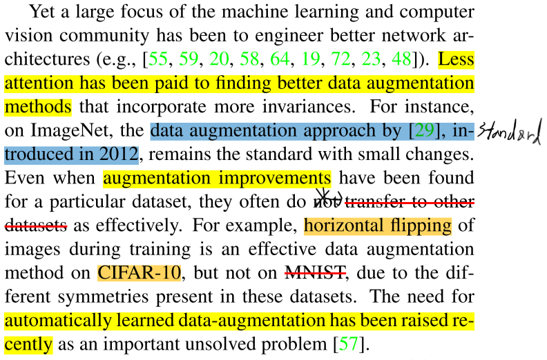
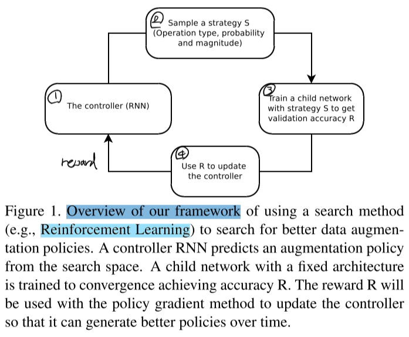
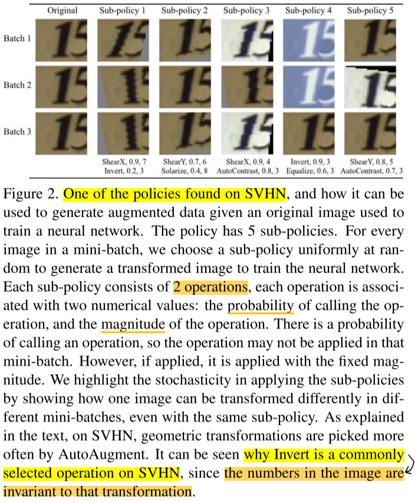
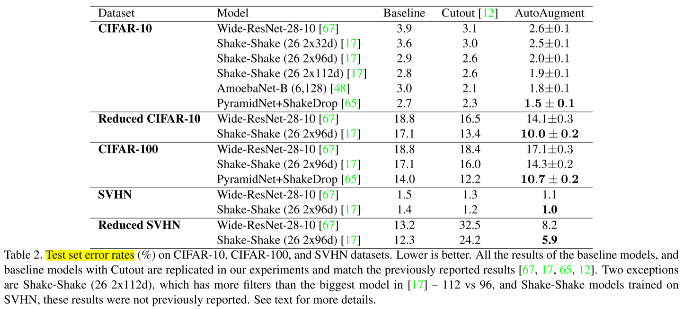
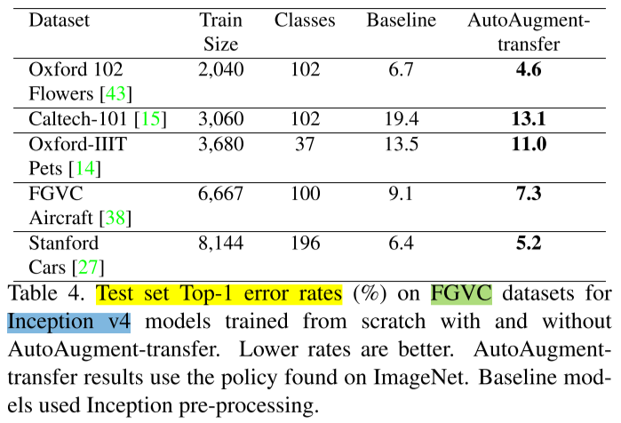
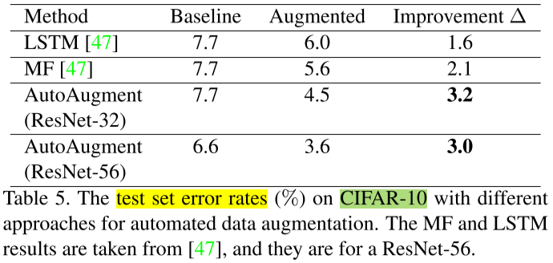

========================================================
AutoAugment: Learning Augmentation Strategies from Data
========================================================

Introduction
=============

To solve above problems, in this paper, they aim to automate the process of finding an effective data augmentation policy for a target dataset.

Each policy expresses several **choices and orders of possible augmentation operations**, where each operation is an image processing function (e.g., translation, rotation, or color normalization), the **probabilities** of applying the function, and the **magnitudes** with which they are applied.

Their extensive experiments show that AutoAugment achieves excellent improvements in two use cases:

* AutoAugment can be **applied directly** on the dataset of interest to find the best augmentation policy (AutoAugment-direct).
* Learned policies can be **transferred to new datasets** (AutoAugment-transfer).

Materials and methods
======================

Dataset
********

* Direct search

    * CIFAR-10, CIFAR-100, SVHN, and ImageNet

* Fine-grained search with augmentation policy found on ImageNet

    * Oxford 102 Flowers, Caltech-101, Oxford-IIIT Pets, FGVC Aircraft, and Stanford Cars

Methods
********

The operations we searched over are ShearX/Y, TranslateX/Y, Rotate, AutoContrast, Invert, Equalize, Solarize, Posterize, Contrast, Color, Brightness, Sharpness, Cutout, Sample Pairing.

Results
========

Direct search
**************

Fine-grained search
********************

AutoAugment vs. Other automated data augmentation methods
**********************************************************

The difference of our method to theirs is that our method tries to optimize classification accuracy directly whereas their method just tries to make sure the augmented images are similar to the current training images.

Conclusions
============

Critics
=======

:h2:`Reference`

* Google Brain, AutoAugment: Learning Augmentation Strategies from Data, ICLR 2020.
