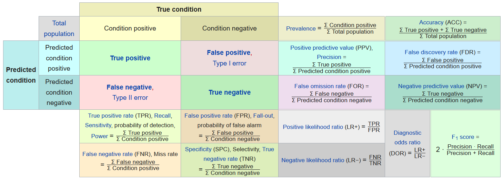
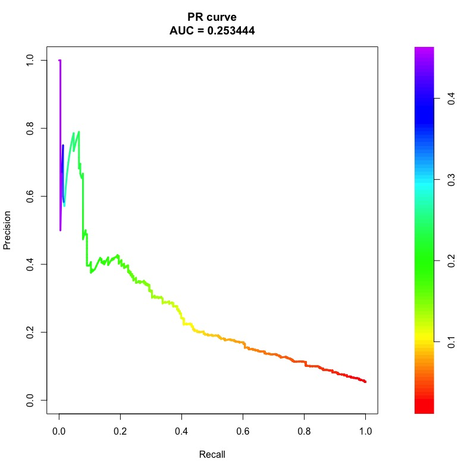

===================
Performance metric
===================

논문에서 모델의 성능을 평가할 때 여러 가지 Performance metric을 사용한다. 여기서 각 Metric에 대해 살펴보자.

Basic metric
=============

기본적인 Performance metric은 크게 Accuracy, Precision, Sensitivity, Specificity 이렇게 4가지가 있다.

Accuracy
*********

정확도 (Accuracy)는 과학, 산업, 공업, 통계학 분야에서 재거나 계산된 양이 실제값과 얼만큼 가까운지를 나타내는 기준이다.

.. rst-class:: centered
    
    :math:`\displaystyle \mathrm {ACC} ={\frac {\mathrm {TP} +\mathrm {TN} }{P+N}}={\frac {\mathrm {TP} +\mathrm {TN} }{\mathrm {TP} +\mathrm {TN} +\mathrm {FP} +\mathrm {FN} }}`

Precision
**********

Precision은 Positive라고 예측한 것들 중 실제 Positive인 비율이다. 한 마디로 Positive 예측의 정확도라고 할 수 있고, Precision을 Postive Predictive Value (PPV)라고 부르기도 한다.

.. rst-class:: centered
    
    :math:`{\displaystyle \mathrm {PPV} ={\frac {\mathrm {TP} }{\mathrm {TP} +\mathrm {FP} }}}`

그렇다면 Positive라고 예측한 것들 중 잘못 예측한 Positive의 비율은 뭐라고 부를까? 이는 False Discovery Rate (FDR)이라고 하고 수식은 아래와 같다.

.. rst-class:: centered
    
    :math:`{\displaystyle \mathrm {FDR} ={\frac {\mathrm {FP} }{\mathrm {FP} +\mathrm {TP} }}=1-\mathrm {PPV} }`

Sensitivity (=Recall)
*********************

Sensitivity (=Recall)은 실제 Positive 중 Positive라고 예측한 것들의 비율을 의미한다. 한 마디로 Positive 예측의 적중률이라고 할 수 있고, Sensitivity를 True Positive Rate (TPR)라고 부르기도 한다. "The percentage of sick people who are correctly identified as having the condition" 이 대표적인 예시이다.

.. rst-class:: centered
    
    :math:`{\displaystyle \mathrm {TPR} ={\frac {\mathrm {TP} }{P}}={\frac {\mathrm {TP} }{\mathrm {TP} +\mathrm {FN} }}}`

그렇다면 실제 Negative 중 Positive라고 잘못 예측한 비율은 무엇일까? 이는 False Positive Rate (FPR)이라고 하고 수식은 아래와 같다.

.. rst-class:: centered
    
    :math:`{\displaystyle \mathrm {FPR} ={\frac {\mathrm {FP} }{N}}={\frac {\mathrm {FP} }{\mathrm {FP} +\mathrm {TN} }}=1-\mathrm {TNR} }`

Specificity
************

Specificity는 Negative라고 예측한 것들 중 실제 Negative인 것들의 비율을 의미한다. 이는 True Negative Rate (TNR)이라고 불리기도 한다. "The percentage of healthy people who are correctly identified as not having the condition" 이 대표적인 예시이다.

.. rst-class:: centered
    
    :math:`{\displaystyle \mathrm {TNR} ={\frac {\mathrm {TN} }{N}}={\frac {\mathrm {TN} }{\mathrm {TN} +\mathrm {FP} }}}`

Confusion matrix
*****************

Confusion matrix는 지금까지 설명한 Accuracy, Precision (=PPV), Sensitivity, Specificity (=TNR)를 한 눈에 볼 수 있게 만든 Matrix 이다.

.. rst-class:: centered

    출처: `Wikipedia <https://en.wikipedia.org/wiki/Confusion_matrix>`_

Precision and recall
*********************

Precision과 Recall이 어떤 용도로 모델을 평가할 때 사용되는지 직관적으로 와닿지 않는다. 그래서 예를 통해 이해해보려고 한다.

예를 들어 어떤 사진이든 무조건 사람이라고 판단하는 모델이 있다고 했을 때, 이 모델이 사람을 100% 검출한다면 좋은 모델일까? 여기서 검출율은 실제로 정답 중에 내가 예측한 결과의 비율을 의미하고 이는 Recall과 같다. 답은 아니다. 다음 예로 이해해보자.

만약 10장의 사진 중에 1장만 사람이고 나머지는 고양이라고 했을 때, 이 모델의 검출율은 100%이다. 하지만 사람이라고 예측한 것 중 실제 사람인 비율, 즉 예측의 정확도는 10% 밖에 안된다. 그래서 어떤 모델을 평가할 때, Precision과 Recall을 모두 고려해야 한다.

(작성 예정)

Mixed metric
=============

Basic metric에서 설명한 Performance metric을 조합하여 만든 대표적인 Metric에는 F1-measure, AUC, AUPR이 있다.

F1-measure (=F1-score)
***********************

F1-measure는 Precision과 Recall의 조화 평균이다.

.. rst-class:: centered
    
    :math:`{\displaystyle F_{1}=2\cdot {\frac {\mathrm {PPV} \cdot \mathrm {TPR} }{\mathrm {PPV} +\mathrm {TPR} }}={\frac {2\mathrm {TP} }{2\mathrm {TP} +\mathrm {FP} +\mathrm {FN} }}}`

AUC
****

Area under the curve (AUC) is the area under the ROC curve.

----------------------------------------------
Receiver Operating Characteristic (ROC) curve
----------------------------------------------

.. figure:: ìmg/auc_in_performance_metric.png
    :align: center
    :scale: 80%

.. rst-class:: centered

    출처: `GLASS BOX, Measuring Performance: AUC (AUROC) <https://glassboxmedicine.com/2019/02/23/measuring-performance-auc-auroc/>`_

AUPR
*****

Area under the curve (AUC) is the area under the precision-recall curve.

.. rst-class:: centered

    출처: `? <#>`_

:h2:`출처`

* `다크프로그래머 - precision, recall 이해 <https://darkpgmr.tistory.com/162>`_
