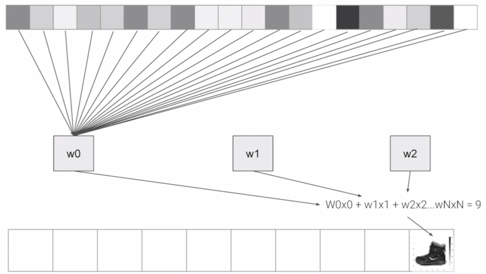

===============
Computer vision
===============

Computer vision is the field of having a computer understand and label what is present in an image.

Example: classify fashion images
================================

We can construct a fashion image classification model using `Fashion MNIST <https://github.com/zalandoresearch/fashion-mnist>`_ dataset which can be loaded by Tensorflow API and this is a description of Fashion MNIST dataset:

* 70k images
* 10 categories
* Images are 28 x 28

We classify categories as numbers (0 to 9) to avoid bias -- instead of labelling it with words in a specific language and excluding people who don’t speak that language! You can learn more about bias and techniques to avoid it `here <https://developers.google.com/machine-learning/fairness-overview/>`_.

Classfication of fashion images
*******************************

Classification is working like this:

If you want to know neural network and deep learning more detaily, then you can see these videos (`Link <https://www.youtube.com/watch?v=CS4cs9xVecg&list=PLkDaE6sCZn6Ec-XTbcX1uRg2_u4xOEky0>`_).

----
Code
----

This is a whole `code <https://colab.research.google.com/github/lmoroney/dlaicourse/blob/master/Course%201%20-%20Part%204%20-%20Lesson%202%20-%20Notebook.ipynb#scrollTo=WzlqsEzX9s5P>`_ to classify 9 categories of images from Fashion MNIST dataset:

.. code-block:: python

    import tensorflow as tf
    print(tf.__version__)

    mnist = tf.keras.datasets.fashion_mnist
    
    (training_images, training_labels), (test_images, test_labels) = mnist.load_data()

    import matplotlib.pyplot as plt
    plt.imshow(training_images[0])
    print(training_labels[0])
    print(training_images[0])

    training_images  = training_images / 255.0
    test_images = test_images / 255.0

    model = tf.keras.models.Sequential([tf.keras.layers.Flatten(), 
                                        tf.keras.layers.Dense(128, activation=tf.nn.relu), 
                                        tf.keras.layers.Dense(10, activation=tf.nn.softmax)])

    model.compile(optimizer = tf.train.AdamOptimizer(),
                  loss = 'sparse_categorical_crossentropy',
                  metrics=['accuracy'])

    model.fit(training_images, training_labels, epochs=5)

    model.evaluate(test_images, test_labels)

Callback function
-----------------

We can stop training using callback function. Callback function is called the end of each epoch and this code is the method for how to use callback function:

.. code-block:: python

    import tensorflow as tf

    class myCallback(tf.keras.callbacks.Callback):
        def on_epoch_end(self, epoch, logs={}):
            if(logs.get('acc')>0.6):
                print("\nReached 60% accuracy so cancelling training!")
                self.model.stop_training = True

    mnist = tf.keras.datasets.fashion_mnist

    (x_train, y_train),(x_test, y_test) = mnist.load_data()
    x_train, x_test = x_train / 255.0, x_test / 255.0

    callbacks = myCallback()

    model = tf.keras.models.Sequential([
        tf.keras.layers.Flatten(input_shape=(28, 28)),
        tf.keras.layers.Dense(512, activation=tf.nn.relu),
        tf.keras.layers.Dense(10, activation=tf.nn.softmax)
    ])

    model.compile(optimizer='adam',
                  loss='sparse_categorical_crossentropy',
                  metrics=['accuracy'])

    model.fit(x_train, y_train, epochs=10, callbacks=[callbacks])

Example: classify 9 digit images
================================

This is another exmaple of the image classification example. We can use MNIST which has items of handwriting -- the digits 0 through 9 and this is a code:

.. code-block:: python

    import tensorflow as tf

    class myCallback(tf.keras.callbacks.Callback):
        def on_epoch_end(self, epoch, logs={}):
            if(logs.get('acc') > 0.99):
                print("\nReached 99% accuracy so cancelling training!")
                self.model.stop_training = True

    def train_mnist():
        mnist = tf.keras.datasets.mnist

        (x_train, y_train),(x_test, y_test) = mnist.load_data()

        x_train  = x_train / 255.0
        x_test = x_test / 255.0

        model = tf.keras.models.Sequential([tf.keras.layers.Flatten(),
                                            tf.keras.layers.Dense(128, activation=tf.nn.relu),
                                            tf.keras.layers.Dense(10, activation=tf.nn.softmax)])

        model.compile(optimizer='adam',
                    loss='sparse_categorical_crossentropy',
                    metrics=['accuracy'])

        history = model.fit(x_train, y_train, epochs=10, callbacks=[myCallback()])

        return history.epoch, history.history['acc'][-1]

    train_mnist()

Quiz: Introduction to computer vision
=====================================

.. toggle-header::
    :header: **Quiz list**

    |
    **Question 1**

        What’s the name of the dataset of Fashion images used in this week’s code?

        \[　\] Fashion Tensors

        \[　\] Fashion MNIST

        \[　\] Fashion Data

        \[　\] Fashion MN

    **Question 2**

        What do the above mentioned Images look like?

        \[　\] 82x82 Greyscale

        \[　\] 100x100 Color

        \[　\] 28x28 Color

        \[　\] 28x28 Greyscale

    **Question 3**

        How many images are in the Fashion MNIST dataset?

        \[　\] 42

        \[　\] 60,000

        \[　\] 0,000

        \[　\] 70,000

    **Question 4**
        
        Why are there 10 output neurons?

        \[　\] To make it classify 10x faster

        \[　\] Purely arbitrary

        \[　\] To make it train 10x faster

        \[　\] There are 10 different labels

    **Question 5**

        What does Relu do?

        \[　\] It only returns x if x is less than zero

        \[　\] It only returns x if x is greater than zero

        \[　\] For a value x, it returns 1/x

        \[　\] It returns the negative of x

    **Question 6**

        Why do you split data into training and test sets?

        \[　\] To make testing quicker

        \[　\] To train a network with previously unseen data

        \[　\] To test a network with previously unseen data

        \[　\] To make training quicker

    **Question 7**

        What method gets called when an epoch finishes?

        \[　\] On_training_complete

        \[　\] on_end

        \[　\] on_epoch_finished

        \[　\] on_epoch_end

    **Question 8**

        What parameter to you set in your fit function to tell it to use callbacks?

        \[　\] callback=

        \[　\] oncallback=

        \[　\] callbacks=

        \[　\] oncallbacks=

|

Reference
=========

* https://www.coursera.org/learn/introduction-tensorflow
