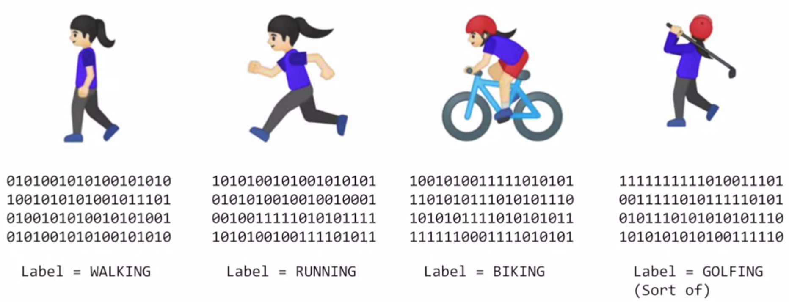

=========================
New programming paradigm
=========================

Traditional programmming vs. Machine learning
=============================================

This is a difference between traditional programming and machine learning.

.. figure:: img/intro/programming_paradigm.png
    :align: center
    :scale: 40%

Example: Activity recognition
*****************************

------------------------
Traditional programmming
------------------------

In traditional programming, we should make a rule for all situations. So, if we meet unknown situations, we can't handle the situation.

.. figure:: img/intro/traditional_programming.png
    :align: center
    :scale: 40%

----------------
Machine learning
----------------

However, in machine learning, we make a rule about data so we can handle unknown situations.

Summary
*******

As a result, the traditional paradigm of expressing rules in a coding language may not always work to solve a problem. As such, scenarios such as Computer Vision are very difficult to solve with rules-based programming.

Instead, if we feed a computer with enough data that we describe (or label) as what we want it to recognize, given that computers are really good at processing data and finding patterns that match, then we could potentially ‘train’ a system to solve a problem. 

Exaple: Neural network
======================

This code is for a model with a rule (:math:`y = 2x - 1`) and we can simply contruct and train the model using keras (`Link <https://github.com/lmoroney/dlaicourse/blob/master/Course%201%20-%20Part%202%20-%20Lesson%202%20-%20Notebook.ipynb>`_).

.. code-block:: python

    import tensorflow as tf
    import numpy as np
    from tensorflow import keras

    model = keras.Sequential([keras.layers.Dense(units=1, input_shape[1])])
    model.compile(optimizer='sgd', loss='mean_squared_error')

    xs = np.array([-1.0, 0.0, 1.0, 2.0, 3.0, 4.0], dtype=float)
    ys = np.array([-3.0, -1.0, 1.0, 3.0, 5.0, 7.0], dtype=float)

    model.fit(xs, ys, epochs=500)

    print(model.predict([10.0])

Quiz: New programming paradigm
==============================

.. toggle-header::
    :header: **Quiz list**

    |
    **Question 1**

        The diagram for traditional programming had Rules and Data In, but what came out?

        \[　\] Binary

        \[　\] Answers

        \[　\] Machine Learning

        \[　\] Bugs

    **Question 2**

        The diagram for Machine Learning had Answers and Data In, but what came out?

        \[　\] Binary

        \[　\] Bugs

        \[　\] Models

        \[　\] Rules

    **Question 3**

        When I tell a computer what the data represents (i.e. this data is for walking, this data is for running), what is that process called?

        \[　\] Labelling the Data

        \[　\] Learning the Data

        \[　\] Categorizing the Data

        \[　\] Programming the Data

    **Question 4**

        What is a Dense?

        \[　\] Mass over Volume

        \[　\] A single neuron

        \[　\] A layer of disconnected neurons

        \[　\] A layer of connected neurons

    **Question 5**

        What does a Loss function do?

        \[　\] Generates a guess

        \[　\] Measures how good the current ‘guess’ is

        \[　\] Figures out if you win or lose

        \[　\] Decides to stop training a neural network

    **Question 6**

        What does the optimizer do?

        \[　\] Measures how good the current guess is

        \[　\] Generates a new and improved guess

        \[　\] Figures out how to efficiently compile your code

        \[　\] Decides to stop training a neural network

    **Question 7**

        What is Convergence?

        \[　\] The process of getting very close to the correct answer

        \[　\] A programming API for AI

        \[　\] The bad guys in the next ‘Star Wars’ movie

        \[　\] A dramatic increase in loss

    **Question 8**

        What does model.fit do?

        \[　\] It trains the neural network to fit one set of values to another

        \[　\] It determines if your activity is good for your body

        \[　\] It makes a model fit available memory

        \[　\] It optimizes an existing model

|

Additional resources
====================

* AI For Everyone is a non-technical course that will help you understand many of the AI technologies, and help you spot opportunities in applying this technology to solve your problems (https://www.deeplearning.ai/ai-for-everyone/).

* TensorFlow is available at TensorFlow.org, and video updates from the TensorFlow team are at https://www.youtube.com/tensorflow.

* Play with a neural network right in the browser at http://playground.tensorflow.org. See if you can figure out the parameters to get the neural network to pattern match to the desired groups. The spiral is particularly challenging!

Reference
=========

* https://www.coursera.org/learn/introduction-tensorflow
